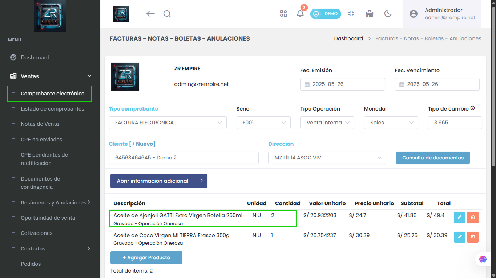

# Comprobantes: Acumulación de Productos Agregados (Incluye los que usan Series)

Para una creación de comprobantes más ágil y clara, al añadir un artículo (estándar o con serie) que ya se encuentra en el detalle, la cantidad se sumará automáticamente a la línea existente en lugar de crear una nueva.

*Imagen: Ejemplo de acumulación automática de productos en el detalle del comprobante.*

## Características Principales

- Acumulación automática de cantidades
- Gestión simplificada de productos
- Mejor organización de comprobantes

## Beneficios

- Mayor eficiencia en la creación
- Reducción de duplicados
- Mejor control de cantidades

## Funcionalidades

- Acumulación automática
- Gestión de series integrada
- Interfaz más intuitiva
- Mejor control de productos 