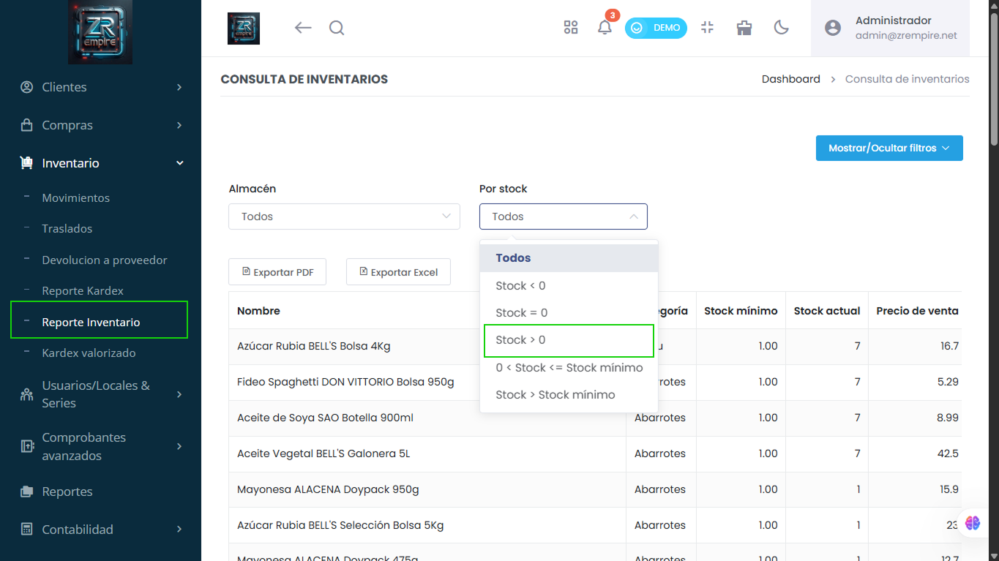

# Reporte de Inventario: Nuevo Filtro "En Stock > 0"

Accede rápidamente a la lista de tus productos en existencia. El reporte de inventario ahora cuenta con un filtro específico para mostrar solo aquellos artículos con stock positivo (cantidad mayor a 0).

## Características Principales

- Filtro de stock positivo
- Visualización rápida de existencias
- Mejor control de inventario

## Beneficios

- Acceso rápido a productos disponibles
- Mayor eficiencia en consultas
- Mejor gestión de inventario

## Funcionalidades

- Filtro de stock > 0
- Visualización optimizada
- Reportes más precisos
- Mejor control de existencias 