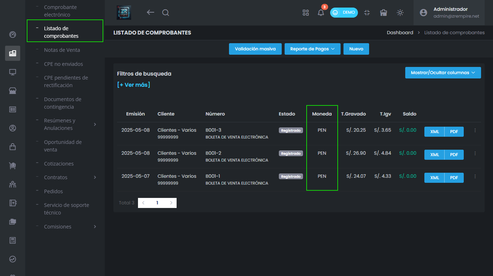

# Mayor Claridad Financiera: Símbolos de Moneda Visibles

Facilitamos la lectura de tu información monetaria. Ahora verás el símbolo de la moneda correspondiente junto a los importes en el listado de comprobantes y en más secciones del sistema, reduciendo ambigüedades.

## Características Principales

- Símbolos de moneda visibles
- Mayor claridad financiera
- Mejor presentación de datos

## Beneficios

- Información más clara
- Reducción de confusiones
- Mejor control financiero

## Funcionalidades

- Visualización de símbolos
- Presentación mejorada
- Control de monedas
- Interfaz más clara 