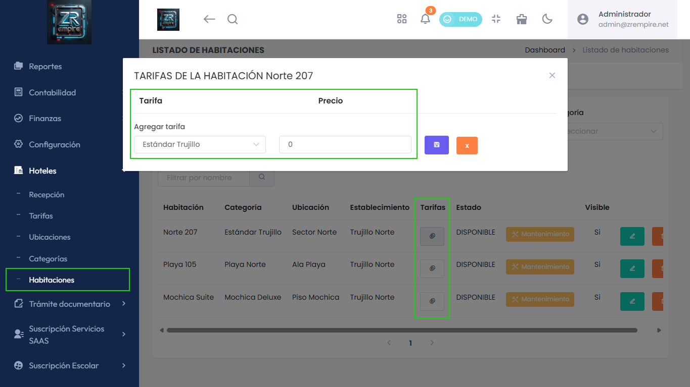

# Módulo Hotel: Opción para Seleccionar 'Tarifas Libres' de Habitación

Ampliamos tus herramientas de tarificación. Ahora, dentro del módulo de hotel, puedes elegir 'tarifas libres' específicas para cada habitación, facilitando la aplicación de precios personalizados o de último momento.

## Características Principales

- Tarifas libres por habitación
- Mayor flexibilidad en precios
- Mejor control de tarifas

## Beneficios

- Precios más flexibles
- Mayor personalización
- Mejor gestión de tarifas

## Funcionalidades

- Selección de tarifas libres
- Precios personalizados
- Control de tarifas
- Interfaz más intuitiva 