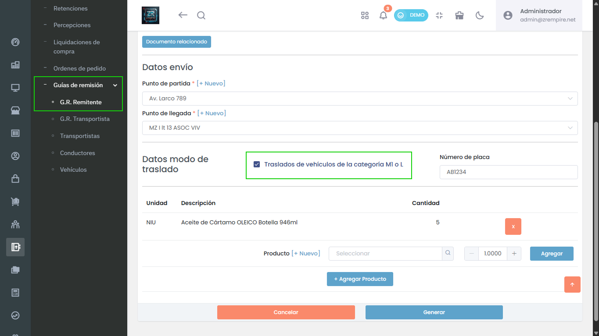

# Nuevo: GRE Remitente para Traslado de Vehículos M1/L

Para tus operaciones de transporte de vehículos categorías M1 o L, hemos habilitado la generación de la Guía de Remisión Remitente (GRE) correspondiente, asegurando la correcta y completa documentación.

## Características Principales

- GRE para vehículos M1/L
- Documentación completa
- Mejor control de traslados

## Beneficios

- Documentación más precisa
- Mayor control de operaciones
- Mejor gestión de traslados

## Funcionalidades

- Generación de GRE
- Control de vehículos
- Validación mejorada
- Interfaz más clara 