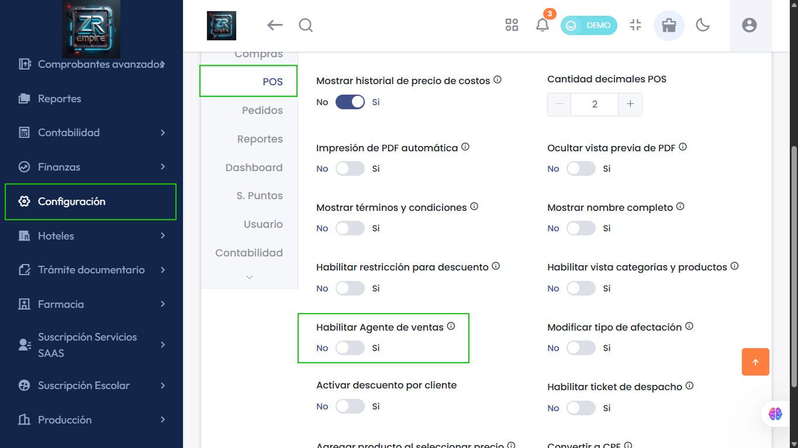
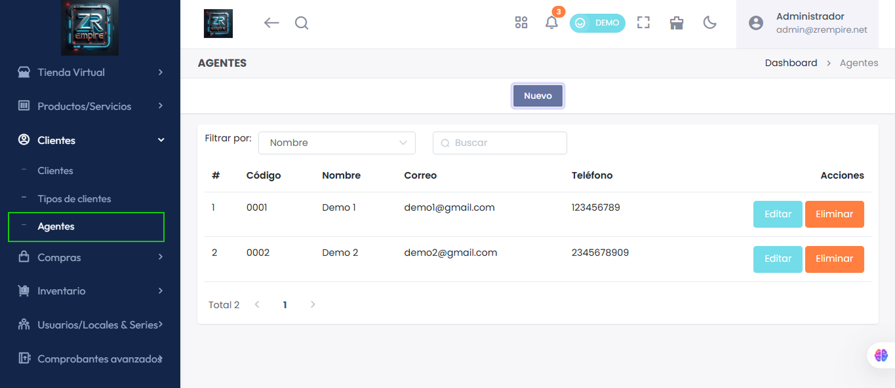

# Módulo Agentes: ¡Habilitado y Funcionando!

El submodulo  Agentes ya está disponible y sin errores. Accede ahora para gestionar a tus agentes y sus operaciones de manera eficiente.

## ¿Cómo activar el submódulo de Agentes?

Para habilitar el submódulo de Agentes, sigue estos pasos:

1. Ve a **Configuración** > **Empresa** > **Avanzado** > **POS**.
2. Activa la opción correspondiente a **Agentes**.

Esto permitirá gestionar agentes desde el módulo de operaciones.

---

## Características Principales

- Gestión completa de agentes
- Control de operaciones
- Interfaz optimizada

## Beneficios

- Mejor gestión de agentes
- Mayor eficiencia operativa
- Control centralizado

## Funcionalidades

- Registro de agentes
- Control de operaciones
- Reportes y estadísticas
- Gestión de comisiones 