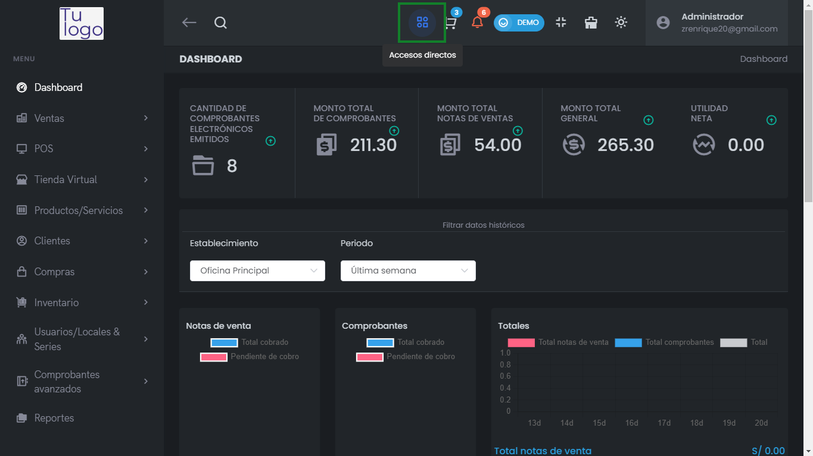
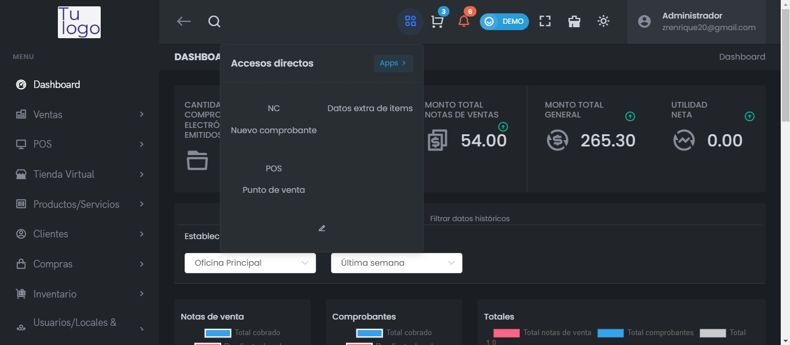

# Accesos Directos  

La función de **Accesos Directos** en el Dashboard permite a los usuarios acceder rápidamente a las funcionalidades más utilizadas del sistema, mejorando la eficiencia y fluidez en el trabajo diario.  

## Cómo utilizar los Accesos Directos  

1. **Localizar el botón de Accesos Directos**: En la parte superior del Dashboard, encontrarás un botón que indica **Accesos directos**.   

     

2. **Abrir el menú**: Haz clic en el botón para desplegar un menú con varias opciones rápidas.  

     

3. **Opciones Disponibles**:  
   - **NC**: Acceso rápido al módulo de **Nuevo Comprobante** para agregar comprobantes de manera inmediata.  
   - **Datos extra de ítems**: Acceso a la funcionalidad que permite gestionar información adicional sobre los productos.  
   - **POS**: Acceso directo al **Punto de Venta** para realizar transacciones rápidamente.  

4. **Seleccionar una opción**: Haz clic en la opción deseada para ser dirigido a la sección correspondiente del sistema.  

## Beneficios  

- **Eficiencia**: Reduce el número de clics necesarios para acceder a funciones comunes.  
- **Ahorro de tiempo**: Permite a los usuarios realizar tareas rápidamente sin navegar a través de múltiples menús.  
- **Accesibilidad**: Ofrece un acceso directo a características críticas, mejorando la experiencia general del usuario.  

