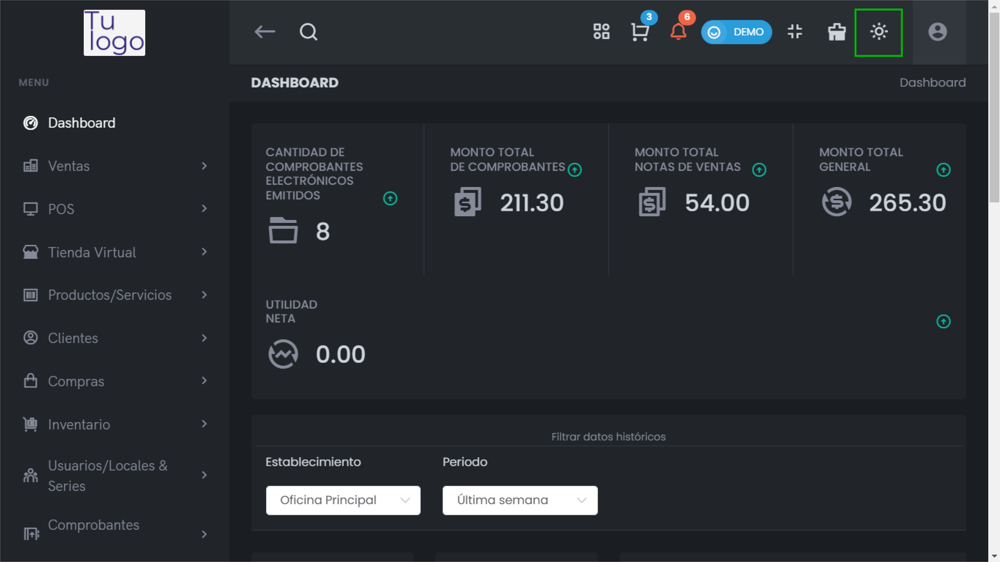

# Modo Oscuro/Claro  

La aplicación ofrece la opción de cambiar entre **modo oscuro** y **modo claro**, permitiéndote personalizar tu experiencia visual según tus preferencias y condiciones de iluminación.  

## Activar/Desactivar Modo Oscuro  

1. **Identifica el icono de configuración**: Busca el icono que permite alternar entre los modos en la parte superior derecha de la interfaz.  
   
      
   
     

2. **Haz clic en el icono**: Para cambiar entre el modo claro y el modo oscuro, simplemente haz clic en el icono. La interfaz se actualizará automáticamente para reflejar tu elección.  

3. **Ventajas del Modo Oscuro**:  
   - Reduce la fatiga visual en ambientes con poca luz.  
   - Puede ayudar a preservar la duración de la batería en dispositivos con pantallas OLED.  

4. **Ventajas del Modo Claro**:  
   - Mejora la legibilidad en entornos bien iluminados.  
   - Proporciona una apariencia más brillante y alegre a la interfaz.  

