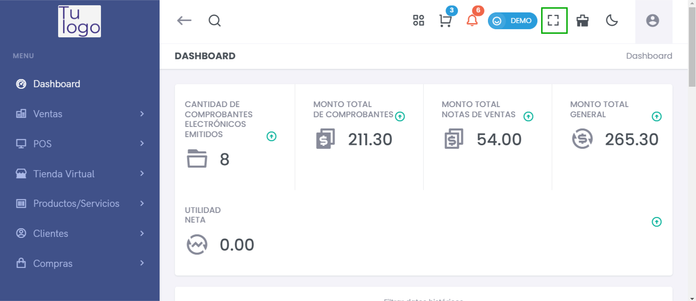
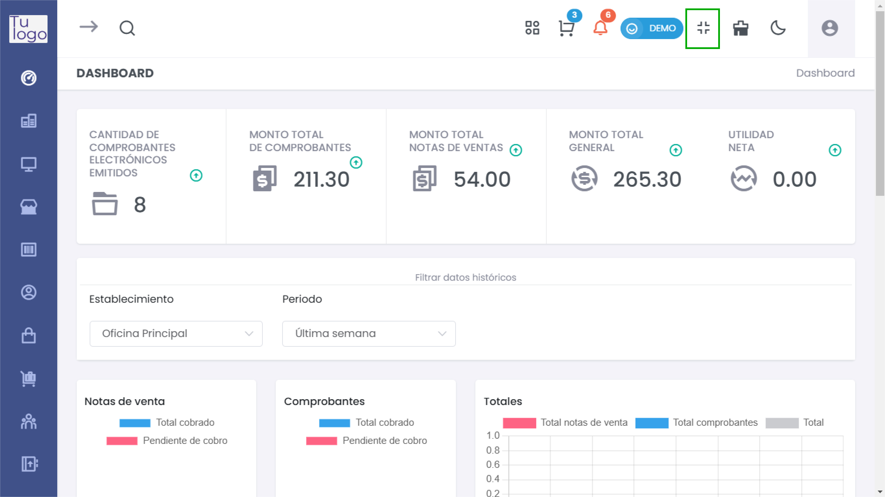

# Pantalla Completa  

Para maximizar tu espacio de trabajo y visualizar la información de manera más amplia, puedes usar el botón de **pantalla completa**. Este botón se encuentra en la parte superior derecha del panel del sistema.

Al hacer clic en este botón, la interfaz del sistema ocupará toda la pantalla de tu dispositivo, eliminando distracciones y permitiéndote concentrarte en tus reportes y datos.  

**Pasos para activar la pantalla completa:**  

1. Localiza el icono de pantalla completa en la barra superior.  
2. Haz clic en el icono.  
3. Para salir de pantalla completa, puedes presionar la tecla **Esc** 
4. Volver a hacer clic en el mismo icono.

