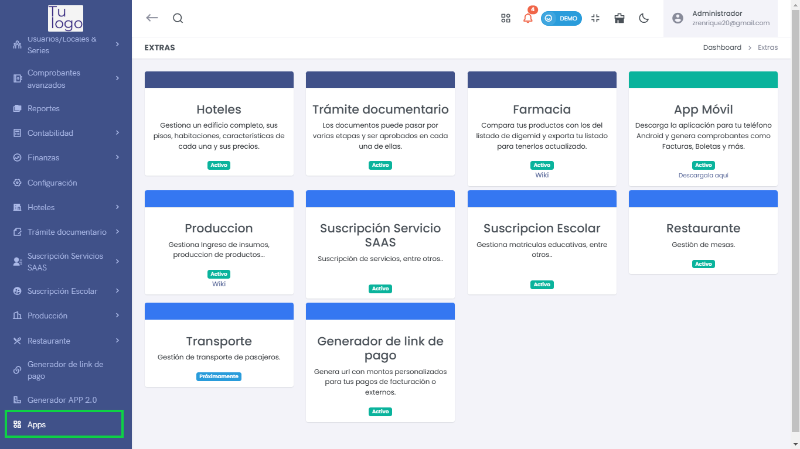

## Apps

El módulo **Apps** proporciona acceso a distintas aplicaciones adicionales para ampliar la funcionalidad de la plataforma. Cada aplicación cuenta con características únicas y se pueden activar o descargar según sea necesario.

Para acceder al módulo de Apps:

1. Dirígete al menú lateral y selecciona **Apps**.
2. Esto te llevará a la sección de **Extras**, donde verás las aplicaciones disponibles.

### Aplicaciones Disponibles

- **Hoteles**: Gestiona un edificio completo, incluyendo pisos, habitaciones, características y precios de cada unidad.
- **Trámite documentario**: Permite gestionar el flujo de documentos, haciéndolos pasar por distintas etapas para su aprobación.
- **Farmacia**: Comparte productos con los del listado de digemid y exporta el inventario actualizado.
- **App Móvil**: Descarga la aplicación para Android, que permite generar comprobantes como facturas y boletas. [Descárgala aquí](#).
- **Producción**: Gestiona el ingreso de insumos y la producción de productos, permitiendo una mejor administración de recursos. [Wiki](#).
- **Suscripción Servicio SAAS**: Permite gestionar suscripciones de servicios.
- **Suscripción Escolar**: Gestiona matrículas educativas y otros servicios relacionados.
- **Restaurante**: Gestiona la configuración de mesas y pedidos de restaurante.
- **Transporte**: Gestiona el transporte de pasajeros. **Disponible próximamente**.
- **Generador de link de pago**: Crea URLs personalizadas con montos específicos para facilitar pagos de facturación o pagos externos.

Cada módulo tiene una descripción detallada que puedes consultar para conocer más sobre sus funciones y utilidad.

