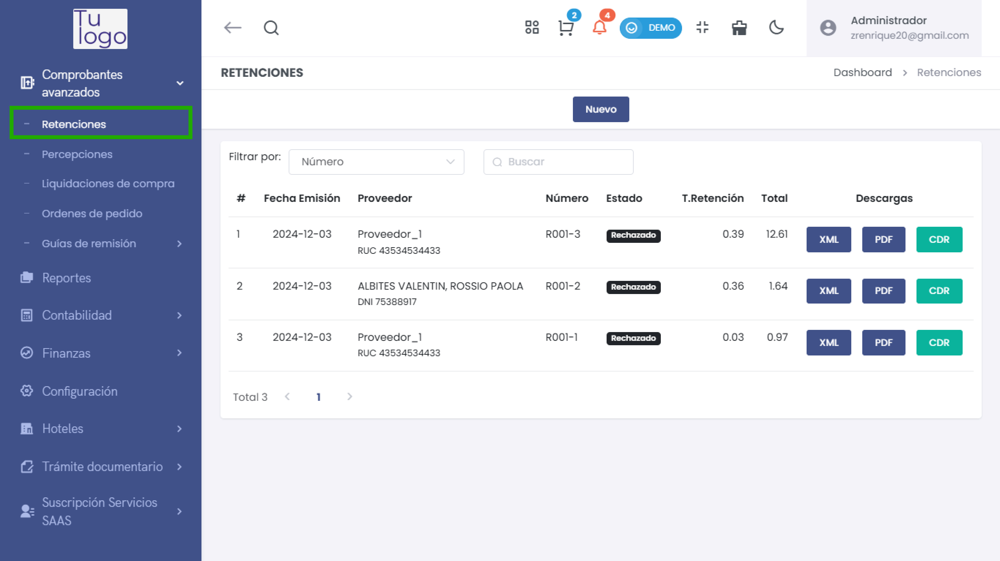
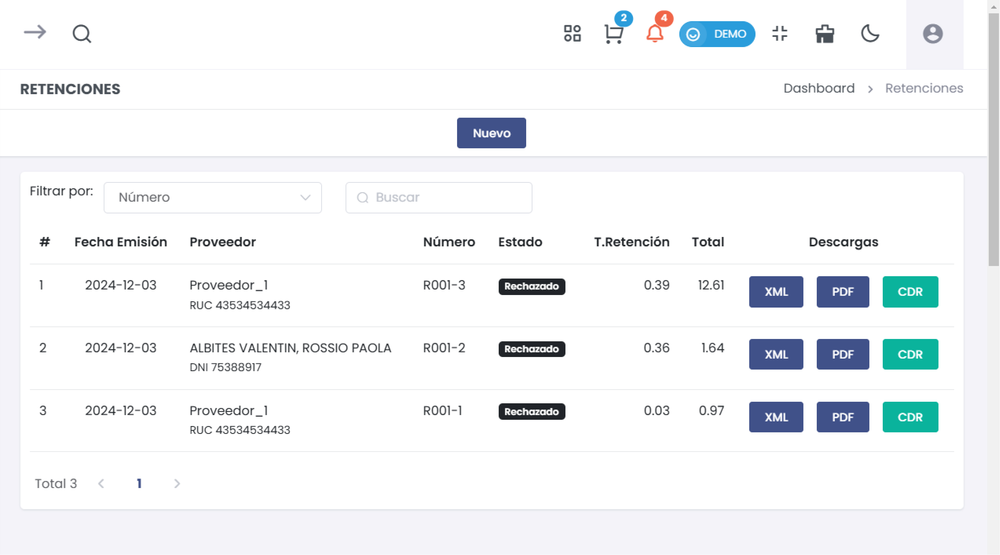
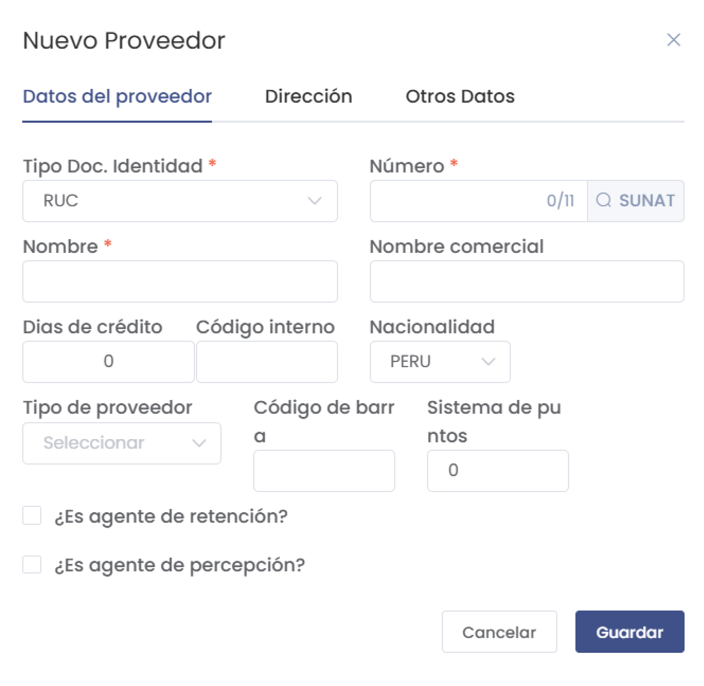
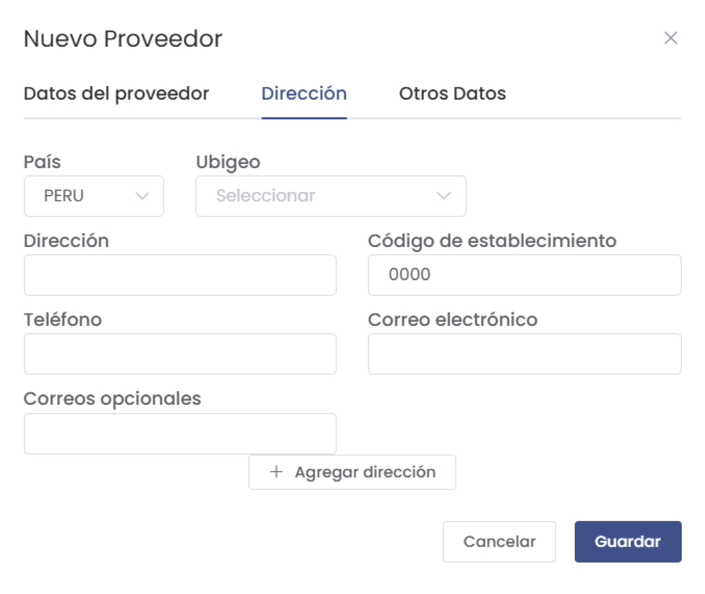
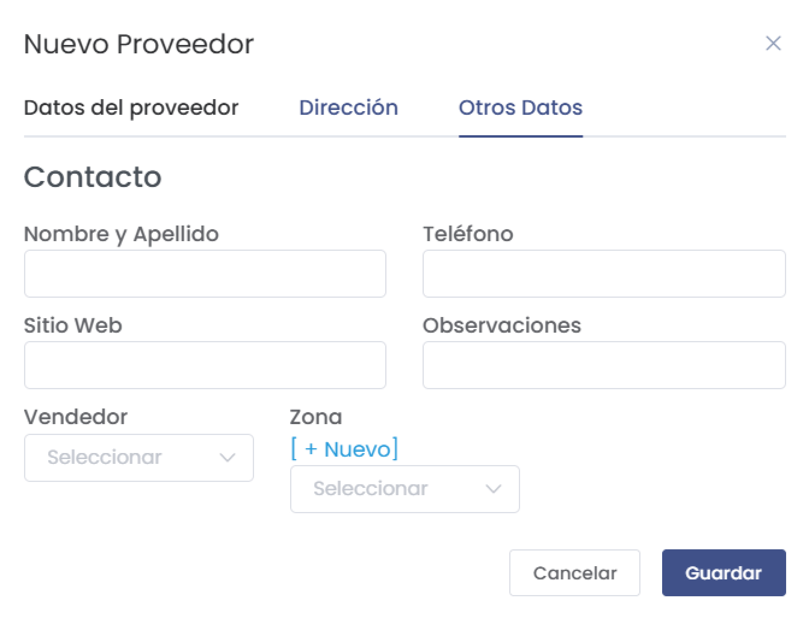
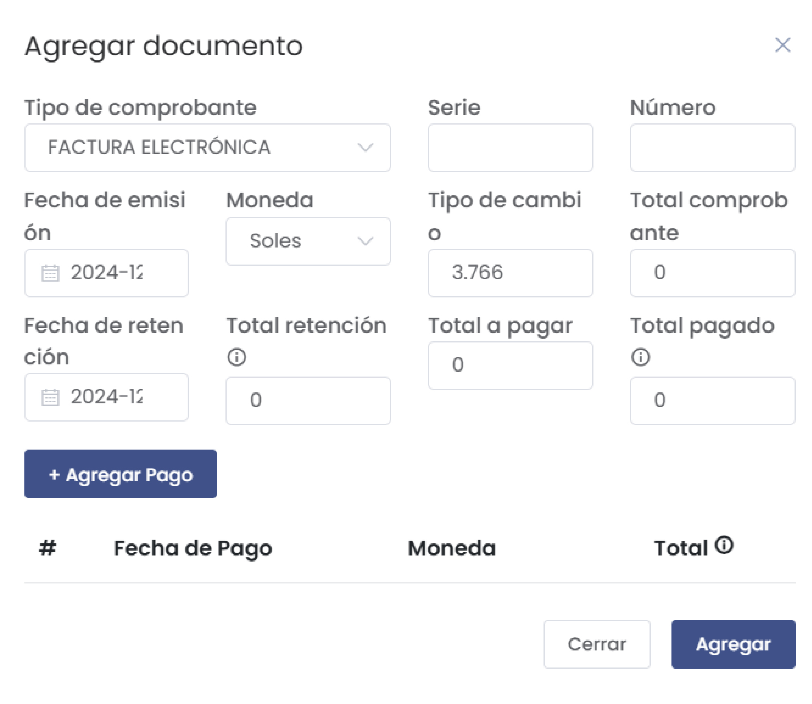
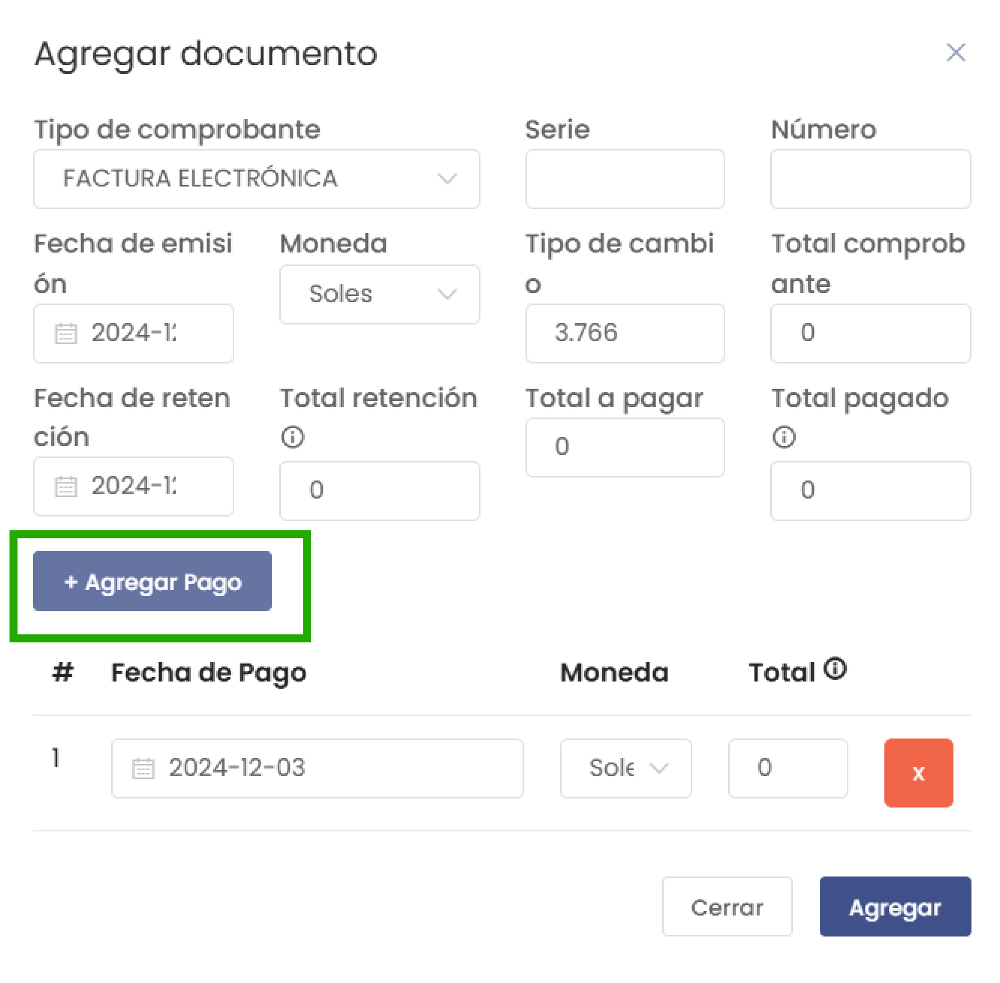

# Retenciones

Esta guía explica cómo agregar un nuevo proveedor en el sistema y gestionar las retenciones relacionadas con ellos. Sigue cada sección para completar el proceso correctamente.

## Acceder a la Gestión de Retenciones

Para comenzar a gestionar las retenciones, sigue estos pasos:

1. **Acceder al Menú de Retenciones**: En el menú principal del sistema, selecciona la opción **Retenciones** para acceder a la interfaz de gestión de retenciones.

   

---

## 1. Listar Retenciones Existentes

En la sección de retenciones, verás una lista de todas las retenciones registradas. Los detalles incluidos son:

- **#**: Número de referencia.
- **Fecha de Emisión**: La fecha en que se emitió la retención.
- **Proveedor**: Nombre del proveedor asociado.
- **Número**: Número del documento de retención.
- **Estado**: Estado actual de la retención (Ej: Aprobado, Rechazado).
- **T. Retención**: Tipo de retención aplicada.
- **Total**: Monto total de la retención.
- **Descargas**: Opciones para descargar documentos en formatos XML, PDF y CDR relacionados con cada retención.

   

---

## 2. Agregar una Nueva Retención

Para crear una nueva retención, sigue estos pasos:

### Paso 1: Hacer clic en **Nuevo**

En la lista de retenciones, haz clic en el botón **Nuevo** para comenzar a registrar una nueva retención.

   

### Paso 2: Completar el Formulario de Retención

En el formulario de retención, completa la siguiente información:

   

- **Establecimiento**: Selecciona el establecimiento correspondiente.
- **Serie**: Especifica la serie del documento de retención.
- **Fecha de emisión**: Indica la fecha de emisión de la retención.
- **Tipo de retención**: Selecciona el tipo de retención que se aplicará (e.g., Tasa 3%).
- **Observaciones**: Agrega cualquier observación que consideres relevante.
---

## 3. Agregar un Nuevo Proveedor

Para añadir un nuevo proveedor, sigue estos pasos:

### Paso 1: Datos del Proveedor

Accede al formulario para añadir un nuevo proveedor. Completa los siguientes campos:

- **Tipo de Doc. Identidad***: (Campo obligatorio) Selecciona el tipo de documento que identifica al proveedor (e.g., RUC, DNI, etc.).
- **Número***: (Campo obligatorio) Introduce el número de identificación del proveedor.
- **Nombre***: (Campo obligatorio) Escribe el nombre completo del proveedor.
- **Nombre comercial**: Proporciona el nombre comercial del proveedor, si aplica.
- **Días de crédito**: Especifica los días de crédito otorgados al proveedor.
- **Código interno**: Un identificador interno para el proveedor.
- **Nacionalidad**: Selecciona la nacionalidad del proveedor.
- **Tipo de proveedor**: Selecciona el tipo adecuado de proveedor.
- **Código de barras**: Introduce un código de barras si es necesario.
- **Sistema de puntos**: Especifica el sistema de puntos asociado.
- **¿Es agente de retención?**: Marca esta casilla si el proveedor es un agente de retención.
- **¿Es agente de percepción?**: Marca esta casilla si corresponde.

   

### Paso 2: Dirección

Haz clic en la pestaña **Dirección** y completa los siguientes campos:

- **País**: Selecciona el país del proveedor.
- **Ubigeo**: Selecciona el ubigeo correspondiente.
- **Dirección**: Proporciona la dirección completa del proveedor.
- **Código de establecimiento**: Introduce el código del establecimiento.
- **Teléfono**: Agrega el número de contacto del proveedor.
- **Correo electrónico**: Escribe la dirección de correo electrónico principal.
- **Correos opcionales**: Puedes añadir otros correos electrónicos si es necesario.
- **Agregar dirección**: Si el proveedor tiene múltiples ubicaciones, haz clic en **Agregar dirección**.

   

### Paso 3: Otros Datos

Haz clic en la pestaña **Otros Datos** y completa la información de contacto:

- **Nombre y Apellido**: (Campo obligatorio) Especifica el contacto principal en el proveedor.
- **Teléfono**: Completa el número de teléfono del contacto.
- **Sitio Web**: Si el proveedor tiene un sitio web, ingrésalo aquí.
- **Observaciones**: Escribe cualquier anotación o comentario relevante sobre el proveedor.
- **Vendedor**: Selecciona un vendedor asociado al proveedor.
- **Zona**: Puedes seleccionar la zona correspondiente; si no existe, haz clic en **[ + Nuevo]** para crear una nueva zona.

   

### Paso 4: Guardar el Proveedor

Después de completar todas las secciones, haz clic en el botón **Guardar** para registrar el nuevo proveedor en el sistema.

---

## 4. Agregar un Documento

Haz clic en **Agregar Documento** para asociar documentos relevantes con la retención.

Para agregar un nuevo documento de comprobante, sigue estos pasos:

### Paso 1: Completar el Formulario

Se abrirá un formulario donde deberás rellenar la siguiente información:

   

- **Tipo de comprobante***: Selecciona el tipo de comprobante (por ejemplo, **Factura Electrónica**).
- **Serie**: Especifica la serie del comprobante.
- **Número**: Indica el número del comprobante.
- **Fecha de emisión**: Selecciona la fecha en que se emite el comprobante.
- **Moneda**: Selecciona la moneda (por ejemplo, **Soles**).
- **Tipo de cambio**: Indica el tipo de cambio aplicable.
- **Total comprobante**: Especifica el monto total de la transacción.
- **Fecha de retención**: Selecciona la fecha en la que se aplicará la retención.
- **Total retención**: Ingresa el total de la retención que se aplicará.

### Paso 2: Agregar Pagos

Después de ingresar la información del comprobante, puedes añadir los pagos correspondientes:

- Haz clic en **+ Agregar Pago** para incluir un nuevo pago.
- En la sección de pagos, debes ingresar:
  - **Fecha de Pago**: Indica la fecha en que se realizará el pago.
  - **Moneda**: Selecciona la moneda del pago.
  - **Total**: Introduce el monto total que se pagará.

   

- Repite este proceso para cada pago que desees agregar y, al final, haz clic en **Agregar** para guardar toda la información.

---
