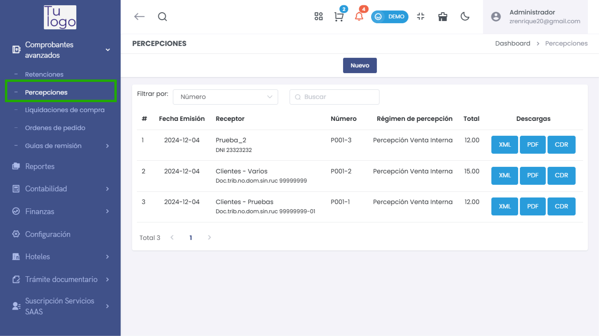
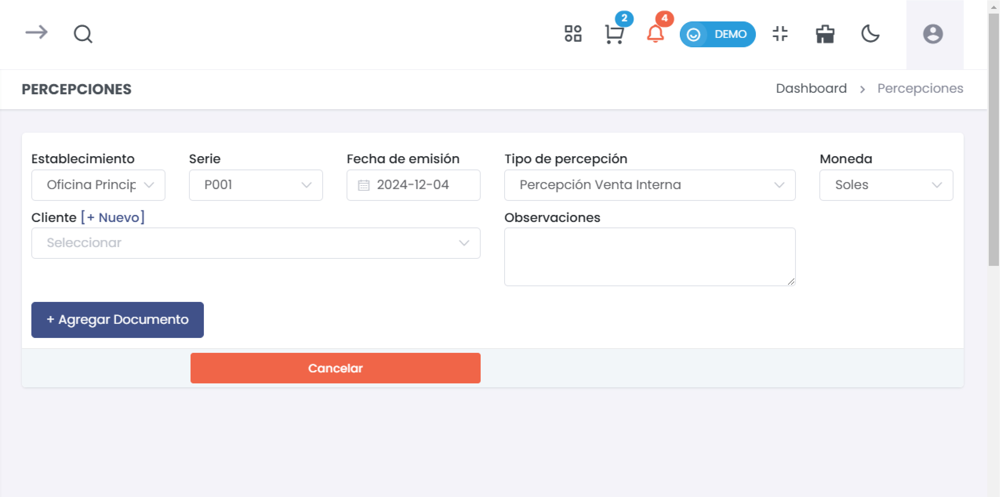
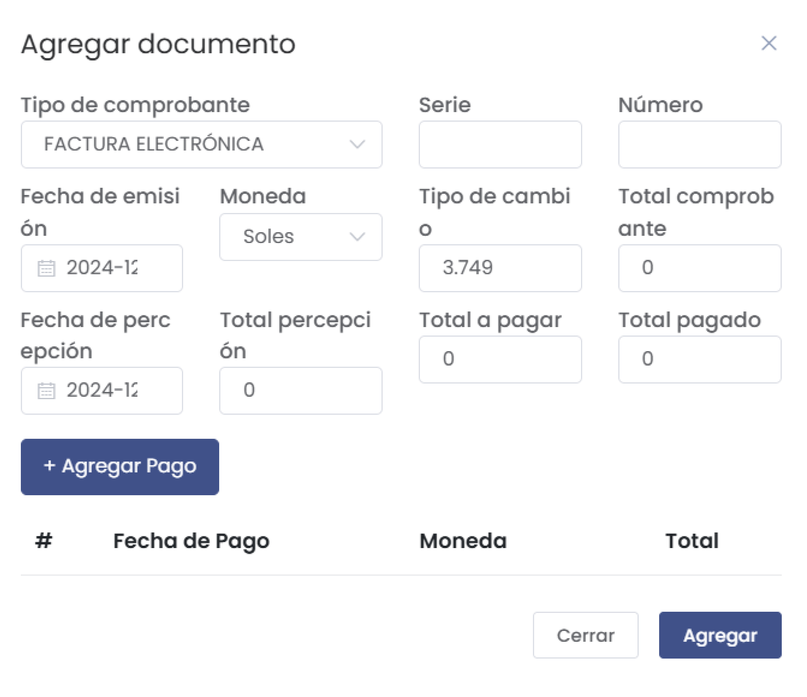
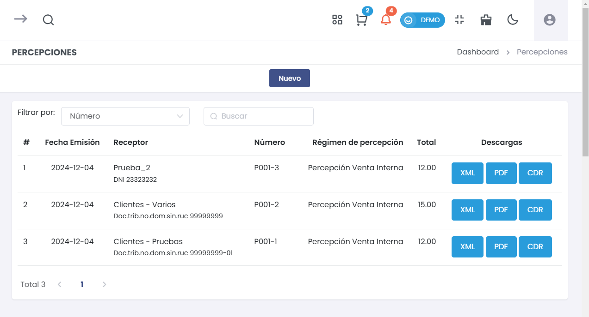

# Percepciones 

Esta guía abarca cómo agregar documentos de percepciones y gestionar la información relacionada en el módulo de **Comprobantes Avanzados**.  

---

## 1. Agregar un Documento de Percepción  

Para agregar un nuevo documento de percepción, sigue estos pasos:  

### Paso 1: Acceder a la Opción de Percepciones  

1. Desde el menú principal, selecciona **Comprobantes Avanzados**.
2. Luego, haz clic en la opción **Percepciones** para acceder al módulo de gestión de percepciones.

     

### Paso 2: Completar el Formulario de Percepción  

1. Haz clic en el botón **Nuevo**.  
2. Se abrirá un formulario en el cual deberás completar la siguiente información:

   - **Establecimiento**: Selecciona el establecimiento desde el cual se emite la percepción.  
   - **Serie**: Indica la serie del comprobante de percepción.  
   - **Fecha de emisión**: Selecciona la fecha de emisión del documento.  
   - **Cliente**: Puedes seleccionar un cliente existente o hacer clic en **+ Nuevo** para agregar uno nuevo.  
   - **Tipo de percepción**: Selecciona el tipo de percepción a aplicar (por ejemplo, **Percepción Venta Interna**).  
   - **Moneda**: Selecciona la moneda en la que se está realizando la percepción.  
   - **Observaciones**: Agrega cualquier comentario o nota relevante sobre la percepción.  

     

:::danger IMPORTANTE
 Todos los campos del formulario de percepción son **obligatorios**. Asegúrate de completar cada uno de ellos antes de proceder. 
  
:::

### Paso 3: Agregar Documento  

1. Se abrirá un formulario en el cual deberás completar la siguiente información:  

    

 ### Campos del Formulario  

- **Tipo de comprobante**: Selecciona el tipo de comprobante (e.g., FACTURA ELECTRÓNICA).  

- **Serie**: Ingresa la serie del comprobante.  

- **Número**:Proporciona el número del comprobante.  

- **Fecha de emisión**: Selecciona la fecha en la que se emite el comprobante.   

- **Moneda**: Selecciona la moneda (e.g., Soles).  

- **Tipo de cambio**: Introduce la tasa de cambio aplicable.  

- **Fecha de retención**: Selecciona la fecha en la que se retiene el impuesto.  

- **Total retención**: Ingresa el monto total de la retención.  

- **Total a pagar**: Especifica el total a pagar por el comprobante.  

- **Total comprobante**: Indica el total del comprobante.  

- **Total pagado**: Muestra el monto total que ha sido pagado hasta el momento.  

2. Haz clic en el botón **Agregar** y por ultimo en **Generar** para guardar la percepción en el sistema.  

---

## 2. Listar Percepciones Existentes  

Una vez que hayas agregado un documento de percepción, podrás ver una lista de todas las percepciones registradas. La tabla mostrará la siguiente información para cada documento:

- **#**: Número de referencia del documento.  
- **Fecha Emisión**: La fecha en que se emitió la percepción.  
- **Receptor**: El nombre del cliente o receptor.  
- **Número**: El número del comprobante de percepción.  
- **Régimen de Percepción**: El tipo de régimen bajo el cual se aplica la percepción (e.g., Venta Interna).  
- **Total**: El monto total de la percepción.  
- **Descargas**: Opciones para descargar el documento en formatos **XML**, **PDF** y **CDR**.  

     

### Paso 4: Filtrar Percepciones  

Puedes filtrar la lista de percepciones por **número** para encontrar documentos específicos rápidamente. Simplemente ingresa el número del comprobante en el campo de filtro.

---

