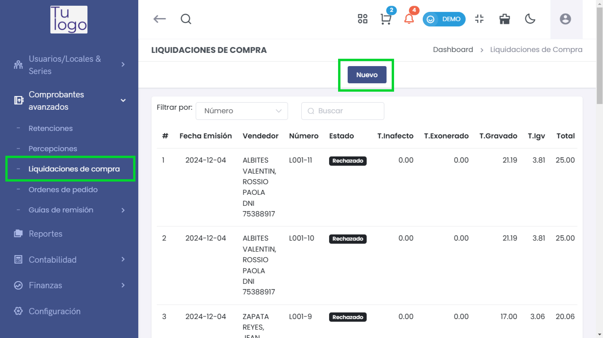
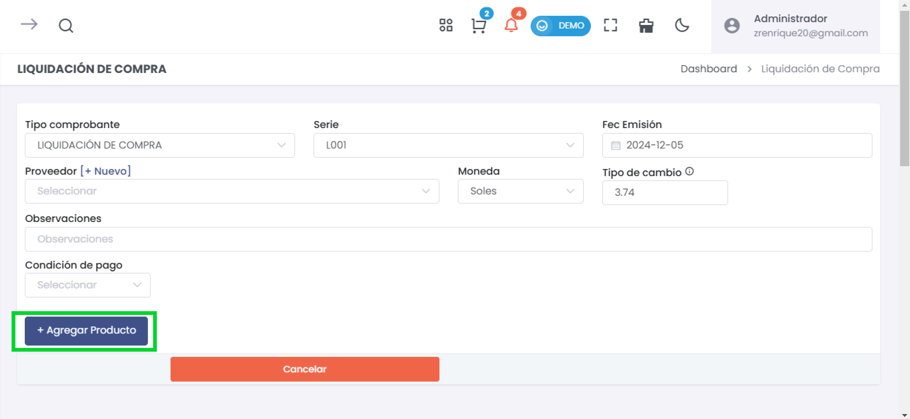
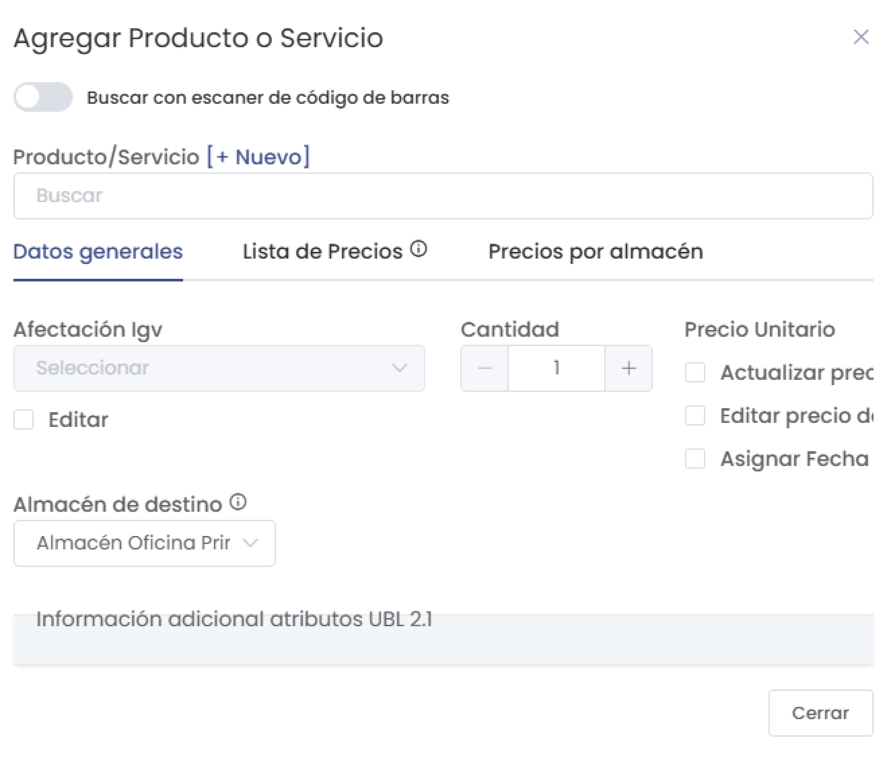
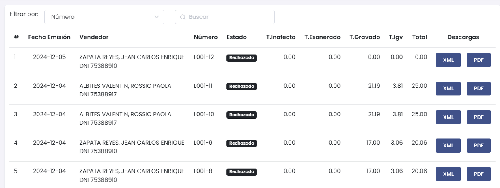

# Liquidaciones de Compra  

Las liquidaciones de compra son documentos esenciales que respaldan las operaciones comerciales y deben ser emitidas por el proveedor de bienes o servicios. Estos registros son de suma importancia en el contexto de las transacciones comerciales y tributarias. En este artículo, te guiaremos a través de los pasos necesarios para crear y gestionar adecuadamente documentos de liquidaciones de compra, asegurando un cumplimiento óptimo de las regulaciones tributarias. Sigue estos pasos para llevar a cabo este proceso de manera efectiva:  

1. Ingresa al **módulo Comprobantes avanzados** y selecciona la subcategoría **Liquidaciones de Compra**. Luego, selecciona el botón **Nuevo**.  

     

2. Completa los siguientes datos:  

     

   - **Tipo comprobante:** Selecciona el establecimiento desde el cual se está realizando el documento de liquidación de compras.  
   - **Proveedor:** Selecciona el proveedor a quien le realizarás el documento de detracción. Si aún no está creado, puedes crearlo siguiendo este **[artículo](https://fastura.github.io/documentacion/Pro-X/Compras/Proveedores/Listado)**.  
   - **Observaciones:** Ingresa cualquier anotación relevante.  
   - **Condición de pago:** Establece la forma de pago aplicable.  
   - **Agregar Producto:**  

     

   - **Producto/Servicio:** Inserta el producto o servicio. Si aún no lo has creado, selecciona **+Nuevo** y sigue este **[artículo](https://fastura.github.io/documentacion/Pro-X/Productos-Servicios/Lista%20de%20Productos)**.  
   - **Cantidad:** Inserta la cantidad del producto.  
   - **Almacén de destino:** Selecciona el almacén donde se destinará el producto.  

3. Seguido, selecciona el botón **Agregar** y después **Generar**.  

4. Una vez completados todos los datos, podrás ver el resumen de tus liquidaciones en la sección correspondiente.  

     

---  

:::danger IMPORTANTE:
Todos los comprobantes emitidos seran enviados a Sunat
:::