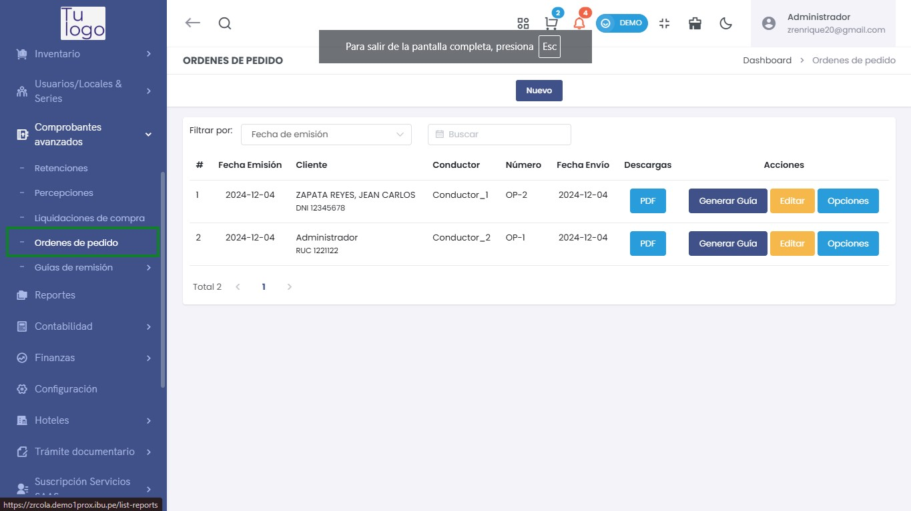
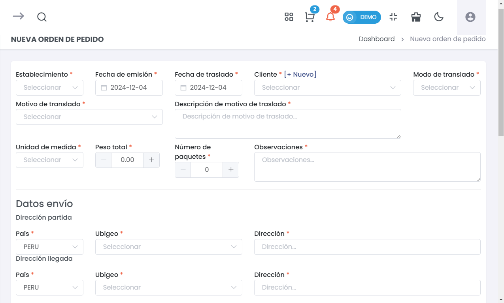
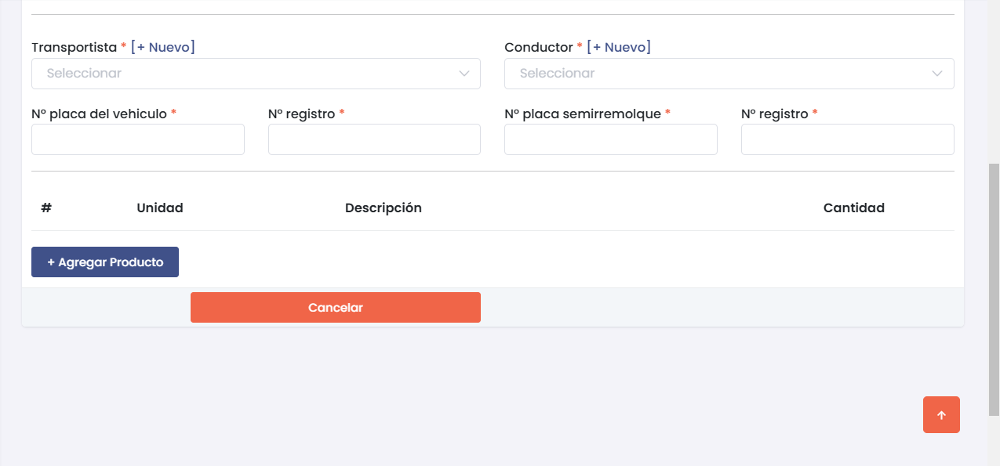
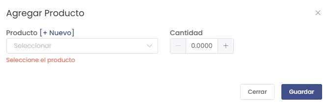
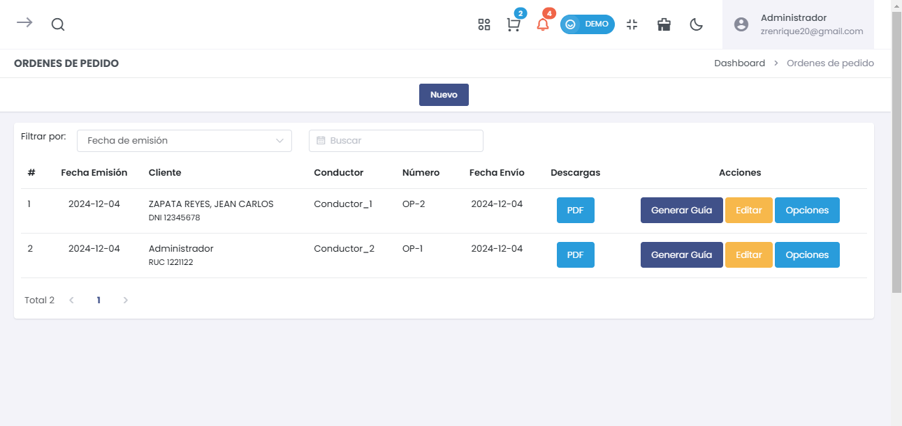
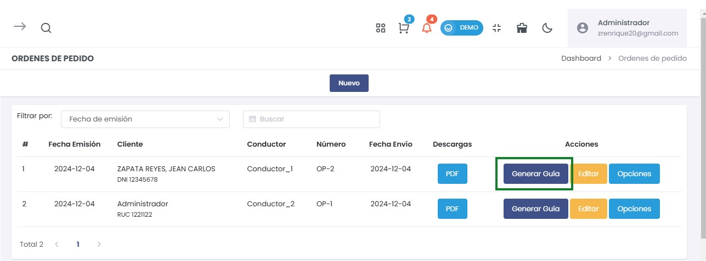

# Órdenes de Pedido 

Esta guía te permitirá agregar y gestionar órdenes de pedido, así como generar guías de remisión desde estas órdenes.  

## 1. Agregar una Nueva Orden de Pedido  

### Paso 1: Acceder a la Opción de Órdenes de Pedido  

Desde el menú de **Comprobantes Avanzados**, selecciona **Órdenes de Pedido**.  

  

### Paso 2: Crear Nueva Orden de Pedido  

Haz clic en el botón **Nuevo** para abrir el formulario de registro de una nueva orden de pedido.  

  

### Paso 3: Completar el Formulario  

1. Se abrirá un formulario donde deberás completar la siguiente información:  

   - **Establecimiento**: Selecciona el establecimiento correspondiente.  
   - **Fecha de emisión**: Establece la fecha de la orden.  
   - **Fecha de traslado**: Ingresa la fecha en que se realizará el traslado.  
   - **Motivo de traslado**: Selecciona el motivo del traslado.  
   - **Cliente**: Selecciona o agrega un nuevo cliente.  
   - **Descripción de motivo de traslado**: Proporciona una breve descripción del motivo.  
   - **Unidad de medida**: Selecciona la unidad de medida pertinente.  
   - **Peso total**: Ingresa el peso total de la carga.  
   - **Número de paquetes**: Ingresa la cantidad de paquetes.  
   - **Observaciones**: Incluye cualquier observación relevante.  

### Datos de Envío  

Esta sección detalla la información necesaria para el envío de la orden.  

- **Dirección partida**: Información sobre el lugar de origen del envío.  
  - **País**: Selecciona el país de origen (ej. PERÚ).  
  - **Ubigeo**: Selecciona el código ubigeo correspondiente.  
  - **Dirección**: Proporciona la dirección completa de partida.  

- **Dirección llegada**: Información sobre el destino del envío.  
  - **País**: Selecciona el país de destino (ej. PERÚ).  
  - **Ubigeo**: Selecciona el código ubigeo correspondiente al destino.  
  - **Dirección**: Proporciona la dirección completa de llegada.  

Esta sección capta la información necesaria para el envío de la orden.  

  

- **Transportista**:   
  - Selecciona el transportista de la lista ofrecida o usa la opción **[+ Nuevo]** para agregar uno nuevo.  
  
- **Conductor**:   
  - Selecciona el conductor de la lista o utiliza la opción **[+ Nuevo]** para registrar uno nuevo.  

- **Nº placa del vehículo**:   
  - Ingresa el número de placa correspondiente al vehículo que realizará el transporte. *(Campo obligatorio)*  

- **Nº registro**:   
  - Proporciona el número de registro del vehículo. *(Campo obligatorio)*  

- **Nº placa semirremolque**:   
  - Especifica el número de placa del semirremolque, si es aplicable. *(Campo obligatorio)*  

- **Nº registro**:   
  - Ingresa el número de registro del semirremolque. *(Campo obligatorio)*  

### Productos a Transportar  

- Puedes agregar los productos que se transportarán en la orden.  
- Haz clic en **+ Agregar Producto** para incluir más artículos.  

### Botones de Acción  

- **Cancelar**: Cancela la operación de creación de la orden de pedido.  

### Advertencia  

**¡Atención!** Todos los campos son **obligatorios**. Asegúrate de completar cada uno de ellos antes de proceder.  

### Paso 4: Agregar Productos  

Después de completar la información de la orden y los datos de envío, puedes añadir productos a la misma. Haz clic en **Agregar Producto**.  

  

- **Producto**: Selecciona el producto deseado.  
- **Cantidad**: Ingresa la cantidad del producto.  

### Paso 5: Guardar la Orden de Pedido  

Revisa la información ingresada y haz clic en el botón **Guardar** para registrar la nueva orden de pedido.  

## 2. Listar Órdenes de Pedido Existentes  

Después de agregar una orden de pedido, podrás ver una lista de todas las órdenes registradas.  

  

### Información de la Tabla de Órdenes de Pedido  

La tabla mostrará la siguiente información:  

- **#**: Número de referencia.  
- **Fecha Emisión**: La fecha en que se emitió la orden.  
- **Cliente**: Nombre del cliente asociado.  
- **Conductor**: Nombre del conductor asignado.  
- **Número**: Número de la orden de pedido.  
- **Fecha Envío**: Fecha programada para el envío.  
- **Descargas**: Opciones para descargar el documento en formato PDF.  
- **Acciones**: Opciones para generar guía de remisión, editar o ver más opciones.  

### Paso 6: Generar Guía de Remisión  

Desde la tabla de órdenes de pedido, selecciona la opción **Generar Guía** al lado de la orden correspondiente.  

  

Esto abrirá el formulario necesario para completar la guía de remisión asociada a la orden de pedido.  

