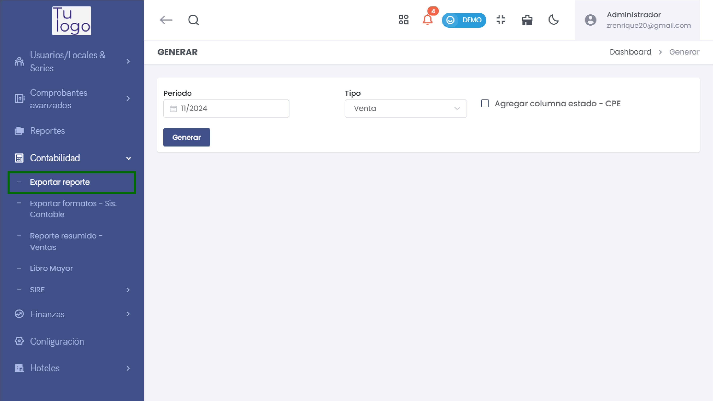
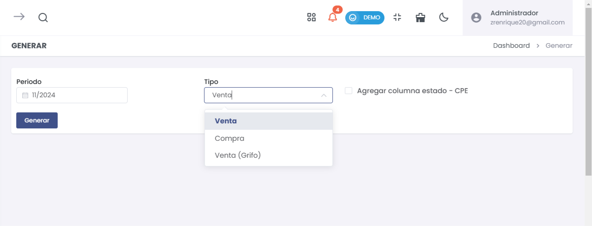

# Exportar Reporte 

En esta sección, aprenderás a exportar reportes desde el módulo de contabilidad en el sistema. Este proceso te permitirá generar informes financieros relevantes según el periodo y tipo de transacción deseado.  

### 1. Acceder al Módulo de Contabilidad  

Para comenzar, dirígete al menú principal y selecciona la opción **Contabilidad**. Dentro de esta sección, encontrarás varias opciones relacionadas con la gestión contable y financiera.  

### 2. Exportar Reporte  

1. **Seleccionar la Opción de Exportar Reporte**  

   En el menú de contabilidad, haz clic en **Exportar reporte**. Esto te llevará a la pantalla donde podrás generar y exportar los reportes deseados.  

  

2. **Definir el Periodo del Reporte**  

   - **Periodo**: Selecciona el periodo para el cual deseas generar el reporte. Utiliza el campo de fecha para ingresar el mes y año deseado (por ejemplo, **11/2024** para noviembre de 2024).  
   - Asegúrate de que el formato sea correcto antes de continuar.  

3. **Seleccionar el Tipo de Reporte**  

   - **Tipo**: En este menú desplegable, selecciona el tipo de reporte que deseas generar. Las opciones incluyen:  
     - **Venta**: Para exportar reportes de las ventas realizadas.  
     - **Compra**: Para reportar las compras realizadas.  
     - **Venta (Grifo)**: Específico para reportar transacciones realizadas en estaciones de servicio si aplica.  

     

4. **Agregar Columna de Estado (Opcional)**  

   - **Agregar columna estado - CPE**: Si necesitas incluir el estado de los comprobantes de pago electrónicos (CPE) en el reporte, marca esta opción. Esto puede ayudarte a tener un mejor seguimiento de los estados de los documentos emitidos.  

5. **Generar el Reporte**  

   - Haz clic en el botón **Generar** para producir el reporte según los criterios definidos.  
   - El sistema comenzará a procesar la información y generará el reporte correspondiente.  

6. **Descargar el Reporte**  

   - Una vez generado, el sistema te mostrará el reporte en un formato descargable (como CSV o PDF).  
   - Puedes hacer clic en el enlace de descarga o en el botón correspondiente para guardar el reporte en tu dispositivo.  

