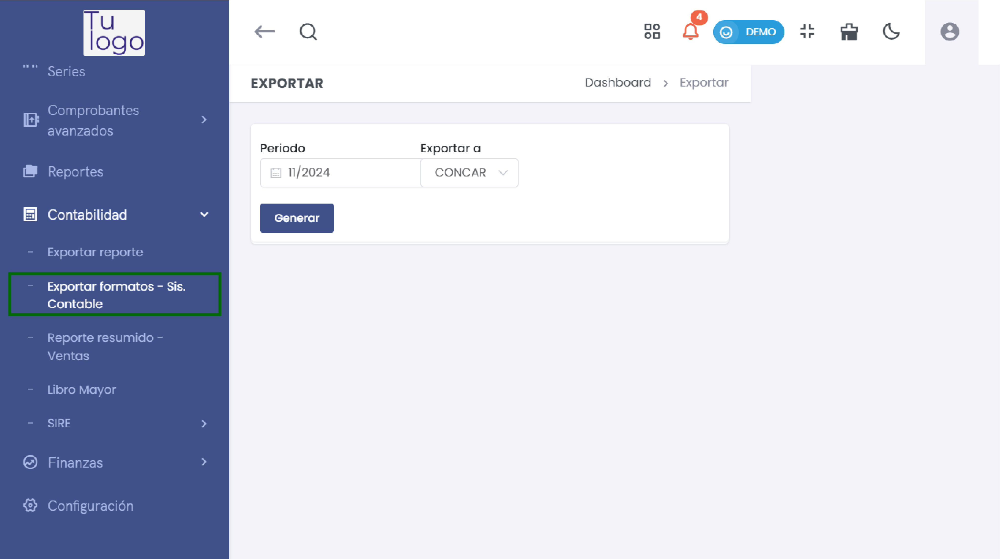
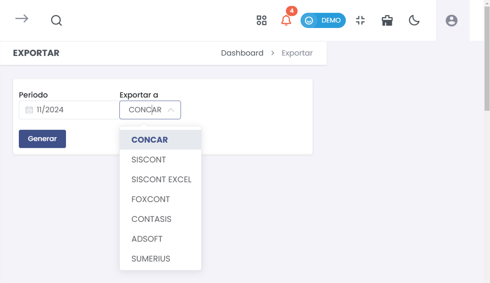

# Exportar Formato - Sis 
En esta guía, aprenderás a exportar reportes desde el módulo de contabilidad, lo que te permitirá obtener información financiera útil en diferentes formatos.  

### 1. Acceder al Módulo de Contabilidad  

Para iniciar el proceso, dirígete al menú principal y selecciona **Contabilidad**. Esta sección contiene herramientas para gestionar y analizar la información financiera.  

### 2. Exportar Reporte  

1. **Seleccionar la Opción de Exportar**  

   En el menú de contabilidad, elige  **Exportar formatos - Sis. Contable** .  

  

2. **Definir el Periodo del Reporte**  

   - **Periodo**: Introduce el mes y año para el reporte que deseas generar en el campo designado (por ejemplo, **11/2024** para noviembre de 2024).  

3. **Seleccionar el Formato de Exportación**  

   - **Exportar a**: Haz clic en el campo que dice **CONCAR** y se desplegará una lista de opciones de formatos disponibles para exportar. Las opciones incluyen:  
     - **SISCONT**  
     - **SISCONT EXCEL**  
     - **FOXCONT**  
     - **CONTASIS**  
     - **ADSOFT**  
     - **SUMERIUS**  

   Selecciona el formato adecuado según tus necesidades.  

     

4. **Generar el Reporte**  

   - Una vez que hayas seleccionado el periodo y el formato de exportación, haz clic en el botón **Generar**. El sistema comenzará a procesar la información solicitada.  

5. **Descargar el Reporte**  

   - Tras generarse el reporte, el sistema te ofrecerá un enlace o un botón para descargarlo en el formato seleccionado. Haz clic para guardar el archivo en tu dispositivo.  
