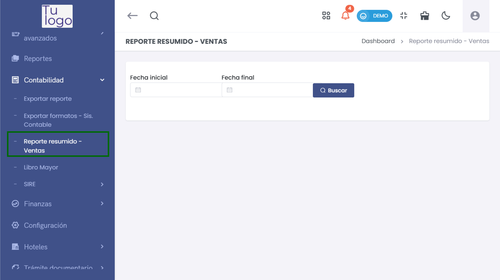
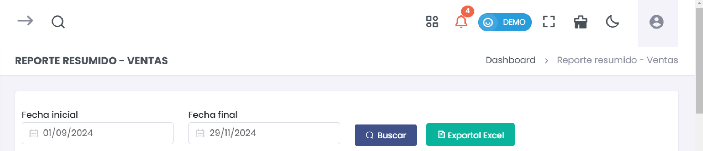
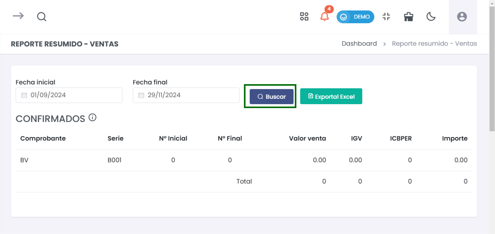
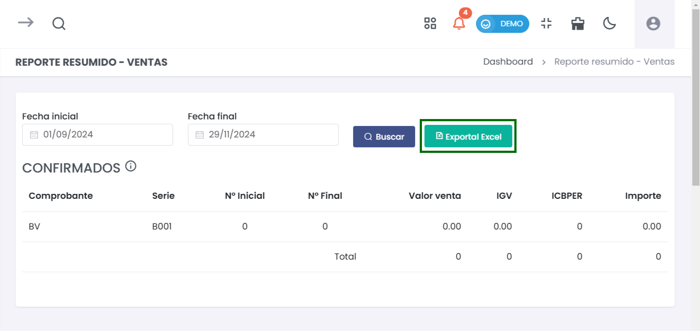

#  Reporte Resumido de Ventas  

Esta guía te permitirá generar un reporte resumido de ventas y exportarlo en formato Excel, facilitando la revisión y análisis de la información financiera.  

### 1. Acceder al Módulo de Reportes  

Para comenzar, dirígete a la sección de **Contabilidad** en el menú principal y selecciona **Reporte resumido - Ventas**.  

  

### 2. Definir Fechas para el Reporte  

1. **Seleccionar Fechas**  
   - Introduce la **Fecha inicial** y la **Fecha final** del periodo que deseas analizar.  

     

### 3. Buscar Reporte  

2. **Buscar Reporte**  
   - Haz clic en el botón **Buscar** después de ingresar las fechas. Esto generará un resumen de las ventas confirmadas en el periodo seleccionado.  

  

### 4. Interpretar el Reporte  

El reporte incluirá las siguientes columnas:  

- **Comprobante**: Tipo de comprobante (Ej. BV).  
- **Serie**: La serie del comprobante (Ej. B001).  
- **Nº Inicial**: El número de comprobante inicial.  
- **Nº Final**: El número de comprobante final.  
- **Valor venta**: El total de ventas antes de impuestos.  
- **IGV**: Impuesto General a las Ventas.  
- **ICBPER**: Impuesto a las transacciones.  
- **Importe**: Total a pagar que incluye impuestos.  

### 5. Exportar el Reporte  

Para exportar el reporte a Excel:  

1. **Haz clic en el botón **Exportar Excel** que encontrarás en la parte superior del resumen.  

  

2. Esto descargará un archivo en formato Excel que podrás abrir y editar para realizar un análisis más detallado de las ventas registradas.  

