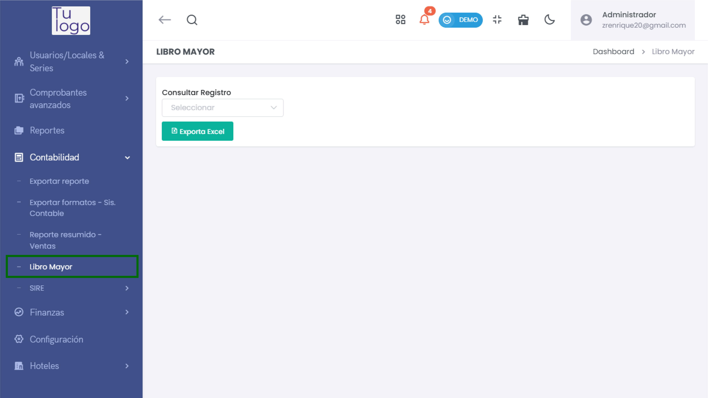
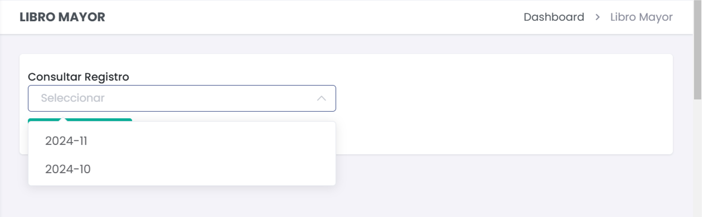
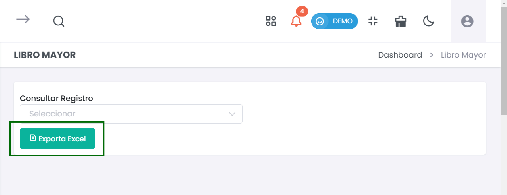

# Libro Mayor  

El **Libro Mayor** es una herramienta fundamental en la contabilidad, que te permite verificar y gestionar las transacciones financieras registradas en el sistema. Esta guía te enseñará cómo consultar los registros y exportar los datos en formato Excel.  

### 1. Acceder al Módulo de Libro Mayor  

Para comenzar, dirígete al menú lateral y selecciona **Contabilidad**. Luego, elige **Libro Mayor** para acceder a la sección correspondiente.  

  

### 2. Consultar Registros  

1. **Seleccionar el Registro**  

   - En la sección **Consultar Registro**, encontrarás un menú desplegable. Haz clic en este menú para ver las opciones de registros disponibles.  
   - Selecciona el mes y año que deseas consultar. Por ejemplo, puedes elegir **2024-11** o **2024-10**.  

     

2. **Ver los Detalles del Registro**  

   - Una vez seleccionado, el sistema mostrará todas las transacciones correspondientes al periodo indicado. Asegúrate de revisar la información con detalle.  

### 3. Exportar el Libro Mayor  

1. **Exportar a Excel**  

   - Después de consultar los registros, si deseas exportar la información, haz clic en el botón **Exporta Excel** que aparece en la interfaz.  
   
     

2. **Descargar el Archivo**  

   - Al hacer clic en este botón, el sistema generará un archivo Excel con los registros seleccionados. Descarga el archivo a tu dispositivo para realizar un análisis más detallado o para su almacenamiento.  

