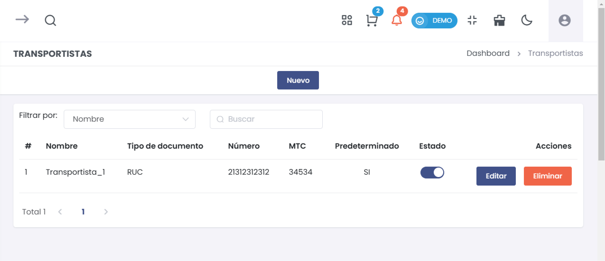

# Transportistas

Esta guía te permitirá agregar y gestionar transportistas en el módulo de Comprobantes Avanzados, específicamente en la sección de Guías de Remisión.  

## 1. Agregar un Nuevo Transportista  

### Paso 1: Acceder a la Opción de Transportistas  

Desde el menú de **Comprobantes Avanzados**, selecciona **Guías de Remisión** y luego accede a la opción **Transportistas**.  

  

### Paso 2: Agregar Nuevo Transportista  

Haz clic en el botón **Nuevo** para abrir el formulario de registro de un nuevo transportista.  

  

### Paso 3: Completar el Formulario  

1. Se abrirá un formulario en el cual deberás completar la siguiente información:  

   - **Tipo Doc. Identidad**: Selecciona el tipo de documento (ej. RUC).  
   - **Número**: Ingresa el número de identificación (hasta 11 dígitos).  
   - **Nombre**: Escribe el nombre del transportista.  
   - **Dirección fiscal**: Completa la dirección fiscal del transportista.  
   - **MTC**: Ingresa el número del MTC.  
   - **Predeterminado**: Activa esta opción si deseas que este transportista sea el predeterminado.  

## Advertencia  

**¡Atención!** Todos los campos son **obligatorios**. Asegúrate de completar cada uno de ellos antes de proceder.  

### Paso 4: Guardar el Transportista  

Revisa la información ingresada y haz clic en el botón **Guardar** para registrar el nuevo transportista en el sistema.  

## 2. Listar Transportistas Existentes  

Después de agregar un transportista, podrás ver una lista de todos los transportistas registrados.  

  

### Información de la Tabla de Transportistas  

La tabla de transportistas mostrará la siguiente información:  

- **#**: Número de referencia.  
- **Nombre**: Nombre del transportista.  
- **Tipo de documento**: Tipo de documento de identidad.  
- **Número**: Número de identificación del transportista.  
- **MTC**: Número asignado por el MTC.  
- **Predeterminado**: Indica si el transportista es el predeterminado (Sí/No).  
- **Estado**: Estado actual del transportista.  
- **Acciones**: Opciones para editar o eliminar el transportista.  

### Paso 5: Filtrar Transportistas  

Puedes utilizar la opción de **Filtrar por** para buscar transportistas específicos por nombre o número de documento.  

