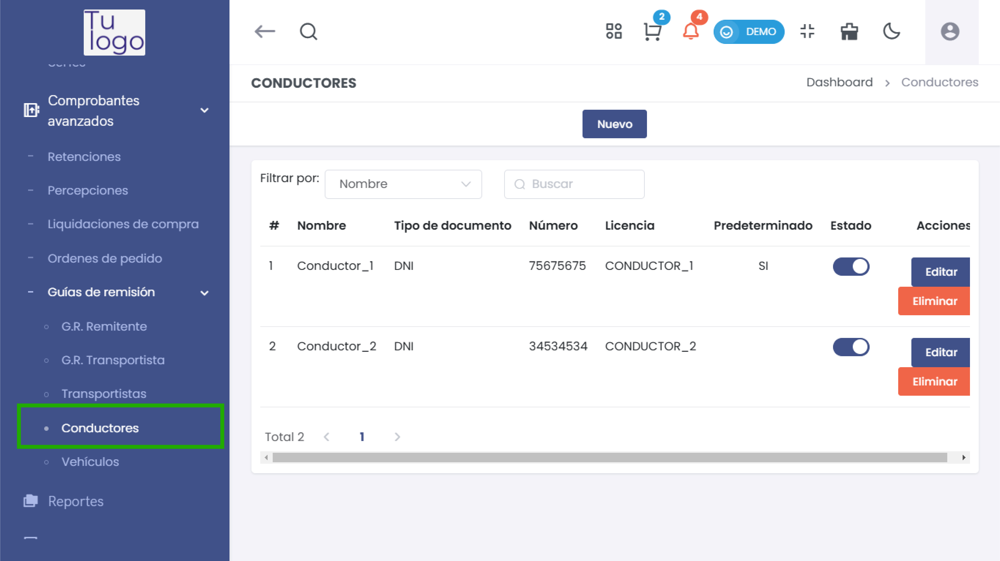
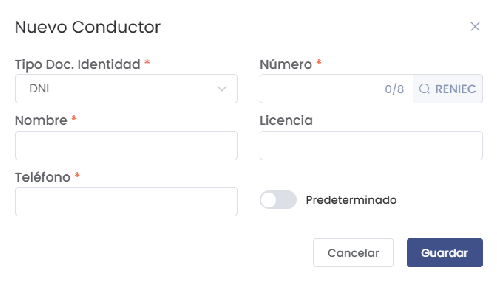
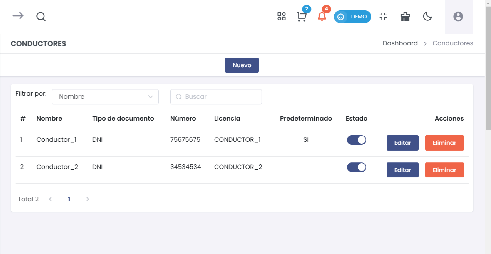

# Conductores   

Esta guía te permitirá agregar y gestionar conductores en el módulo de Comprobantes Avanzados, específicamente en la sección de Guías de Remisión.  

## 1. Agregar un Nuevo Conductor  

### Paso 1: Acceder a la Opción de Conductores  

Desde el menú de **Comprobantes Avanzados**, selecciona **Guías de Remisión** y luego accede a **Conductores**.  

  

### Paso 2: Agregar Nuevo Conductor  

Haz clic en el botón **Nuevo** para abrir el formulario de registro de un nuevo conductor.  

  

### Paso 3: Completar el Formulario  

1. Se abrirá un formulario donde deberás completar la siguiente información:  

   - **Tipo Doc. Identidad**: Selecciona el tipo de documento (ej. DNI).  
   - **Número**: Ingresa el número de identificación (hasta 8 dígitos).  
   - **Nombre**: Escribe el nombre del conductor.  
   - **Licencia**: Indica el número de la licencia de conducir.  
   - **Teléfono**: Ingresa el número de teléfono del conductor.  
   - **Predeterminado**: Activa esta opción si deseas que este conductor sea el predeterminado.  

## Advertencia  

**¡Atención!** Todos los campos son **obligatorios**. Asegúrate de completar cada uno de ellos antes de proceder.  

### Paso 4: Guardar el Conductor  

Revisa la información ingresada y haz clic en el botón **Guardar** para registrar el nuevo conductor en el sistema.  

## 2. Listar Conductores Existentes  

Después de agregar un conductor, podrás ver una lista de todos los conductores registrados.  

  

### Información de la Tabla de Conductores  

La tabla de conductores mostrará la siguiente información:  

- **#**: Número de referencia.  
- **Nombre**: Nombre del conductor.  
- **Tipo de documento**: Tipo de documento de identidad.  
- **Número**: Número de identificación del conductor.  
- **Licencia**: Número de licencia del conductor.  
- **Predeterminado**: Indica si el conductor es el predeterminado (Sí/No).  
- **Estado**: Estado actual del conductor.  
- **Acciones**: Opciones para editar o eliminar el conductor.  

### Paso 5: Filtrar Conductores  

Puedes utilizar la opción de **Filtrar por** para buscar conductores específicos por nombre o número de documento.  

