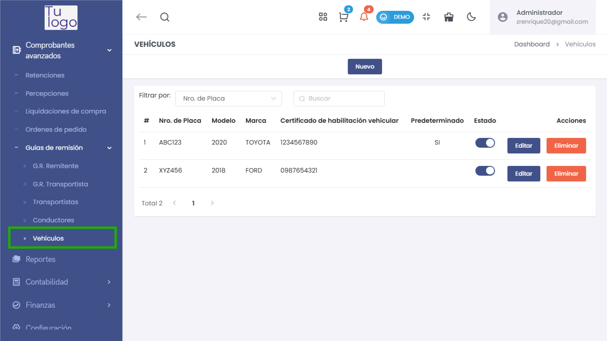
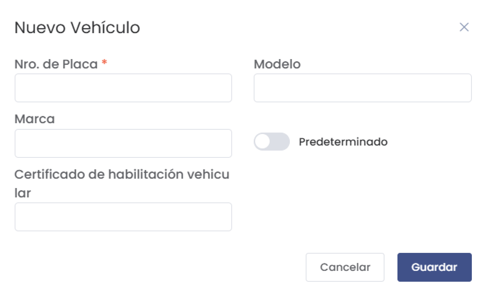
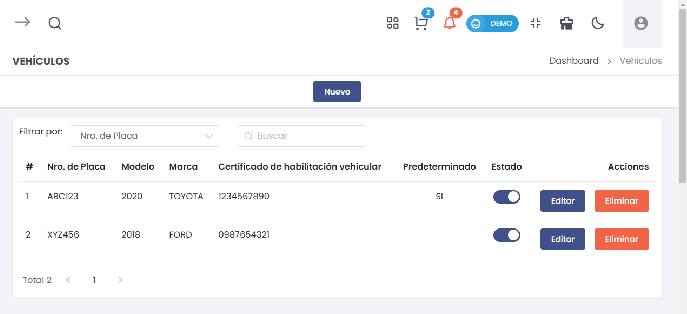

# Vehículos 

Esta guía te permitirá agregar y gestionar vehículos en el módulo de Comprobantes Avanzados, específicamente en la sección de Guías de Remisión.  

## 1. Agregar un Nuevo Vehículo  

### Paso 1: Acceder a la Opción de Vehículos  

Desde el menú de **Comprobantes Avanzados**, selecciona **Guías de Remisión** y luego accede a la opción **Vehículos**.  

  

### Paso 2: Agregar Nuevo Vehículo  

Haz clic en el botón **Nuevo** para abrir el formulario de registro de un nuevo vehículo.  

  

### Paso 3: Completar el Formulario  

1. Se abrirá un formulario donde deberás completar la siguiente información:  

   - **Nro. de Placa**: (Campo obligatorio) Ingresa el número de placa del vehículo.  
   - **Modelo**: Indica el modelo del vehículo.  
   - **Marca**: Especifica la marca del vehículo.  
   - **Certificado de habilitación vehicular**: Ingresa el número del certificado.  
   - **Predeterminado**: Activa esta opción si deseas que este vehículo sea el predeterminado.  

## Advertencia  

**¡Atención!** Todos los campos son **obligatorios**. Asegúrate de completar cada uno de ellos antes de proceder.  

### Paso 4: Guardar el Vehículo  

Revisa la información ingresada y haz clic en el botón **Guardar** para registrar el nuevo vehículo en el sistema.  

## 2. Listar Vehículos Existentes  

Después de agregar un vehículo, podrás ver una lista de todos los vehículos registrados.  

  

### Información de la Tabla de Vehículos  

La tabla de vehículos mostrará la siguiente información:  

- **#**: Número de referencia.  
- **Nro. de Placa**: Número de placa del vehículo.  
- **Modelo**: Modelo del vehículo.  
- **Marca**: Marca del vehículo.  
- **Certificado de habilitación vehicular**: Número del certificado.  
- **Predeterminado**: Indica si el vehículo es el predeterminado (Sí/No).  
- **Estado**: Estado actual del vehículo.  
- **Acciones**: Opciones para editar o eliminar el vehículo.  

### Paso 5: Filtrar Vehículos  

Puedes utilizar la opción de **Filtrar por** para buscar vehículos específicos usando el número de placa.  

