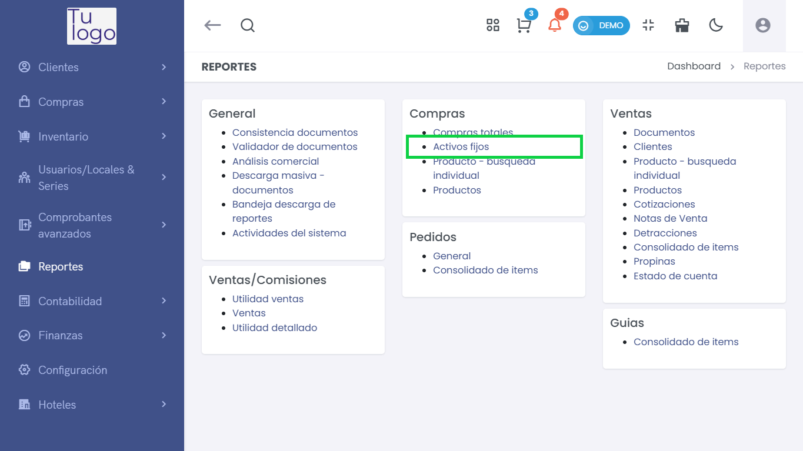
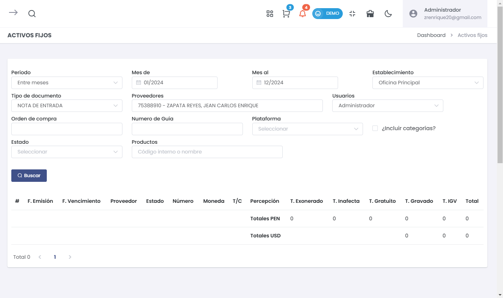
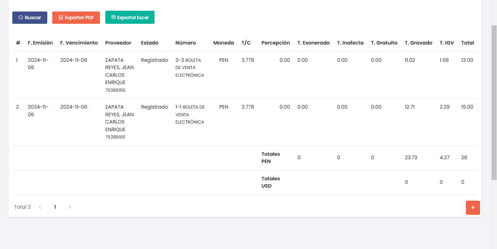

# Activos Fijos  

En este artículo te mostraremos cómo acceder y gestionar los reportes relacionados con los activos fijos en el sistema. Sigue estos pasos para realizarlo:  

1. Ingresa al módulo de **Reportes**, luego selecciona **Compras** y, finalmente, elige **Activos Fijos**.  

     

## Filtros de Búsqueda  

En esta sección, podrás aplicar varios filtros para personalizar tu búsqueda de activos fijos.  

- **Periodo**: Selecciona el rango de meses, entre meses, por fehcas , etc.   
- **Tipo de documento**: Especifica el tipo de documento (ej., Nota de Entrada).  
- **Proveedores**: Selecciona el proveedor correspondiente.  
- **Orden de compra**: Ingresa el número de orden si es aplicable.  
- **Número de Guía**: Puedes ingresar el número de guía si corresponde.  
- **Estado**: Selecciona el estado deseado.  
- **Productos**: Busca productos por código interno o nombre.  

Después de llenar los filtros, haz clic en el botón **Buscar**.  

     

## Resultados de la Búsqueda  

Una vez que realices la búsqueda, verás un resumen de los activos fijos con detalles importantes.  

     

### Detalles de la Tabla  

La tabla presentará la siguiente información:  

* **Totales PEN** y **Totales USD** resumirán los montos totales en las respectivas monedas al final de la tabla.   

Con estos pasos, podrás gestionar y revisar los reportes de activos fijos, facilitando el control de las compras realizadas en tu sistema.