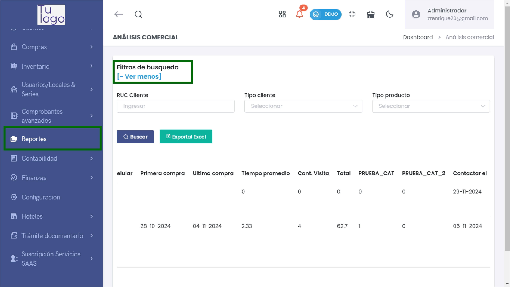

# Análisis Comercial 

En este artículo te mostramos cómo realizar un análisis comercial usando los filtros de búsqueda. Sigue estos pasos para acceder y utilizar la funcionalidad:  

1. Ingresa al módulo de **Reportes** y luego en la subcategoría **General**, selecciona  **Análisis Comercial** 

2. Aquí encontrarás la opción de aplicar **filtros de búsqueda**. Puedes ingresar el **RUC Cliente** y seleccionar el **Tipo de cliente** o el **Tipo de producto**.  

  

3. Para realizar la búsqueda, haz clic en el botón **Buscar**.  

4. También tienes la opción de **exportar los datos a Excel** usando el botón correspondiente.  

  

### Resultados  

Los resultados se mostrarán con la siguiente información:  

- **#**: Número de orden del registro.  
- **Cliente**: Nombre del cliente que realizó las compras.  
- **T. Doc - N° Doc**: Tipo de documento (como DNI o RUC) y su número correspondiente.  
- **Zona**: Ubicación geográfica del cliente.  
- **Celular**: Número de contacto del cliente.  
- **Primera compra**: Fecha en la que el cliente realizó su primera compra.  
- **Última compra**: Fecha de la más reciente compra realizada por el cliente.  
- **Tiempo promedio**: Tiempo promedio en días entre las compras del cliente.  
- **Cant. Visita**: Cantidad de visitas que ha realizado el cliente.  
- **Total**: Total acumulado de compras realizadas por el cliente.  
- **PRUEBA_CAT**: Valor relacionado a una categoría específica de prueba.  
- **PRUEBA_CAT_2**: Otro valor relacionado a una segunda categoría de prueba.  
- **Contactar el**: Indicador sobre si se debe contactar al cliente.  

Con esta funcionalidad, podrás gestionar y analizar la información de tus clientes de manera eficiente. Si requieres más detalles sobre algún aspecto, no dudes en preguntar.