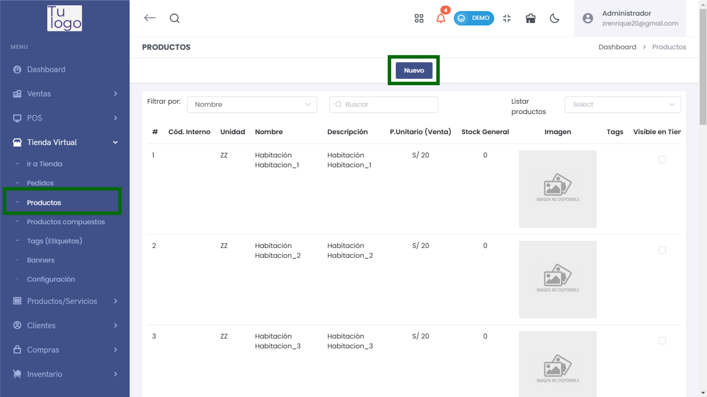
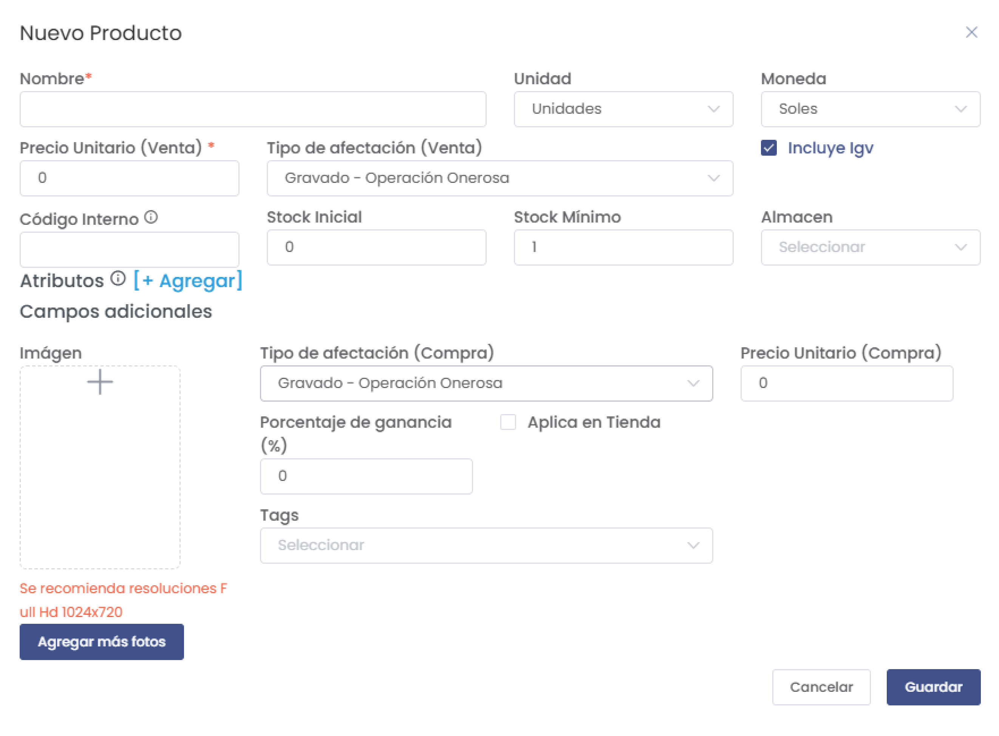
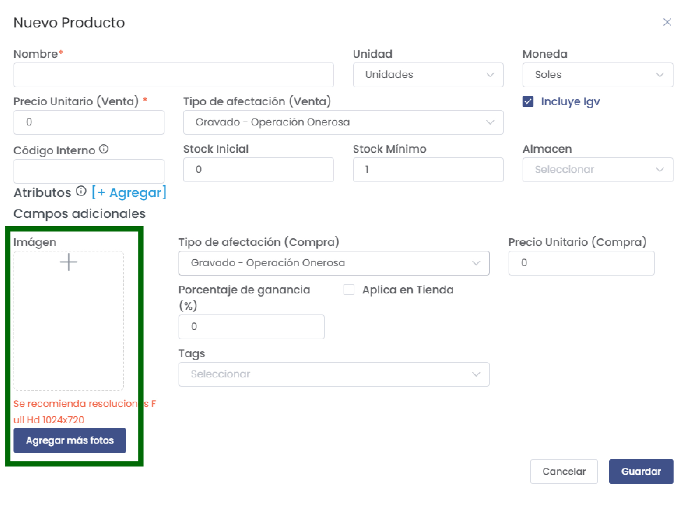
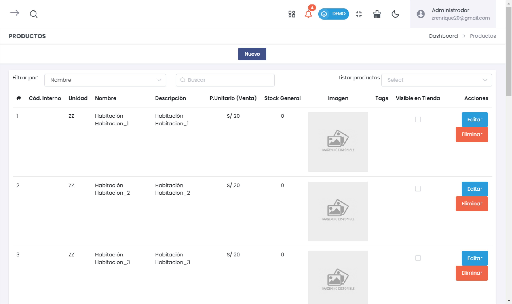

# Creación de Productos 

En esta guía te mostramos cómo crear un nuevo producto en la Tienda Virtual. Es importante seguir cada paso para asegurar que el producto esté correctamente configurado y visible en la tienda.  

## 1. Acceso al Módulo de Productos  

Para comenzar, ve al menú principal y selecciona **Tienda Virtual**, luego haz clic en **Productos** y selecciona el botón **Nuevo**.  

  

## 2. Nuevo Producto  

### Formulario de Creación  

Aperecerá un formulario donde deberás completar los siguientes campos. Recuerda que los campos marcados con * son obligatorios.  

  

- **Nombre***: Ingresa el nombre del producto.  
- **Unidad**: Selecciona la unidad de medida (ej. Unidades).  
- **Precio Unitario (Venta)*:** Indica el precio de venta del producto.  
- **Código Interno*:** Este campo es crucial para que el producto esté visible en la tienda. Debe ser ingreado correctamente.  

:::danger IMPORTANTE  
Los campos marcados con * son obligatorios.  
:::  

### Campos Adicionales  

- **Stock Inicial**: Indica la cantidad de producto disponible al inicio.  
- **Stock Mínimo**: Define el nivel mínimo de stock para hacer seguimiento.  
- **Almacén**: Selecciona el almacén donde se encuentra el producto.  
- **Tipo de afectación (Compra)**: Selecciona el tipo de afectación tributaria.  
- **Porcentaje de ganancia (%):** Indica el porcentaje de ganancia sobre el costo.  
- **Aplicar en Tienda**: Marca esta opción si deseas que el producto esté disponible para su venta.  
- **Tags**: Selecciona etiquetas que ayuden a organizar el producto.  

## 3. Imagen del Producto  

Agrega una imagen representativa del producto. Se recomienda una resolución de 1024x720 píxeles.  

  

## 4. Guardar Producto  

Después de llenar todos los campos requeridos, haz clic en el botón **Guardar** para registrar el nuevo producto.  

## 5. Listado de Productos  

Una vez guardado, podrás ver el producto en el listado de productos.  

  

:::danger IMPORTANTE  
Para que un producto esté visible en la tienda, debe tener un **Código Interno**.  
:::  

### Acciones Disponibles:  

- **Editar**: Cambia la información del producto.  
- **Eliminar**: Quita el producto de la lista (aparecerá un cuadro de confirmación).  

## 6. Conclusión  

La correcta creación de productos es esencial para el funcionamiento de tu tienda virtual. Asegúrate de completar todos los campos obligatorios y verificar que el **Código Interno** está presente para que el producto sea visible en la tienda.  

Si requieres más asistencia, consulta la documentación adicional o contacta al soporte técnico.