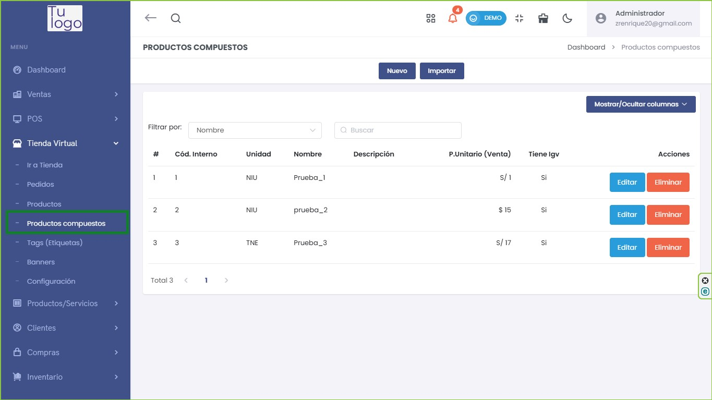
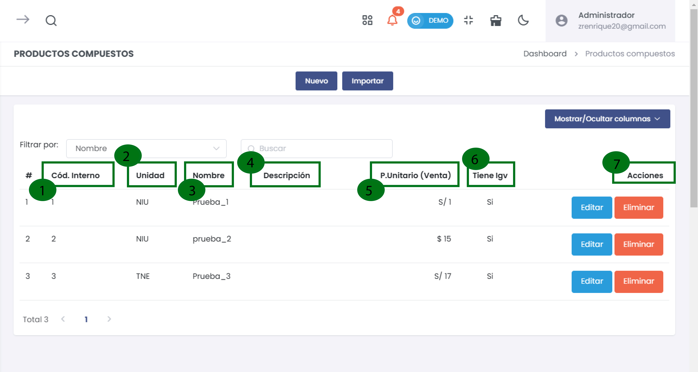
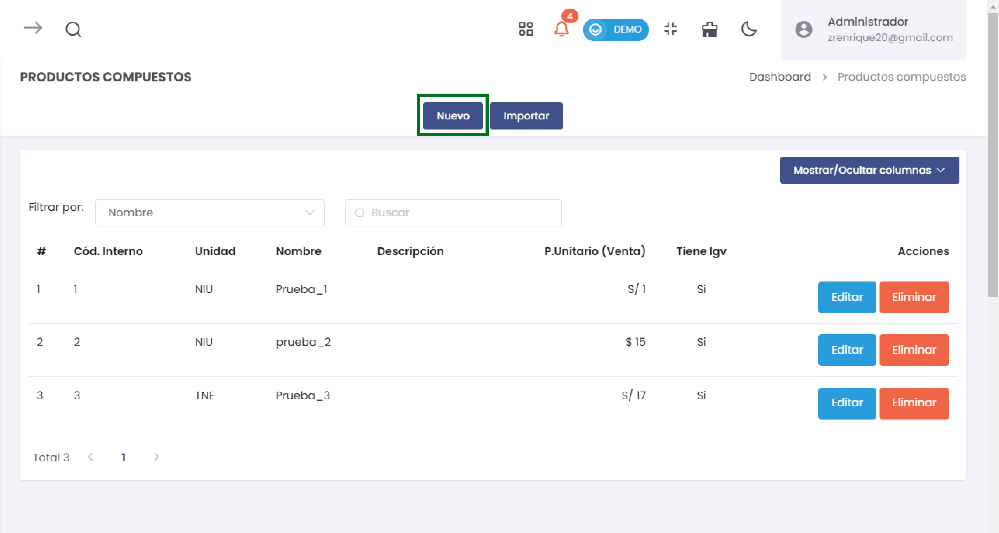
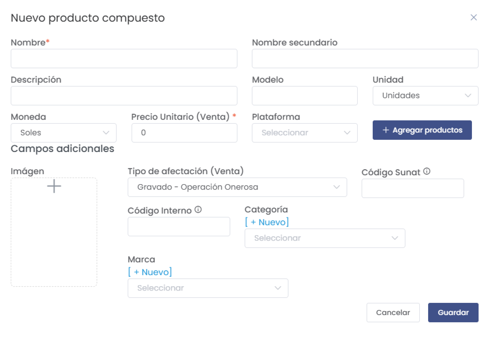
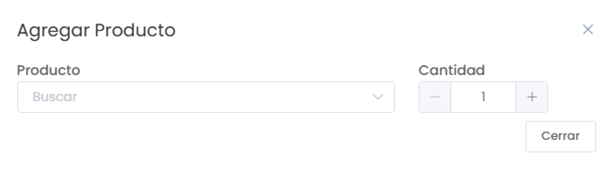
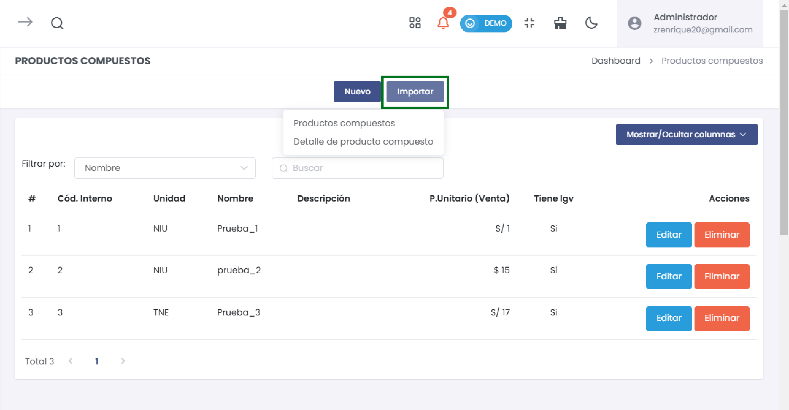

# Productos Compuestos 

Esta guía te proporcionará instrucciones detalladas sobre cómo crear y administrar productos compuestos en tu tienda virtual. Los productos compuestos te permiten agrupar varios productos en un solo artículo, facilitando la venta y promoción a tus clientes.  

## 1. Acceder a Productos Compuestos  

Para comenzar, sigue estos pasos:  

1. **Menú Principal**: Ve al menú de la izquierda en la interfaz de administración de la tienda.  
2. **Seleccionar Tienda Virtual**: Haz clic en **Tienda Virtual**.  
3. **Seleccionar Productos Compuestos**: En el submenú, elige **Productos Compuestos**.   

  

Esta acción te llevará a la sección donde puedes ver todos los productos compuestos existentes.  

## 2. Listar Productos Compuestos  

En esta sección, verás una tabla que muestra todos los productos compuestos que has creado. Los campos en la tabla incluyen:  

- **#**: Número de registro del producto.  
- **Código Interno**: Identificación interna del producto.  
- **Unidad**: Unidad de medida del producto.  
- **Nombre**: Nombre del producto compuesto.  
- **Descripción**: Breve descripción del producto.  
- **Precio Unitario (Venta)**: Precio al que se venderá el conjunto.  
- **Tiene IGV**: Indica si el producto tiene impuesto general a las ventas.  
- **Acciones**: Cada producto tiene botones para **Editar** o **Eliminar**:  
  - **Editar**: Modifica los detalles del producto.  
  - **Eliminar**: Elimina el producto de forma permanente (aparecerá un cuadro de confirmación antes de la eliminación). 

  

### Funcionalidades del Listado  

- **Filtrar por**: Puedes utilizar la barra de filtro para buscar productos por **Nombre**, o **Código Interno**.  
 

## 3. Crear un Nuevo Producto Compuesto  

Para añadir un nuevo producto compuesto, sigue estos pasos:  

1. **Hacer clic en "Nuevo"**: Este botón se encuentra en la parte superior derecha de la pantalla.  

  

### Formulario de Creación  

Tras hacer clic en "Nuevo", se abrirá un formulario que debes completar:  

- **Nombre***: (Campo obligatorio) Ingresa un nombre descriptivo para el producto compuesto. Este nombre debe ser claro para que los clientes lo identifiquen fácilmente.  
  
- **Descripción**: Proporciona una descripción detallada del producto. Esto ayudará a los clientes a entender qué incluye el conjunto.  

- **Moneda**: Selecciona la moneda en la que se realizará la transacción (Soles, Dólares, etc.).  

- **Precio Unitario (Venta)*:** (Campo obligatorio) Especifica el precio total del conjunto. Asegúrate de que este valor abarque todos los productos incluidos.  

- **Código Interno*:** (Campo obligatorio) Este código es esencial para que el producto sea visible en la tienda. Asegúrate de que sea único y fácil de recordar.  

- **Tipo de afectación (Venta)**: Selecciona el régimen tributario aplicable (por ejemplo, "Gravado - Operación Onerosa").  

#### Campos Adicionales  

- **Nombre secundario**: Es opcional; puede ser útil si deseas proporcionar un alias o un nombre alternativo.  
  
- **Modelo**: Indica el modelo del producto, si aplica.  

- **Unidad**: Selecciona la unidad de medida correspondiente (ej. Unidades, Kilogramos).  

- **Plataforma**: Elige la plataforma donde deseas que esté disponible el producto (por ejemplo, Saga Falabella, Mercado Libre, Linio).  

  

- **Imagen**: Subir una imagen representativa del producto. Se recomienda usar imágenes en alta resolución para mejorar la presentación.  

- **Código SUNAT**: Este campo se utiliza para identificar el producto ante la SUNAT si es necesario.   

- **Categoría**: Asigna una categoría al producto para facilitar su búsqueda. Puedes crear nuevas categorías si no existen previamente.  

- **Marca**: Selecciona la marca que representa al producto.  

### Agregar Productos al Conjunto  

1. **Hacer clic en "Agregar productos"**: Este botón está dispuesto en el formulario, lo que te permitirá añadir los productos que componen el conjunto.  

2. **Seleccionar productos**: Aparecerá un cuadro de búsqueda donde podrás buscar y seleccionar los productos individuales que deseas incluir en el conjunto.  

3. **Especificar la cantidad**: Para cada producto que agregues, debes indicar cuántas unidades de ese producto formarán parte del conjunto.  

  

## 4. Guardar Producto Compuesto  

Una vez que hayas completado todos los campos obligatorios y agregado los productos al conjunto, haz clic en el botón **Guardar** para registrar el nuevo producto compuesto.  
  

## 5. Visualizar Detalles del Producto Compuesto  

Después de guardar, serás redirigido de nuevo al listado de productos compuestos. Aquí podrás ver el nuevo producto reflejado en la lista.   

---

## Importar Productos Compuestos  

La opción de **Importar** te permite añadir múltiples productos compuestos a la tienda de manera eficiente. Este proceso es particularmente útil si tienes un catálogo extenso y deseas evitar la entrada manual de cada producto.  

### Cómo Utilizar el Botón Importar  

1. **Acceder a la Función**: En la sección de **Productos Compuestos**, localiza el botón **Importar** en la parte superior de la lista de productos.  

     

2. **Seleccionar el Tipo de Importación**: Al hacer clic en **Importar**, se desplegará un menú donde podrás seleccionar el tipo de archivos que deseas importar. Puedes elegir entre:  
   - **Productos Compuestos**: Para importar un conjunto de productos compuestos.  
   - **Detalle Productos Compuestos**: Para importar los detalles de productos específicos que componen los conjuntos.  

3. **Subir el Archivo**: Una vez que hayas seleccionado el tipo de importación, se abrirá un cuadro de diálogo que te permitirá cargar un archivo CSV o Excel previamente preparado con la información de los productos. Asegúrate de que el archivo tenga el formato correcto y contenga todos los campos requeridos como nombre, descripción, precio, y código interno.  

4. **Validación de Datos**: Después de cargar el archivo, el sistema verificará la información para asegurar que cumpla con los requisitos necesarios. Si hay errores, recibirás una notificación con detalles sobre qué campos necesitan corrección.  

5. **Confirmar Importación**: Una vez validado el archivo, sigue las instrucciones para confirmar la importación. El sistema automáticamente añadirá los productos a tu catálogo, y podrás verlos reflejados en la lista de productos compuestos.  

### Consideraciones Importantes  

- **Formato del Archivo**: Asegúrate de que el archivo siga el formato especificado por el sistema, que generalmente incluye encabezados para cada columna relevante, como nombre del producto, descripción, precio unitario, y código interno.  

- **Duplicados**: El sistema comprobará si ya existen productos con el mismo código interno para prevenir duplicaciones. Si encuentra un duplicado, te informará para que decidas si deseas actualizar la información o ignorar la importación de ese producto.  

- **Errores Comunes**: Algunas de las causas más comunes de errores durante la importación incluyen:  
  - Campos obligatorios no completados.  
  - Formatos de datos incorrectos (por ejemplo, precios como texto en lugar de números).  
  - Códigos internos duplicados.  

