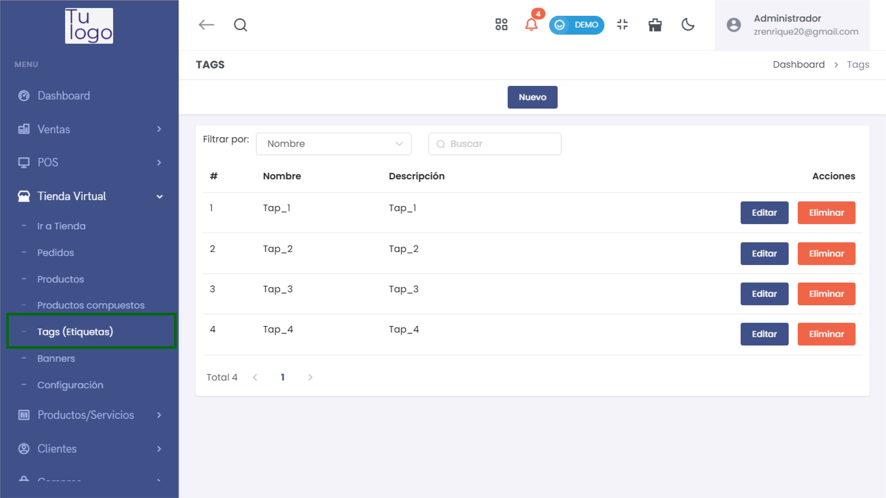
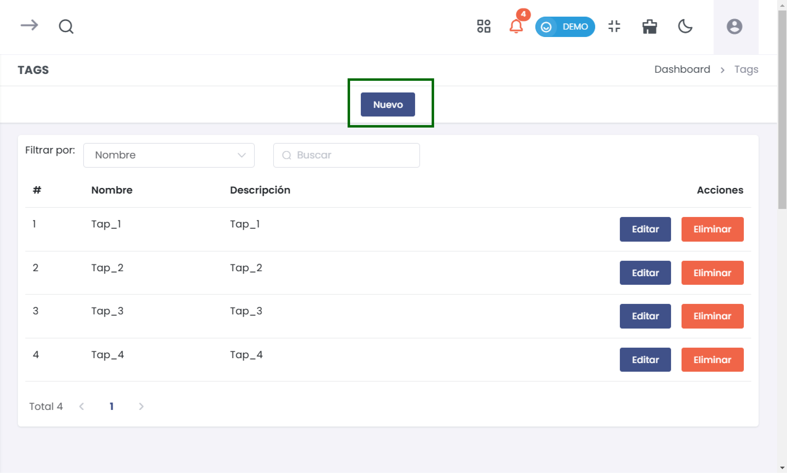
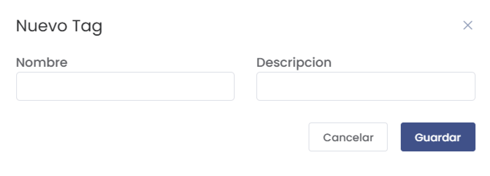
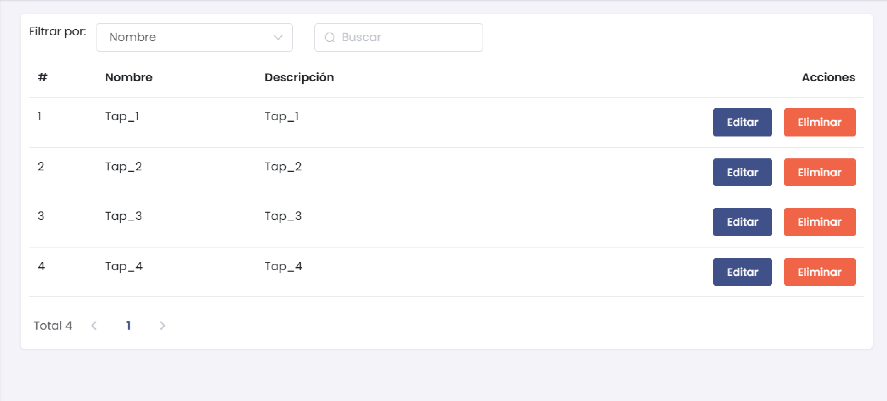
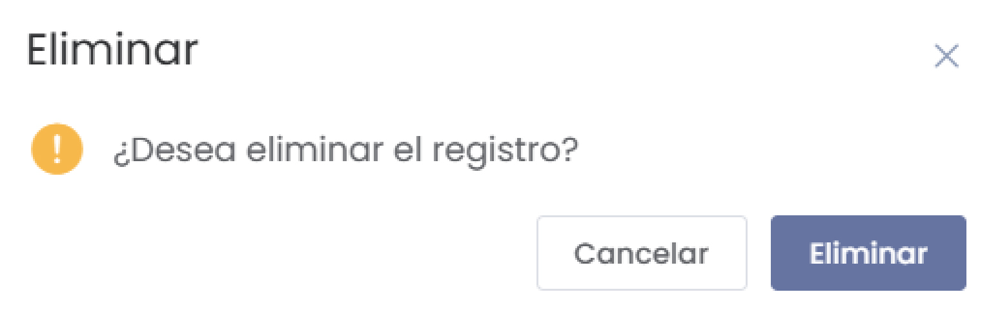

#  Tags  

En esta sección te enseñaremos cómo agregar, editar y eliminar tags (etiquetas) dentro del módulo de Tienda Virtual. Las etiquetas son útiles para organizar productos y mejorar la navegación en tu tienda.  

## 1. Acceso a la Sección de Tags  

Para comenzar, dirígete al menú principal y selecciona **Tienda Virtual**. Luego, selecciona **Tags (Etiquetas)**.  

  

## 2. Crear un Nuevo Tag  

### Nuevo Tag  

1. Haz clic en el botón **Nuevo** en la parte superior derecha de la página.  

  

2. Aparecerá un formulario donde deberás completar los siguientes campos:  
   - **Nombre:** Ingresa el nombre del tag.  
   - **Descripción:** Proporciona una breve descripción del tag.  

  

3. Al completar los campos, selecciona el botón **Guardar** para registrar el nuevo tag.  

## 3. Listado de Tags  

Una vez creado el tag, aparecerá en el listado junto a las etiquetas existentes.  

  

### Acciones en el Listado:  

- **Editar:** Puedes modificar los detalles del tag haciendo clic en el botón **Editar** correspondiente.  
- **Eliminar:** Para eliminar un tag, haz clic en el botón **Eliminar**. Confirmarás la acción en un cuadro de diálogo que te preguntará:  
  **¿Desea eliminar el registro?**  

  

Selecciona **Eliminar** para proceder o **Cancelar** si decides no eliminarlo.  

