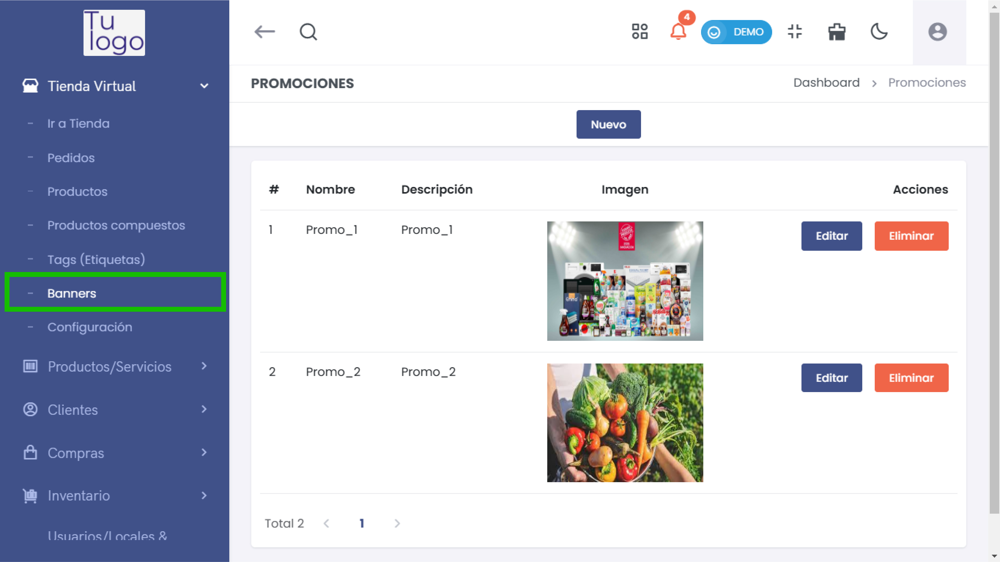
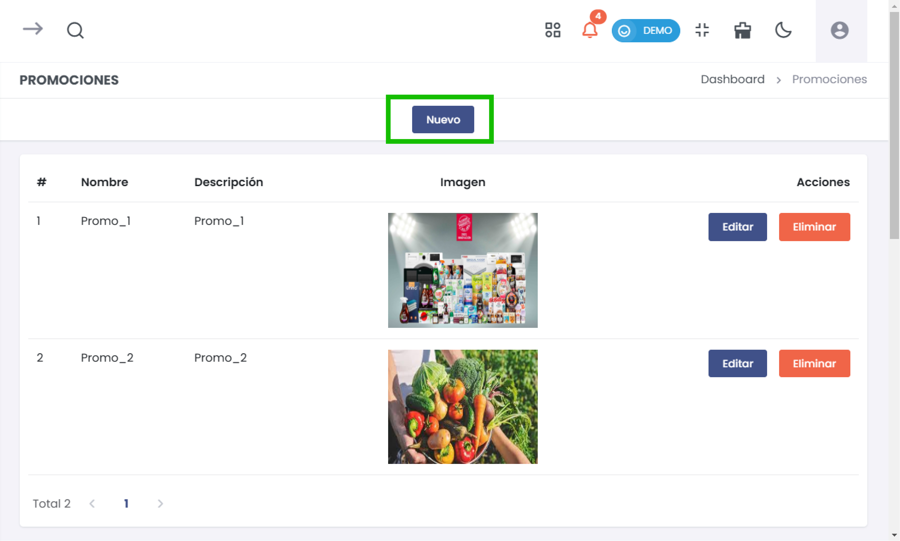
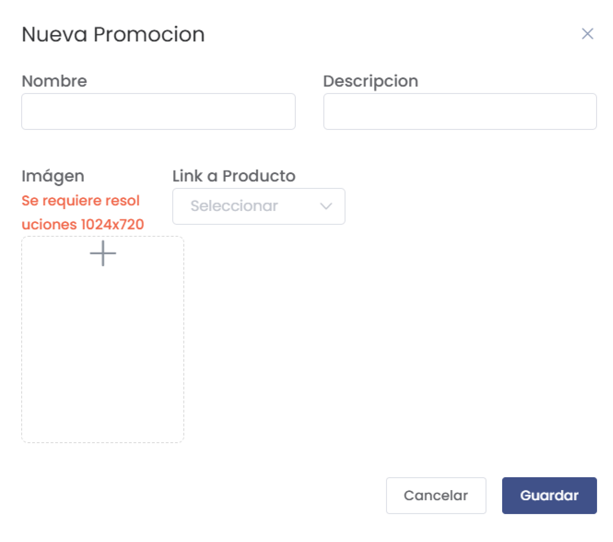
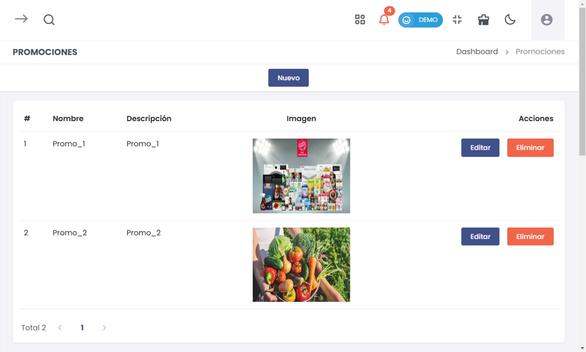

# Gestión de Promociones en la Tienda Virtual  

La sección de **Promociones** te permite crear y gestionar promociones para atraer clientes y aumentar las ventas. A continuación, se describen los pasos para agregar una nueva promoción y cómo administrar las promociones existentes.  

## 1. Acceder a la Sección de Promociones  

Para acceder a las promociones, sigue estos pasos:  

1. **Menú Principal**: En la interfaz de administración, dirígete al menú de la izquierda.  
2. **Seleccionar Tienda Virtual**: Haz clic en **Tienda Virtual**.  
3. **Seleccionar Promociones**: Haz clic en **Promociones** para acceder a la lista de promociones existentes.  

  

## 2. Crear una Nueva Promoción  

Para crear una nueva promoción, haz clic en el botón **Nuevo** en la parte superior de la lista de promociones.  

  

### Formulario de Creación de Promoción  

Se abrirá un formulario donde deberás completar la siguiente información:  

- **Nombre***: (Campo obligatorio) Proporciona un nombre descriptivo para la promoción. Este será visible para los clientes y debe ser atractivo.  

- **Descripción**: Detalla brevemente la promoción. Es importante que incluyas información relevante que ayude a los clientes a entender la oferta.  

- **Imagen**: Debes subir una imagen que represente la promoción. Se requiere que la imagen tenga una resolución de **1024x720 píxeles**.   
  - Si no se respeta esta resolución, aparecerá una advertencia indicando que es necesario.  
  

- **Link a Producto**: Selecciona un producto relacionado con la promoción. Esto vinculará la promoción con un producto específico dentro de tu tienda.  

  

### Guardar Promoción  

Una vez que hayas completado el formulario, revisa la información y haz clic en **Guardar** para registrar la nueva promoción.  

## 3. Listar Promociones Existentes  

Después de guardar, volverás a la lista donde podrás ver todas las promociones registradas.   

### Detalles del Listado  

En la tabla de promociones, puedes observar lo siguiente:  

- **#**: Número de referencia para las promociones.  
- **Nombre**: Título de la promoción.  
- **Descripción**: Breve resumen de la oferta.  
- **Imagen**: Visualización de la imagen que acompaña la promoción.  
- **Acciones**: Botones para **Editar** o **Eliminar** cada promoción.  

  

### Funcionalidades del Listado  

- **Editar**: Permite modificar los detalles de la promoción. Al hacer clic en **Editar**, se abrirá nuevamente el formulario de creación con la información prellenada.  

- **Eliminar**: Para eliminar una promoción, haz clic en el botón **Eliminar**. Se mostrará un cuadro de confirmación que deberás aceptar para proceder con la eliminación. Asegúrate de que no necesitas esta promoción antes de confirmar la eliminación.  

