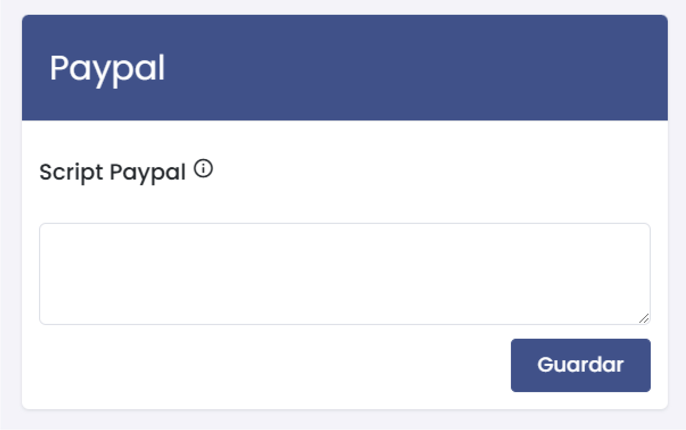

# Configuración 
En esta sección, aprenderás cómo configurar los distintos aspectos de tu tienda virtual. A continuación, se describen los pasos para completar la configuración.  

## 1. Acceso a la Configuración  

Para acceder a la configuración de la tienda virtual, dirígete al menú principal y selecciona **Tienda Virtual**, luego haz clic en **Configuración**.  

  

## 2. Información de Contacto  

### Completar Datos de Contacto  

En la sección de **Información de Contacto**, completa los siguientes campos:  

  

- **Email:** Ingresa el correo electrónico principal de contacto.  
- **Teléfono:** Proporciona un número telefónico de contacto.  
- **Whatsapp:** Si tienes WhatsApp, ingresa el número asociado para facilitar la comunicación.  
- **Nombre:** Ingresa el nombre de la persona de contacto.  
- **Dirección:** Especifica la dirección de la empresa.  

## 3. Logo  

### Subir Logo  

Para agregar el logo de tu tienda, ingresa la URL del archivo en el campo designado:  

  

- **Logo:** Se recomienda que la imagen tenga una resolución de 700x300 píxeles.  

## 4. Redes Sociales  

### Agregar Redes Sociales  

Completa los enlaces de tus redes sociales para que estén visibles en tu tienda:  

  

- **Link Facebook:** Ingresa la URL de tu página en Facebook.  
- **Link YouTube:** Agrega tu canal de YouTube.  
- **Link Twitter:** Proporciona el enlace a tu perfil de Twitter.  

## 5. Configuración de Culqi  

Para integrar pagos, completa los datos de Culqi:  

  

- **Token Público:** Ingresa tu token público de Culqi.  
- **Token Privado:** Proporciona tu token privado.  

## 6. Configuración de Paypal  

### Agregar Script de Paypal  

Si deseas habilitar pagos a través de Paypal, coloca el script correspondiente en el campo indicado:  

  

- **Script Paypal:** Ingresa el script de integración.  

## 7. Configuración de Tags  

### Agregar Tags  

En la sección de **Tags menú**, puedes etiquetar diferentes secciones para facilitar la navegación:  

  

- **Tag Envío:** Especifica las etiquetas relacionadas con el envío.  
- **Tag Moneda:** Define etiquetas para las monedas utilizadas.  
- **Tag Soporte:** Añade etiquetas relacionadas con el servicio al cliente.  

## 8. Guardar Configuración  

Cada vez que completes un formulario, asegúrate de hacer clic en el botón **Guardar** para almacenar los cambios realizados.  
 

