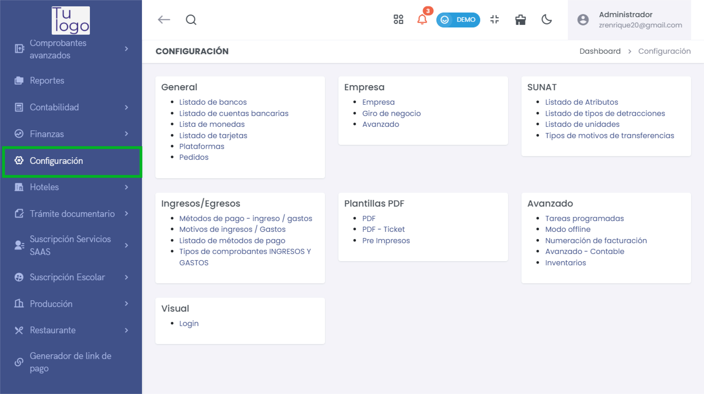

# Configuración

La sección de **Configuración** permite gestionar todos los aspectos relacionados con la operación del sistema. Está organizada en varias áreas para facilitar la administración de configuraciones generales, empresa, SUNAT, y más.

---

## Acceso a la Configuración

1. **Ubicación en el menú**:
   - Navega a **Configuración** desde el menú lateral.

---

## Áreas de Configuración

### 1. General
- **Listado de bancos**: Registro y gestión de bancos.
- **Listado de cuentas bancarias**: Administra las cuentas asociadas.
- **Lista de monedas**: Configura las monedas utilizadas en transacciones.
- **Listado de tarjetas**: Gestiona tarjetas vinculadas al sistema.
- **Plataformas**: Define y gestiona plataformas de venta.
- **Pedidos**: Configura parámetros relacionados con la gestión de pedidos.

---

### 2. Empresa
- **Empresa**: Gestión de datos básicos de la empresa.
- **Giro de negocio**: Define el sector o rubro al que pertenece la empresa.
- **Avanzado**: Configuración avanzada para operaciones específicas.

---

### 3. SUNAT
- **Listado de Atributos**: Configura los atributos requeridos por SUNAT.
- **Listado de tipos de detracciones**: Define los tipos de detracciones aplicables.
- **Listado de unidades**: Gestiona las unidades de medida utilizadas.
- **Tipos de motivos de transferencias**: Configura los motivos para transferencias de inventario.

---

### 4. Ingresos/Egresos
- **Métodos de pago - ingreso / gastos**: Define los métodos de pago permitidos.
- **Motivos de ingresos / Gastos**: Gestiona las categorías de ingresos y egresos.
- **Listado de métodos de pago**: Administra los métodos disponibles para pagos.
- **Tipos de comprobantes INGRESOS Y GASTOS**: Configura los tipos de comprobantes aplicables a ingresos y gastos.

---

### 5. Plantillas PDF
- **PDF**: Personalización de plantillas de documentos en formato PDF.
- **PDF - Ticket**: Configuración de plantillas para tickets de venta.
- **Pre Impresos**: Administra los formatos preimpresos utilizados.

---

### 6. Avanzado
- **Tareas programadas**: Define tareas automatizadas.
- **Modo offline**: Configura el uso del sistema sin conexión.
- **Numeración de facturación**: Gestiona las series y numeración de comprobantes.
- **Avanzado - Contable**: Configuraciones contables avanzadas.
- **Inventarios**: Administra la configuración del módulo de inventarios.

---

### 7. Visual
- **Login**: Personaliza la pantalla de inicio de sesión del sistema.

---

## Conclusión

La sección de **Configuración** es fundamental para adaptar el sistema a las necesidades específicas de la empresa. Desde la gestión de bancos y métodos de pago hasta la configuración de plantillas PDF y tareas programadas, cada módulo permite administrar de forma eficiente los distintos aspectos operativos. Con esta guía tendrás una visión clara para realizar ajustes y configuraciones de manera efectiva en cada área del sistema.
