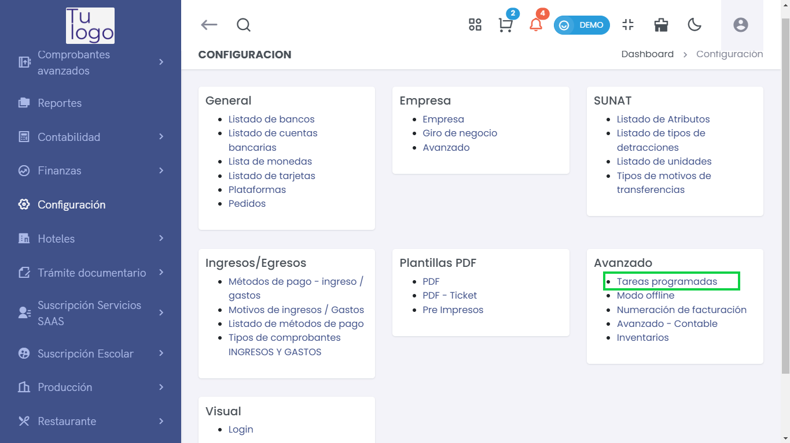
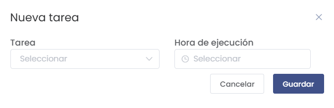

# Tareas programadas

En este artículo te enseñaremos a realizar la configuración necesaria para **enviar las boletas mediante un resumen**. Sigue estos pasos para hacerlo correctamente:

---

## Acceso a Tareas programadas
Ingresa al módulo de **Configuración**, luego en **Avanzado** selecciona la subcategoría **Tareas programadas**.  

---

## 1. Crear nueva tarea
Selecciona el botón **Nuevo**, donde aparecerá la ventana general para llenar la **Nueva tarea**.  

Completa los siguientes campos:

- **Tarea**: `SummarySendCommand`  
- **Hora de ejecución**: Selecciona la hora de ejecución (recomendado en la noche).  

---

## 2. Programar segunda tarea
Para completar el proceso de envío de boletas a SUNAT, añade una **nueva tarea**:  

- **Tarea**: `SummaryQueryCommand`  
- **Hora de ejecución**: Se recomienda programarla **una hora después de la tarea anterior**.  

---

✅ Con estas dos tareas programadas, el sistema enviará automáticamente los **resúmenes de boletas a SUNAT** y verificará su estado de manera eficiente.
