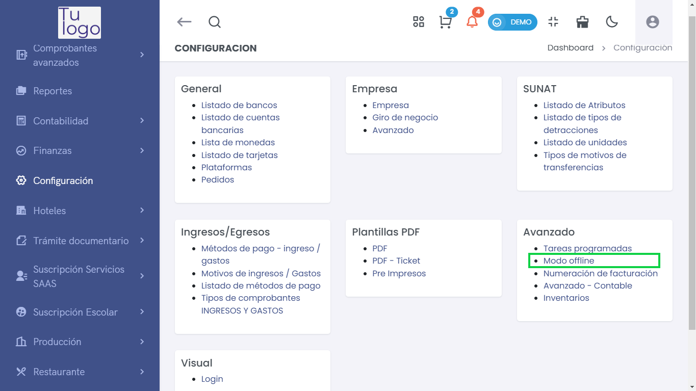
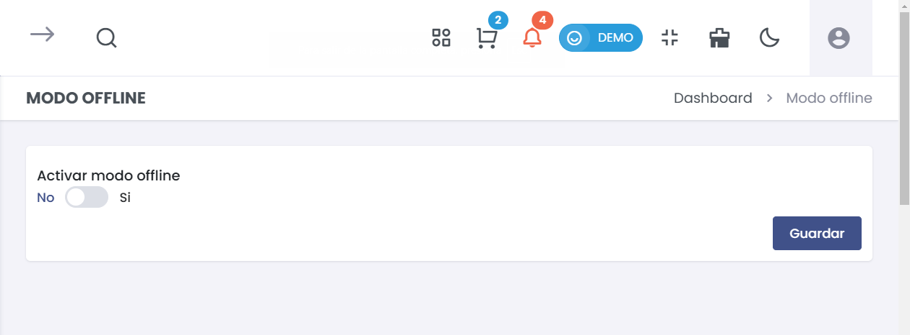

# Modo Offline  
Esta guía describe cómo configurar la sección **Modo Offline** en la plataforma. Esta opción es útil para permitir el funcionamiento del sistema incluso sin conexión a Internet, garantizando que las operaciones críticas pueden llevarse a cabo.  

## Acceso al Modulo

Para gestionar el modo offline en el sistema, accede a **Configuración > Avanzado > Modo Offline**. 

 

---  

## **1. Activar Modo Offline**  
> ### 💻 Activar Modo Offline  
Utiliza esta opción para habilitar o deshabilitar el modo offline según las necesidades de tu negocio.  

  
- **Activar Modo Offline**:  
  Tienes dos opciones, **Sí** o **No**:  
  - **No**: El sistema funcionará únicamente en línea.  
  - **Sí**: Activa el modo offline, permitiendo que las operaciones se realicen sin conexión.  
  
- **Guardar**:  
  Una vez seleccionada la opción deseada, haz clic en **Guardar** para aplicar los cambios. Asegúrate de revisar cualquier indicación o requisito adicional que pueda aparecer al activar esta función.  

---  

