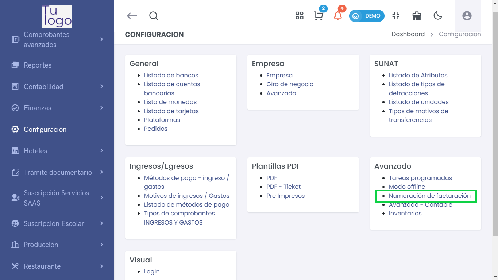
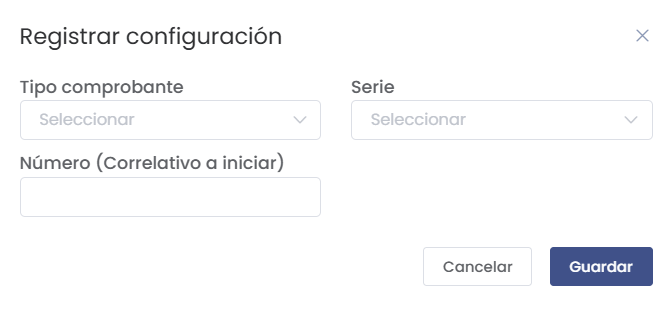
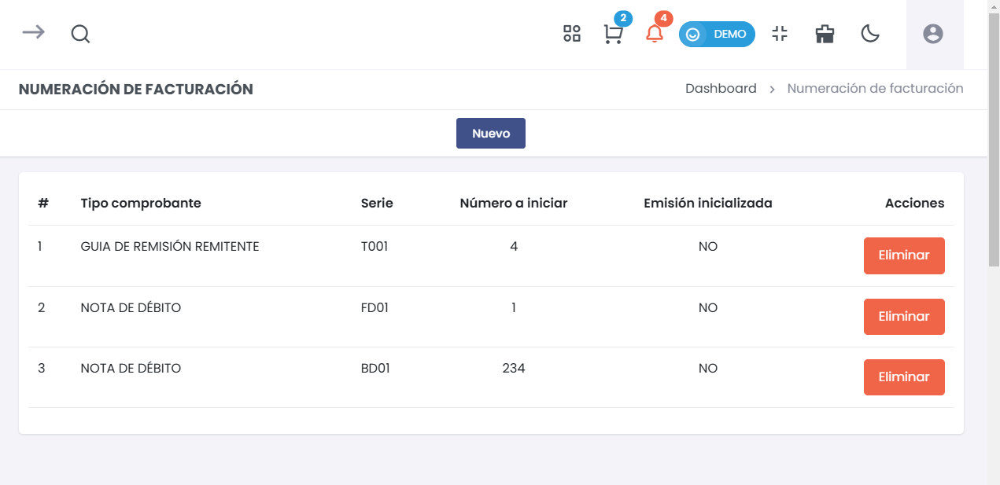

# Numeración de Facturación  
Esta guía describe cómo configurar la sección **Numeración de Facturación** en la plataforma. Esta opción es crucial para gestionar la numeración de los documentos y comprobantes emitidos por tu negocio.  

## Acceso al Modulo

Para gestionar el módulo en el sistema, acceda a **Configuración > Avanzado > Numeración de Facturación**. 

 

---  

## **1. Registrar Configuración**  
> ### ✏️ Registrar nueva configuración  
Desde esta sección, puedes registrar la numeración para diferentes tipos de comprobantes.  

  
- **Tipo Comprobante**:  
  Selecciona el tipo de comprobante que deseas configurar (ej.: factura, guía de remisión).  
  
- **Serie**:  
  Selecciona la serie que corresponde al tipo de comprobante.  

- **Número (Correlativo a iniciar)**:  
  Indica el número inicial a partir del cual comenzará la numeración. Asegúrate de que este número no haya sido utilizado anteriormente.  

- **Guardar**:  
  Una vez que hayas completado todos los campos, haz clic en **Guardar** para registrar la configuración. Si decides no continuar, puedes hacer clic en **Cancelar**.  

---  

## **2. Listado de Numeración**  
> ### 📜 Listado de Comprobantes  
Accede aquí para ver todas las configuraciones de numeración de facturación registradas.  

  
- **Información de Comprobantes**:  
  Cada fila incluye detalles sobre el tipo de comprobante, la serie asignada, el número inicial y si la emisión ha sido inicializada o no.  

- **Eliminar**:  
  Puedes eliminar cualquier configuración no deseada haciendo clic en **Eliminar** junto al comprobante correspondiente. Asegúrate de que no esté en uso antes de proceder.  

---  

## **3. Inicialización de Emisión**  
> ### 🔄 Inicializar Emisión  
Esta opción permite comenzar a utilizar la numeración configurada.  
- **Emisión Inicializada**:  
  Verifica si la emisión ha sido inicializada; si no, podrás proceder a hacerlo desde la misma lista.  

---  

