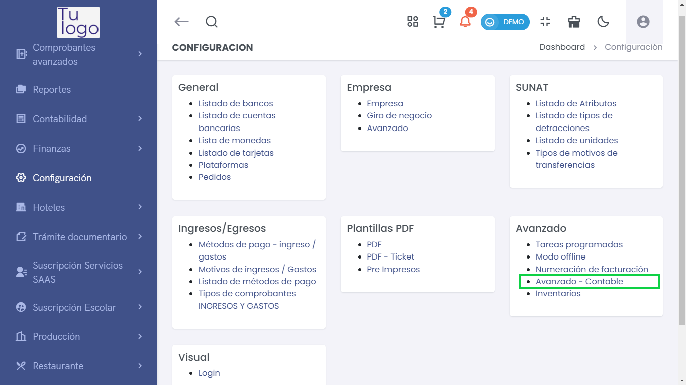
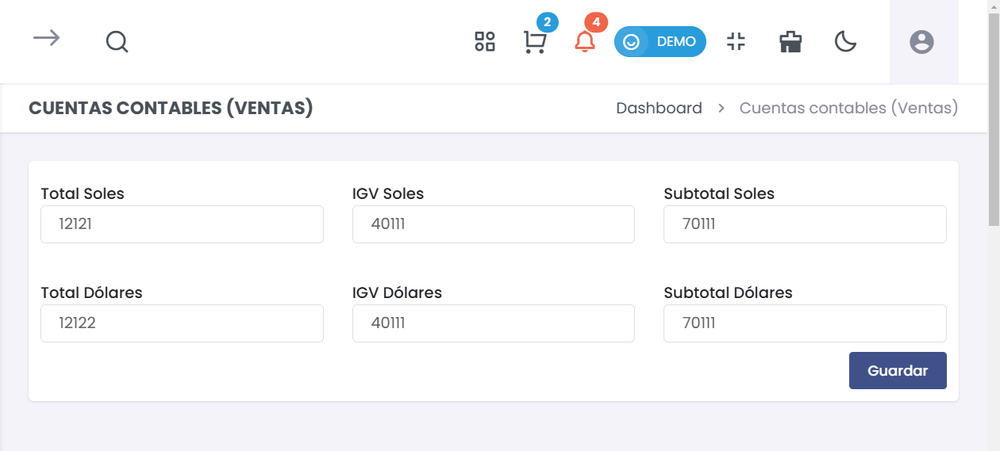

# Avanzado Contable

## Acceso al Módulo  
Para gestionar el módulo en el sistema, acceda a **Configuración > Avanzado > Avanzado Contable**.  

  

---  

## **1. Cuentas Contables (Ventas)**  
> ### 💼 Cuentas Contables  
En esta sección podrás configurar las cuentas contables relacionadas con las ventas de tu negocio.  

  

### Campos a Completar:  

- **Total Soles**:  
  Ingresa el número de cuenta contable que representa el total de ventas en soles (ej.: 12121).  
  
- **IGV Soles**:  
  Indica el número de cuenta correspondiente al IGV (Impuesto General a las Ventas) en soles (ej.: 40111).  
  
- **Subtotal Soles**:  
  Especifica el número de cuenta que representa el subtotal de las ventas en soles (ej.: 70111).  

- **Total Dólares**:  
  Ingresa el número de cuenta que representa el total de ventas en dólares (ej.: 12122).  
  
- **IGV Dólares**:  
  Proporciona el número de cuenta correspondiente al IGV en dólares (ej.: 40111).  
  
- **Subtotal Dólares**:  
  Especifica el número de cuenta que representa el subtotal de ventas en dólares (ej.: 70111).  

### Guardar Configuración  
- **Guardar**:  
  Una vez completados los campos necesarios, haz clic en el botón **Guardar** para aplicar los cambios. Asegúrate de verificar que los números de cuenta sean correctos antes de guardar.  

---  

