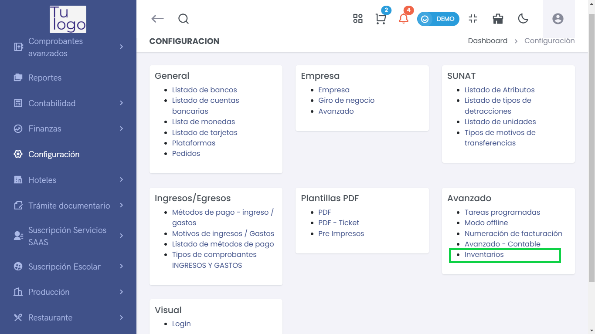
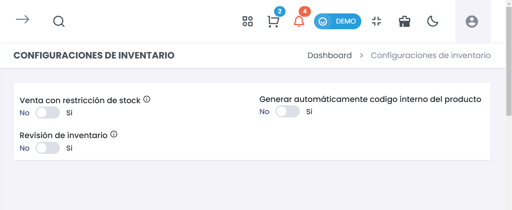

# Inventario  
Esta guía describe cómo gestionar las configuraciones de inventario en la plataforma, lo que es esencial para un manejo eficiente de los productos y el stock disponible.  

# Acceso al Módulo  
Para gestionar el módulo en el sistema, acceda a **Configuración > Avanzado > Inventario**.  

---  

## **1. Configuración General**  
> ### ⚙️ Configuración de Inventario  
Accede a esta sección para ajustar las configuraciones relacionadas con el manejo del stock y la generación de códigos de productos.  

  

### Opciones de Configuración:  

- **Venta con Restricción de Stock**:  
  Permite habilitar o deshabilitar la opción de venta de productos si no hay stock disponible.  
  - **Sí**: Se restringe la venta cuando no hay stock.  
  - **No**: Se permite la venta aunque el stock sea cero.  

- **Revisión de Inventario**:  
  Configura si deseas realizar revisiones periódicas del inventario.  
  - **Sí**: Activa la revisión de inventario, lo que te permitirá mantener actualizada la cantidad de productos disponibles.  
  - **No**: Desactiva las revisiones, permitiendo que las cantidades se gestionen manualmente.  

- **Generar Automáticamente Código Interno del Producto**:  
  Esta opción establece si se debe generar un código interno automáticamente para los productos al momento de su creación.  
  - **Sí**: Se generará un código interno automáticamente.  
  - **No**: Deberás ingresar el código manualmente.  

### Guardar Configuración  
- **Guardar**:  
  Después de realizar los cambios deseados, haz clic en el botón **Guardar** para aplicar las nuevas configuraciones.  

---  
