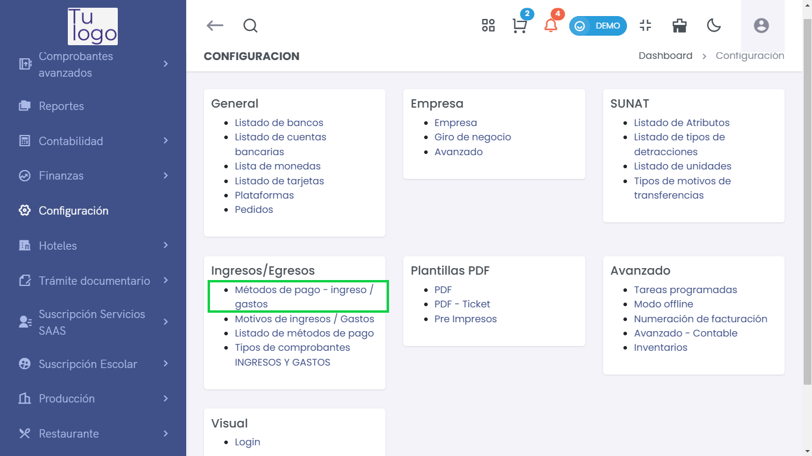
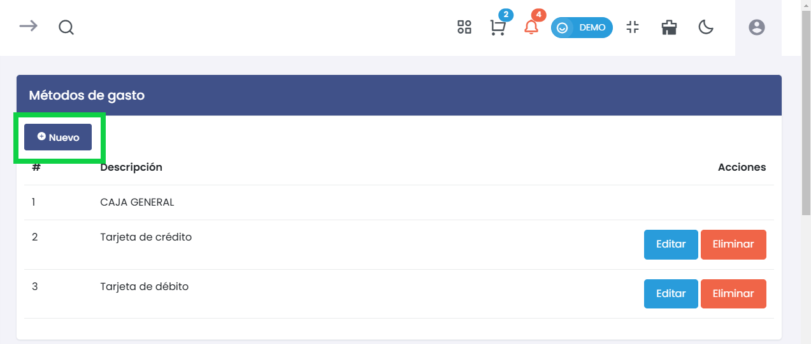
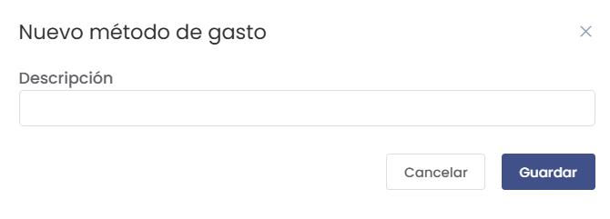
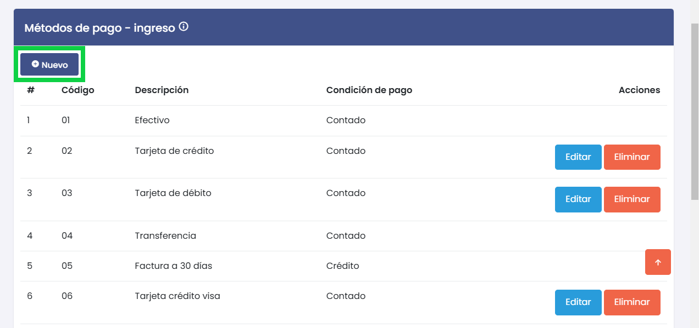
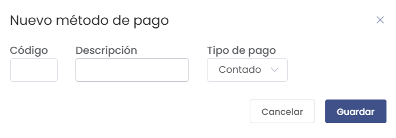

# Métodos de Pago - Ingresos/Egresos  
Esta guía detalla cómo gestionar los métodos de pago en el sistema, tanto para ingresos como para egresos.  

---  

## **1. Acceso a Métodos de Pago**  
> ### 🏦 Configuración de Métodos de Pago  
Para gestionar los métodos de pago, accede a **Configuración > Ingresos/Egresos > Métodos de Pago**.  

  

---  

## **2. Métodos de Gasto**  
> ### 📝 Crear Nuevo Método de Gasto  

En la parte superior izquierda, selecciona el botón **Nuevo.**

Desde esta sección, puedes agregar nuevos métodos de gasto que se utilizarán en las operaciones del negocio.  

  

### Pasos a Seguir:  

- **Descripción**:  
  Ingresa una breve descripción del nuevo método de gasto. Asegúrate de que sea clara para facilitar su identificación.  

- **Guardar**:  
  Haz clic en el botón **Guardar** para registrar el nuevo método. Si decides no continuar, puedes hacer clic en **Cancelar**.  

### Listado de Métodos de Gasto  
Verás una tabla con los métodos de gasto ya registrados:  

| #  | Descripción               | Acciones         |  
|----|--------------------------|-------------------|  
| 1  | CAJA GENERAL             | Editar | Eliminar |  
| 2  | Tarjeta de crédito       | Editar | Eliminar |  
| 3  | Tarjeta de débito        | Editar | Eliminar |  

Puedes **Editar** o **Eliminar** los métodos existentes según sea necesario.  

---  

## **3. Métodos de Pago - Ingreso**  
> ### 💳 Crear Nuevo Método de Pago  

En la parte inferior izquierda, selecciona el botón **Nuevo.**

Esta sección te permite añadir métodos de pago para ingresos.  

  

### Pasos a Seguir:  

- **Código**:  
  Ingresa un código único para el método de pago.  

- **Descripción**:  
  Proporciona una descripción clara del método (ej.: Efectivo, Tarjeta de crédito).  

- **Tipo de Pago**:  
  Selecciona entre las opciones disponibles (ej.: Contado, Crédito).  

- **Guardar**:  
  Haz clic en **Guardar** para registrar el nuevo método de pago. Alternativamente, puedes hacer clic en **Cancelar** si decides no hacer cambios.  

### Listado de Métodos de Pago  
Similar a los métodos de gasto, verás una tabla con los métodos de pago existentes:  

| #  | Código | Descripción         | Condición de Pago | Acciones         |  
|----|--------|--------------------|-------------------|-------------------|  
| 1  | 01     | Efectivo           | Contado           | Editar | Eliminar |  
| 2  | 02     | Tarjeta de crédito  | Contado           | Editar | Eliminar |  
| 3  | 03     | Tarjeta de débito   | Contado           | Editar | Eliminar |  
| 4  | 04     | Transferencia       | Contado           | Editar | Eliminar |  
| 5  | 05     | Factura a 30 días   | Crédito           | Editar | Eliminar |  
| 6  | 06     | Tarjeta crédito visa | Contado           | Editar | Eliminar |  

---  

