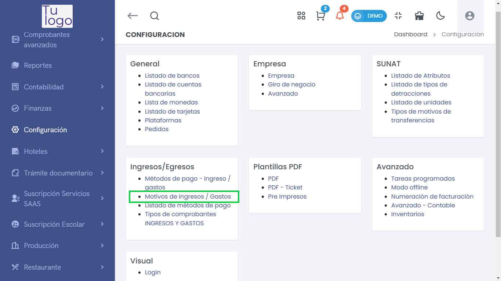
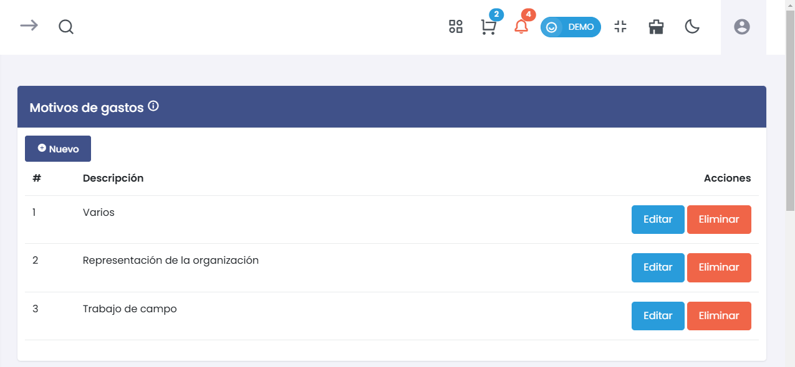
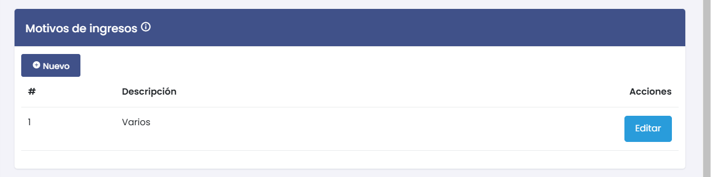
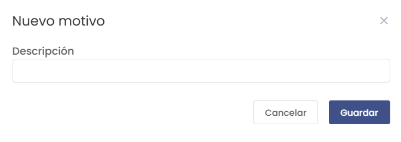

# Motivos de ingresos / Gastos 

Esta sección permite gestionar los motivos de ingresos y gastos dentro de la plataforma, facilitando la categorización y el seguimiento de las transacciones. 

## **1. Acceso al Modulo**  

> ### 🏦 Configuración de Métodos de Ingreso/Gastos  

Para gestionar los métodos de pago, accede a **Configuración > Ingresos/Egresos > Motivos de ingresos / Gastos**.  

  

---  

## **1. Motivos de Gastos**  

### ⚙️ Agregar un Nuevo Motivo  
Para añadir un nuevo motivo de gasto, haz clic en el botón **Nuevo**. Se abrirá un formulario donde podrás ingresar la descripción del motivo.  

  

- **Descripción**: Ingresa el nombre del motivo.  
- **Acciones**: Una vez creado, podrás **Editar** o **Eliminar** motivos existentes.  

  

### **Ejemplo de Motivos de Gastos**  
1. Varios  
2. Representación de la organización  
3. Trabajo de campo  

---  

## **2. Motivos de Ingresos**  

### ⚙️ Agregar un Nuevo Motivo  
Al igual que con los gastos, puedes añadir un nuevo motivo de ingreso haciendo clic en el botón **Nuevo**. El formulario es similar al de gastos.  

  

- **Descripción**: Proporciona el nombre del motivo de ingreso.  
- **Acciones**: Puedes **Editar** motivos existentes según sea necesario.  

  

### **Ejemplo de Motivos de Ingresos**  
1. Varios  

---  

## **3. Consideraciones Finales**  
Asegúrate de que los motivos que agregues sean claros y específicos para facilitar la gestión contable y la generación de reportes en la plataforma.