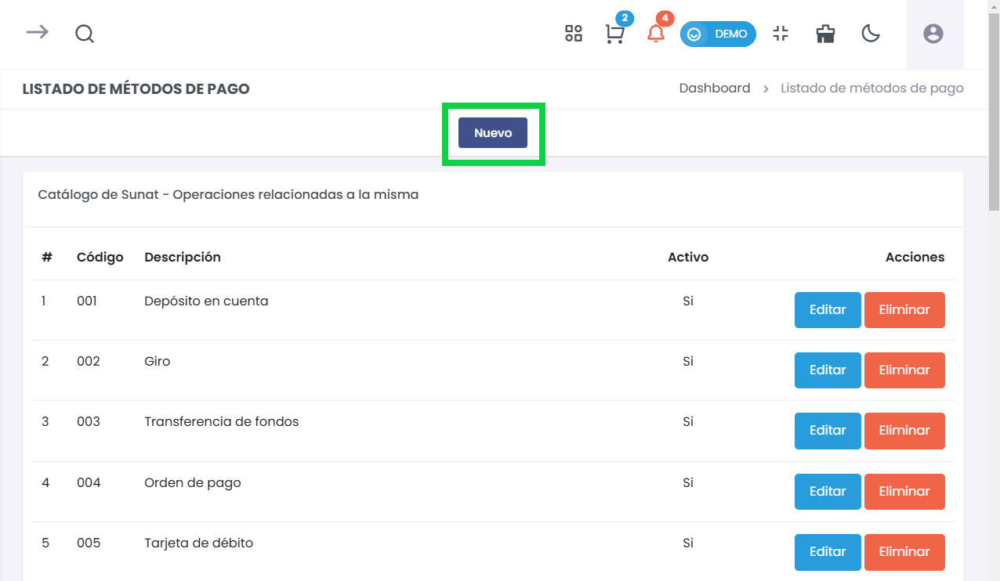
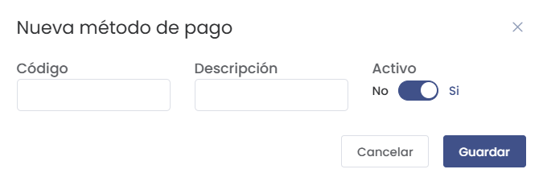
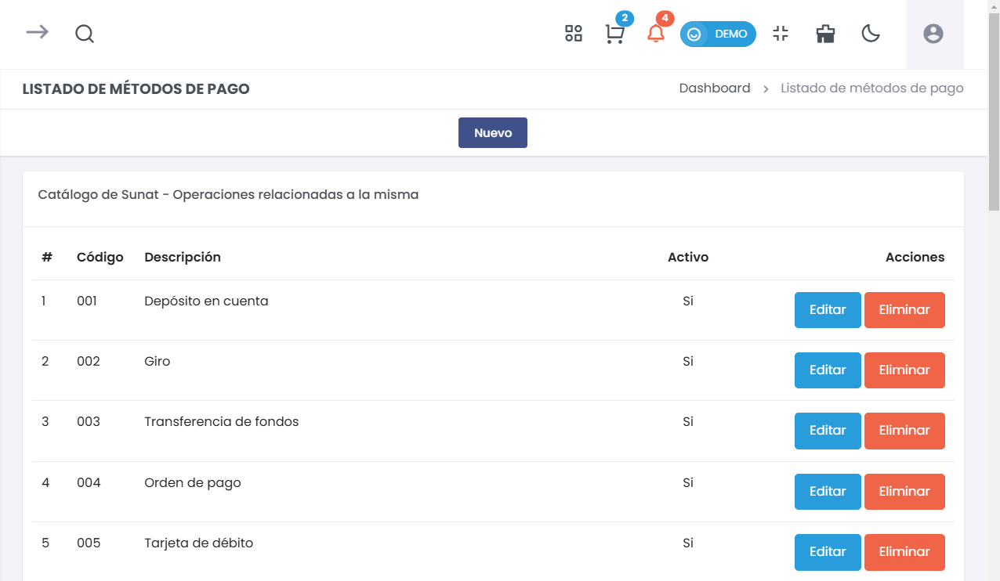

# Listado de Métodos de Pago  

Esta sección permite gestionar los métodos de pago utilizados en la plataforma, facilitando la categorización y el seguimiento de los ingresos y egresos.   

---  

## **1. Acceso al Módulo**  

Para ingresar al módulo, dirígete a **Configuración > Ingresos/Egresos > Listado de Métodos de Pago**. Allí verás la lista de métodos disponibles y la opción para añadir nuevos.  

---  

## **2. Agregar un Nuevo Método de Pago**  

### ⚙️ Ingreso de Datos  
Para añadir un nuevo método de pago, haz clic en el botón **Nuevo**. 

Aparecerá un formulario que requerirá la siguiente información:  

  

- **Código**: Proporciona un código único para el método de pago.  
- **Descripción**: Ingresa una breve descripción del método de pago.  
- **Activo**: Selecciona si el método estará activo (sí/no).  

### **Ejemplo de Métodos de Pago**  
1. **001** - Depósito en cuenta  
2. **002** - Giro  
3. **003** - Transferencia de fondos  
4. **004** - Orden de pago  
5. **005** - Tarjeta de débito  

---  

## **3. Lista de Métodos de Pago**  

La lista mostrará todos los métodos de pago registrados. Cada entrada incluirá su código, descripción y un estado activo.  

   

---  

## **4. Consideraciones Finales**  

Asegúrate de que los métodos de pago sean claros y estén actualizados para evitar confusiones en la gestión de ingresos y egresos. Utiliza la opción de editar o eliminar cuando sea necesario para mantener la lista precisa.