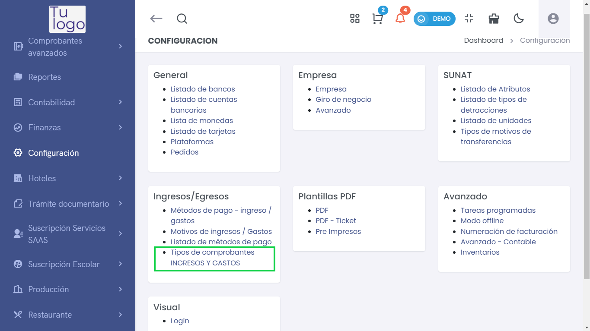
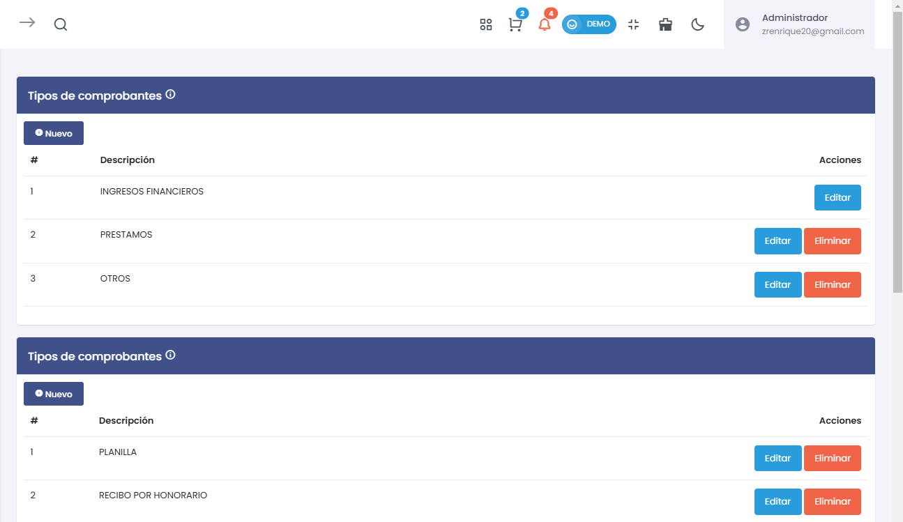
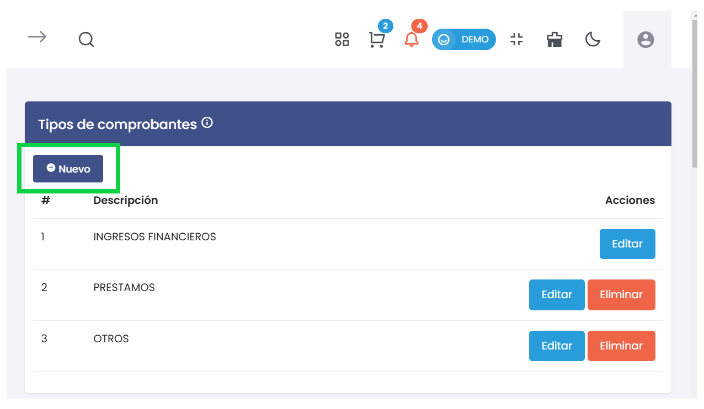
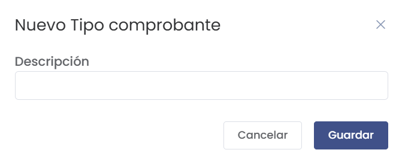

# Tipos de Comprobantes  

Esta sección permite gestionar los tipos de comprobantes de ingresos y gastos dentro de la plataforma, facilitando la clasificación y organización de las transacciones contables.  

---  

## **1. Acceso al Módulo**  

Para acceder a los tipos de comprobantes, sigue estos pasos:  

1. Navega al menú principal.  
2. Selecciona **Configuración**.  
3. Busca la opcion de **Ingresos/Egresos**.  
4. Selecciona **Tipos de Comprobantes**.  

Una vez dentro, verás una lista con los tipos de comprobantes existentes y un botón para añadir nuevos.  

  

---  

## **2. Tipos de Comprobantes Disponibles**  

En esta sección, podrás encontrar los siguientes tipos de comprobantes:  

### **A. Comprobantes de Ingresos**  
Este tipo de comprobante se utiliza para documentar todas las entradas de dinero a la empresa. Por ejemplo:  
- **Facturas de ventas**  
- **Recibos por honorarios**  
- **Depósitos en cuenta**  

### **B. Comprobantes de Gastos Diversos**  
Este comprobante se utiliza para registrar los gastos de la empresa que no se clasifican en categorías específicas. Ejemplos incluyen:  
- **Gastos administrativos**  
- **Pagos de servicios**  
- **Gastos operativos generales**  

---  

## **3. Agregar un Nuevo Tipo de Comprobante**  

Para crear un nuevo tipo de comprobante, realiza los siguientes pasos:  

1. Haz clic en el botón **Nuevo**.   

     

2. Se abrirá un formulario que solicita la **Descripción** del nuevo tipo de comprobante.  

     

3. En el campo **Descripción**:  
   - Ingresa un nombre que identifique claramente el tipo de comprobante (por ejemplo: "Ingreso", "Gasto Diverso").  
   - Este campo es obligatorio.  

4. Una vez completado, tendrás dos opciones:  
   - **Guardar**: Haz clic en el botón **Guardar** para registrar el nuevo tipo de comprobante.  
   - **Cancelar**: Para cerrar el formulario sin guardar, haz clic en **Cancelar**.  

5. Si eliges **Guardar**, el nuevo tipo de comprobante se añadirá a la lista existente.  

---  

## **4. Lista de Tipos de Comprobantes**  

En la lista principal, podrás visualizar todos los tipos de comprobantes registrados. La lista incluye los siguientes campos:  

| #  | Descripción                  | Acciones                   |  
|----|------------------------------|----------------------------|  
| 1  | Ingresos                     | [Editar] [Eliminar]        |  
| 2  | Gastos Diversos              | [Editar] [Eliminar]        |  

### **Acciones Disponibles**  
- **Editar**:   
  - Haz clic en **Editar** para modificar la descripción de un tipo de comprobante existente. Se abrirá el mismo formulario de adición.  
  
- **Eliminar**:   
  - Haz clic en **Eliminar** para borrar un tipo de comprobante. Aparecerá un aviso de confirmación para asegurar que realmente deseas eliminarlo.  

---  

## **5. Consideraciones Finales**  

- **Mantenimiento Eficiente**: Mantener una lista organizada y actualizada de tipos de comprobantes es esencial para una gestión contable eficiente y precisa.  
- **Revisión Regular**: Es recomendable revisar periódicamente los tipos de comprobantes para ajustar o eliminar aquellos que ya no sean necesarios.  

Asegúrate de clasificar adecuadamente todos los comprobantes para asegurar un proceso contable fluido y claro.