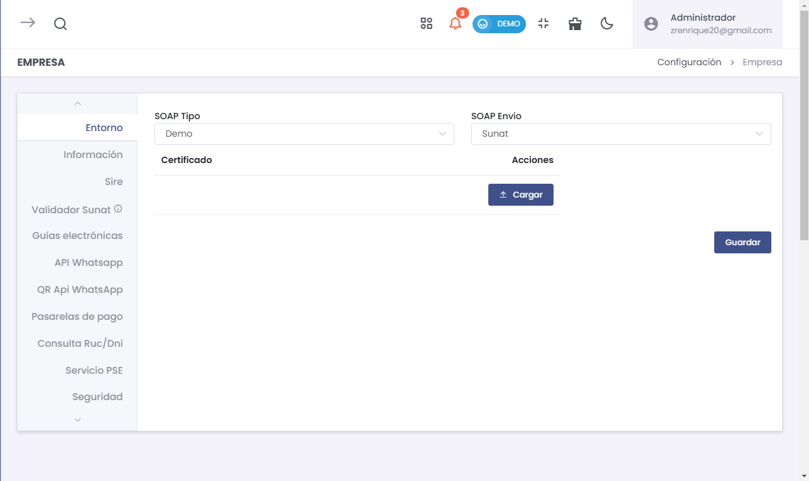
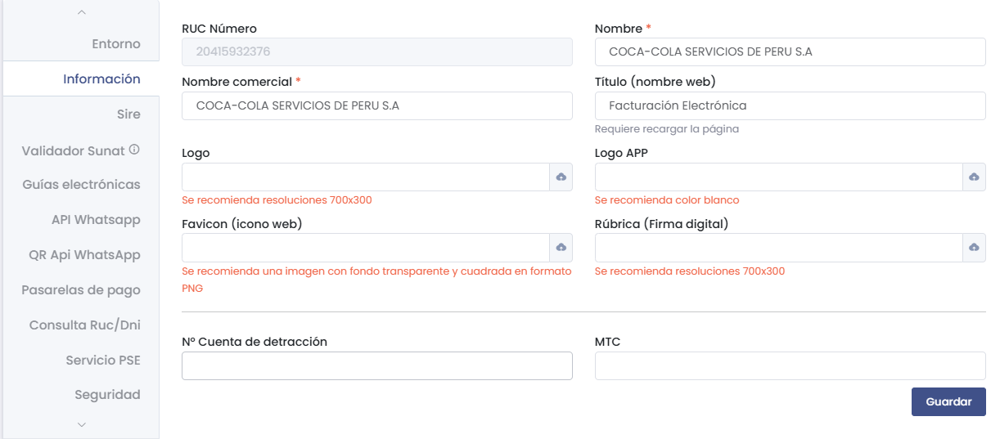
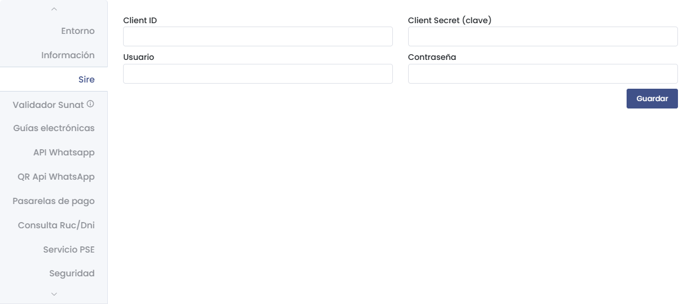
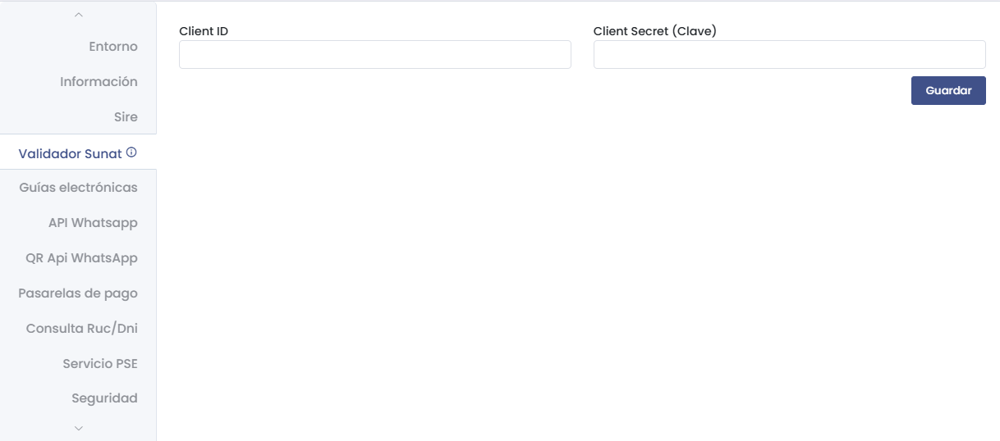
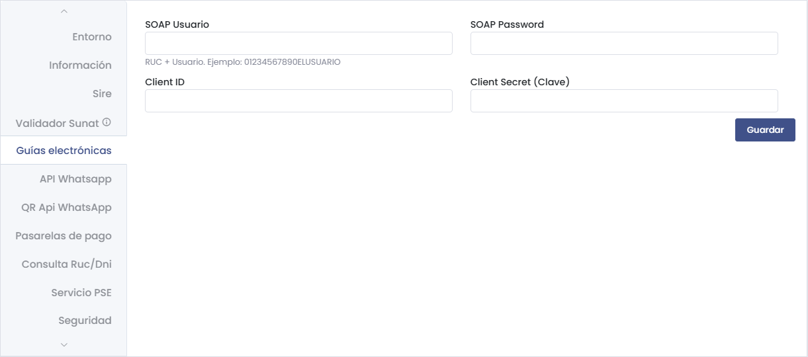
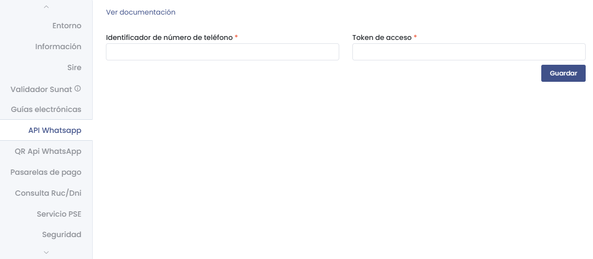
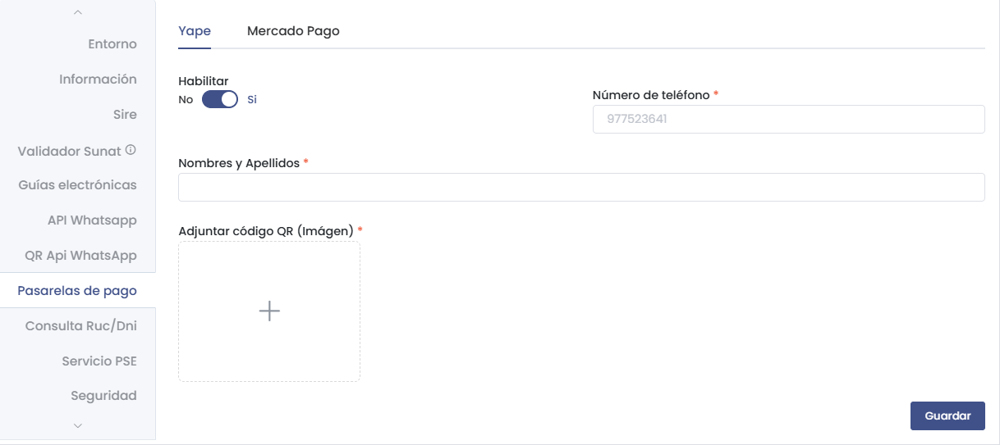
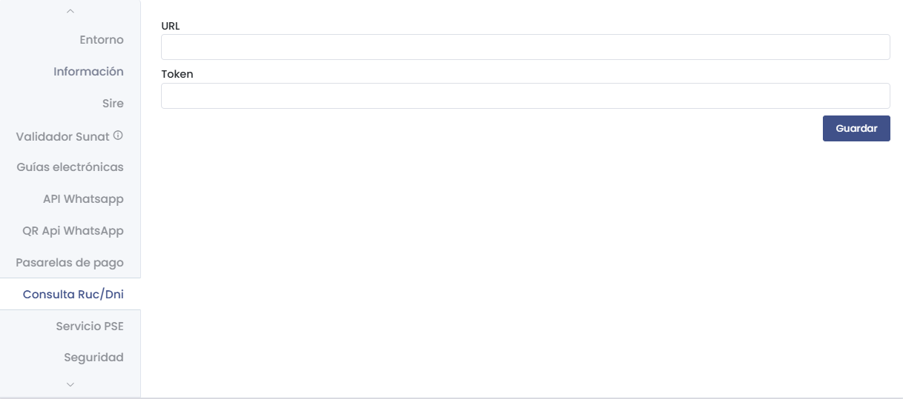
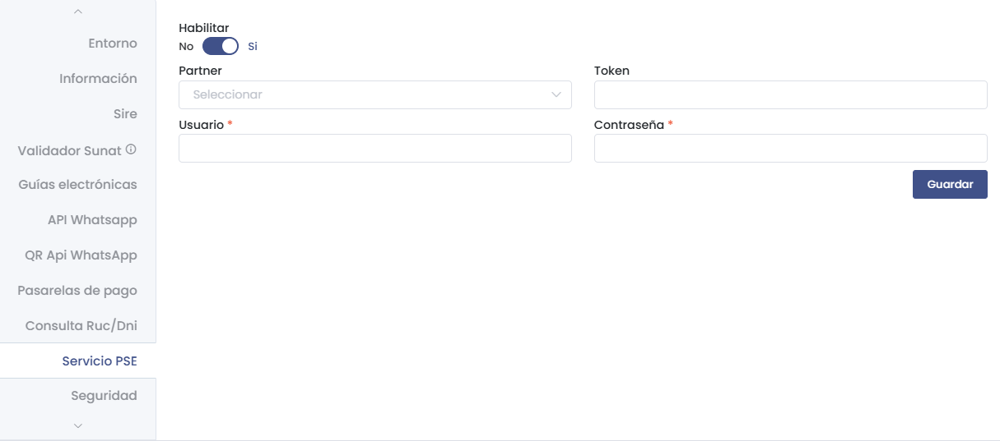
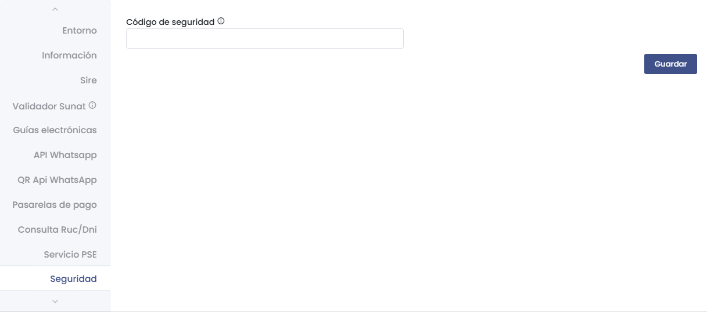

# Empresa - Empresa  
Esta guía describe de manera detallada cómo configurar la sección **Empresa** en la plataforma. Cada subsección permite ajustar los parámetros clave para garantizar la correcta operación del negocio en aspectos de integración, seguridad y personalización.

---

## **1. Entorno**  
> ### 🌐 Entorno  
Configura las conexiones SOAP necesarias para enviar documentos electrónicos.

  
- **SOAP Tipo**:  
  Selecciona si el entorno es "Demo" o "Producción".  
- **SOAP Envío**:  
  Define el destino del envío (ej.: SUNAT).  
- **Certificado**:  
  Permite cargar el certificado digital necesario para la comunicación.

---

## **2. Información**  
> ### 🏢 Información de la Empresa  
Aquí puedes ingresar los datos corporativos de la empresa, como el nombre y logotipos.

  
- **RUC Número**:  
  Número de RUC de la empresa.  
- **Nombre Comercial**:  
  Nombre público que representa a la empresa.  
- **Título**:  
  Nombre que aparece en la página web (requiere recargar la página para aplicar cambios).  
- **Logo y Favicon**:  
  Carga imágenes recomendadas de 700x300 px.  
- **Rúbrica**:  
  Firma digital requerida para ciertos documentos electrónicos.  
- **Nº Cuenta de detracción / MTC**:  
  Datos financieros adicionales para operaciones específicas.

---

## **3. Sire**  
> ### 🔗 Integración con Sire  
Configura los parámetros de integración con Sire.

  
- **Client ID** y **Client Secret**:  
  Credenciales necesarias para conectar con la API de Sire.  
- **Usuario / Contraseña**:  
  Información de acceso adicional.

---

## **4. Validador SUNAT**  
> ### ✅ Validador SUNAT  
Esta opción permite configurar la validación con la API de SUNAT.

  
- **Client ID** y **Client Secret**:  
  Credenciales para validar documentos directamente con SUNAT.

---

## **5. Guías Electrónicas**  
> ### 🚚 Guías Electrónicas  
Administra los usuarios SOAP y sus credenciales para guías electrónicas.

  
- **SOAP Usuario y SOAP Password**:  
  Configuración de acceso al servicio SOAP.  
- **Client ID / Client Secret**:  
  Identificadores necesarios para autenticar la conexión.

---

## **6. API WhatsApp / QR API WhatsApp**  
> ### 💬 Integración con WhatsApp  
Integra servicios de mensajería con WhatsApp.

  
- **Habilitar**:  
  Activa o desactiva la integración.  
- **URL del servicio / API Key**:  
  Define la URL y clave de acceso para la API.

---

## **7. Pasarelas de Pago**  
> ### 💳 Pasarelas de Pago  
Administra las opciones de pago disponibles como Yape y Mercado Pago.

  
- **Yape**:  
  Permite configurar número de teléfono y código QR.  
- **Mercado Pago**:  
  Define tokens públicos y privados para conectar con la API.

---

## **8. Consulta RUC/DNI**  
> ### 🔍 Consulta de RUC/DNI  
Consulta directa de datos de RUC y DNI.

  
- **URL / Token**:  
  Define los parámetros de conexión a la API de consulta.

---

## **9. Servicio PSE**  
> ### 🏦 Servicio PSE  
Configura la integración con servicios de pago electrónico.

  
- **Habilitar**:  
  Activa la opción de PSE.  
- **Partner / Token / Usuario / Contraseña**:  
  Parámetros necesarios para la conexión.

---

## **10. Seguridad**  
> ### 🔐 Seguridad del Sistema  
Administra los códigos de seguridad del sistema.

  
- **Código de Seguridad**:  
  Introduce un código de acceso para operaciones críticas.

---

Con estas configuraciones completas, tendrás todos los parámetros necesarios para gestionar y personalizar el módulo **Empresa** según las necesidades específicas de tu negocio.
