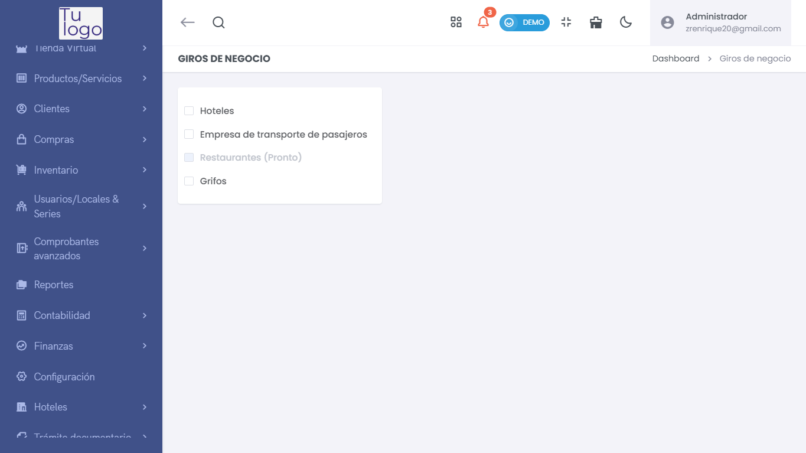

# Empresa - Giros

> ### 🏢 Giros de Negocio  
> Gestiona los diferentes tipos de negocios disponibles en la plataforma.

### **Tipos de Giros Disponibles**  
- **Hoteles**:  
  Opción diseñada para gestionar la facturación, inventario y otros procesos específicos del sector hotelero.
  
- **Empresa de transporte de pasajeros**:  
  Dirigido a empresas que brindan servicios de transporte de pasajeros, con opciones específicas para la gestión de comprobantes y operaciones.

- **Restaurantes (Pronto)**:  
  Este módulo aún no está disponible, pero próximamente integrará opciones específicas para la administración de restaurantes.

- **Grifos**:  
  Configuración orientada a la gestión de estaciones de servicio y venta de combustibles.

---

Esta sección permite seleccionar y personalizar el giro de negocio adecuado para tu empresa, optimizando los procesos en función del tipo de operación que realices. Si alguna de las opciones no está habilitada, ponte en contacto con el equipo de soporte para más detalles.
