# Empresa - Avanzada

Esta guía documenta cada opción disponible en la **Configuración Avanzada** de la plataforma. Cada sección ha sido detallada para que puedas personalizar y optimizar el sistema según las necesidades de tu negocio.

---

## **1. Servicios**  
> ### ⚙️ Servicios Automatizados  
> Automatiza procesos críticos para mayor eficiencia.  

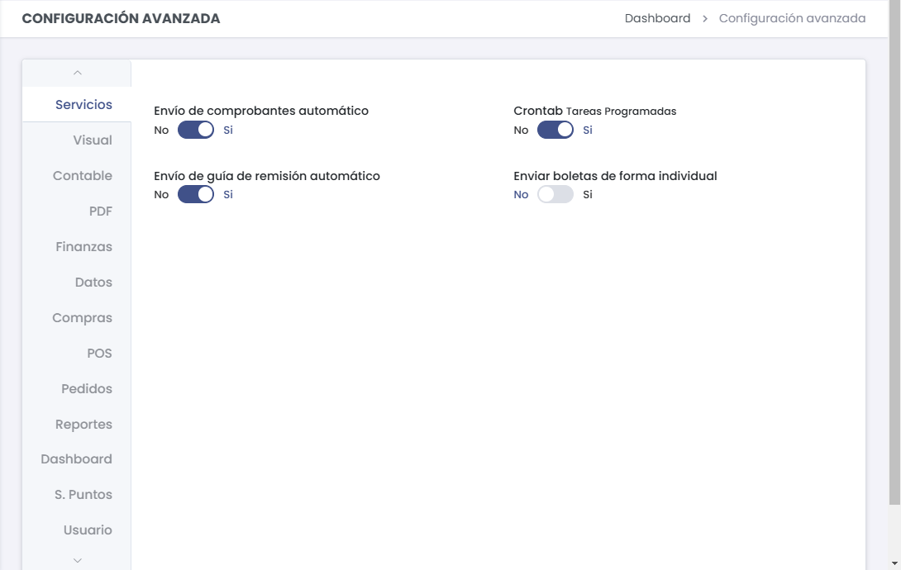  

- **Envío de comprobantes automático**: Activa el envío automático de facturas y boletas electrónicas.  
- **Envío de guía de remisión automático**: Habilita la generación automática de guías de remisión.  
- **Crontab - Tareas Programadas**: Configura tareas recurrentes mediante crontab.  

---

## **2. Visual**  
> ### 💡 Tip  
> Esta sección permite configurar cómo se visualizan las transacciones y los productos dentro del sistema.  

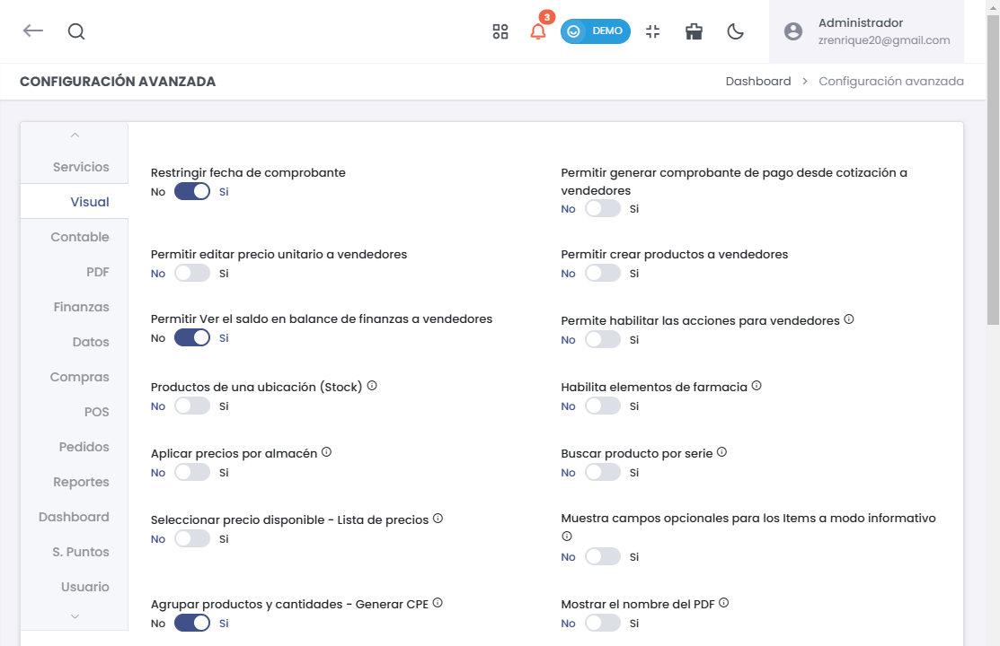  

### **A. Transacciones y Productos**  
- **Separar y ordenar transacciones en caja**:  
  Organiza las transacciones por separado para una mejor gestión.
- **Ordenar transacciones en R. Ingreso**:  
  Clasifica las transacciones dentro del registro de ingresos para mayor claridad.
- **Permitir generar pedidos desde cotización a vendedores**:  
  Facilita la creación directa de pedidos a partir de cotizaciones.
- **Listar productos por almacén**:  
  Muestra los productos disponibles organizados por cada almacén.
- **Restringir selección de serie para vendedor**:  
  Controla qué series de productos pueden ser seleccionadas por los vendedores.
- **Cargar voucher - Pagos**:  
  Permite adjuntar vouchers en los registros de pago para mayor control.

### **B. Búsqueda y Visualización**  
- **Buscar productos por código de fábrica**:  
  Activa la búsqueda de productos utilizando su código de fábrica.
- **Restringir venta de productos**:  
  Limita la venta de ciertos productos según las políticas configuradas.
- **Autocompletar nombre de producto**:  
  Activa la función de autocompletar al ingresar nombres de productos en el sistema.
- **Modo simple de búsqueda**:  
  Simplifica la búsqueda en el sistema para encontrar productos o servicios rápidamente.
- **Visualizar precio de productos en GRE Remitente**:  
  Muestra los precios en la Guía de Remisión Electrónica del remitente.
- **Habilitar búsqueda avanzada**:  
  Permite realizar búsquedas más específicas dentro del sistema.

### **C. Configuración CPE y Despacho**  
- **Agrupar productos y cantidades - Generar CPE**:  
  Consolida productos y cantidades para generar el Comprobante de Pago Electrónico.
- **Habilitar permiso para editar CPE**:  
  Permite modificar un CPE después de ser generado.
- **Mostrar el nombre del PDF**:  
  Visualiza el nombre asignado al archivo PDF en la plataforma.
- **Permitir colocar dirección de llegada en guía**:  
  Agrega la dirección de destino en la guía de remisión.
- **Asignar dirección de partida - guía**:  
  Define la dirección de origen para las guías de despacho.
- **Mostrar totales en el listado de CPE**:  
  Agrega un campo de totales en las listas de CPE.
- **Mostrar precio de última venta**:  
  Visualiza el precio al que se realizó la venta anterior del mismo producto.
- **Días de plazo de envío**:  
  Define el tiempo máximo para el envío de productos o documentos (configurable en días).
- **Filtrar clientes según vendedor asignado**:  
  Muestra solo los clientes vinculados con un vendedor específico.

### **D. Funcionalidades Adicionales**  
- **Permitir crear productos a vendedores**:  
  Habilita la opción de que los vendedores puedan añadir nuevos productos al sistema.
- **Permitir editar precio unitario a vendedores**:  
  Otorga a los vendedores la capacidad de modificar precios unitarios en las transacciones.
- **Permitir generar comprobante de pago desde cotización a vendedores**:  
  Facilita la creación de comprobantes de pago directamente desde una cotización.
- **Productos de una ubicación (Stock)**:  
  Muestra los productos disponibles en una ubicación específica.
- **Aplicar precios por almacén**:  
  Define precios diferenciados según el almacén correspondiente.
- **Seleccionar precio disponible - Lista de precios**:  
  Filtra y selecciona precios de productos según su disponibilidad en la lista.
- **Mostrar campos opcionales para los ítems a modo informativo**:  
  Añade información adicional en los ítems sin afectar su operación.
- **Buscar producto por serie**:  
  Facilita la búsqueda de productos mediante su número de serie.
- **Habilitar registro de propinas**:  
  Permite ingresar propinas como parte de las transacciones.
- **Cantidad de elementos en el validador**:  
  Define el número de elementos a mostrar en el validador (por defecto: 20).

---

## **3. Contable**  
> ### 🧾 Contabilidad  
> Asegúrate de tener al día las configuraciones fiscales y monetarias.

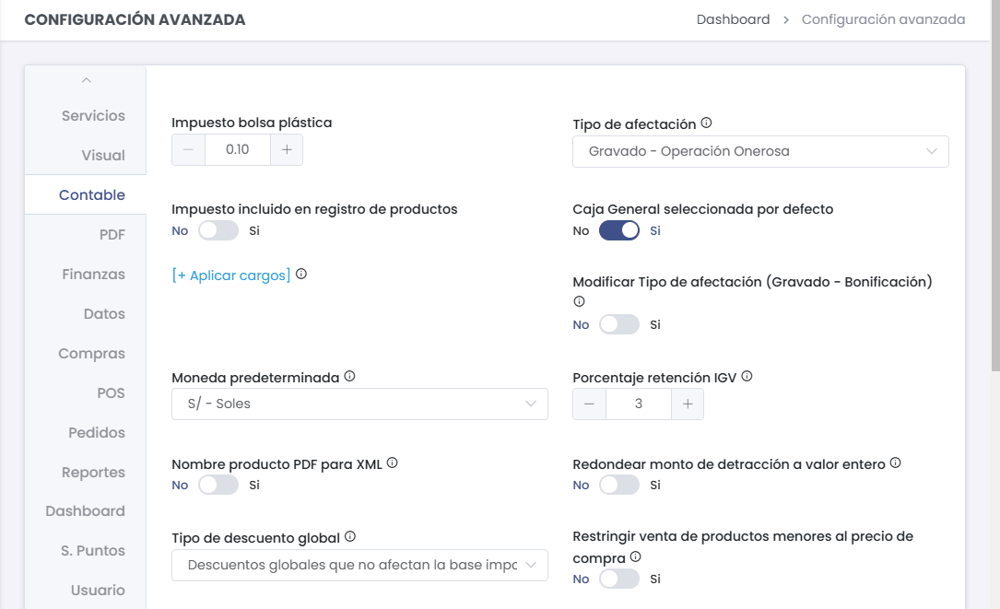

### **A. Configuración Monetaria**  
- **Impuesto bolsa plástica**:  
  Configura el impuesto específico para las bolsas plásticas (por defecto: 0.10 soles).
- **Tipo de afectación**:  
  Define la categoría de afectación del impuesto (por ejemplo: Gravado - Operación Onerosa).
- **Impuesto incluido en registro de productos**:  
  Determina si los precios de los productos ya incluyen el impuesto.
- **Caja General seleccionada por defecto**:  
  Habilita la selección automática de la caja general en todas las operaciones.
- **Modificar Tipo de afectación (Gravado - Bonificación)**:  
  Permite cambiar entre los tipos de afectación fiscal cuando se aplican promociones o bonificaciones.
- **Moneda predeterminada**:  
  Selecciona la moneda principal para las transacciones (por defecto: S/ - Soles).
- **Porcentaje retención IGV**:  
  Configura el porcentaje de retención de IGV en las operaciones (por defecto: 3%).
- **Redondear monto de detracción a valor entero**:  
  Habilita el redondeo de las detracciones al valor entero más cercano.
- **Restringir venta de productos menores al precio de compra**:  
  Bloquea la venta de productos cuyo precio de venta sea inferior al costo de adquisición.

---

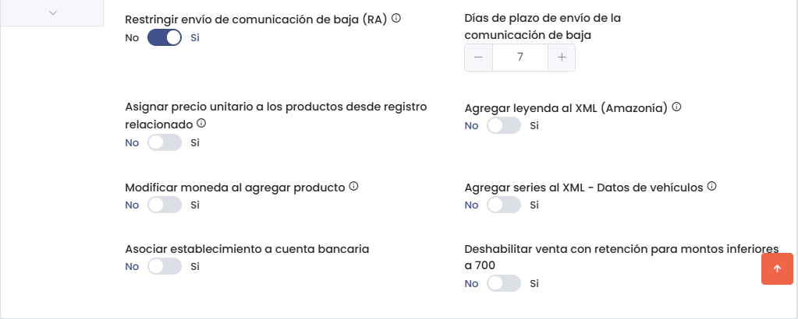

### **B. Comunicación de Baja**  
- **Restringir envío de comunicación de baja (RA)**:  
  Controla si se permite o no el envío de comunicaciones de baja para documentos específicos.
- **Días de plazo de envío de la comunicación de baja**:  
  Define el número máximo de días permitidos para enviar la baja (valor predeterminado: 7 días).
- **Agregar leyenda al XML (Amazonía)**:  
  Añade leyendas específicas en los documentos XML para operaciones realizadas en la Amazonía.

### **C. Configuración Adicional**  
- **Asignar precio unitario a los productos desde registro relacionado**:  
  Permite establecer los precios unitarios de productos basados en registros anteriores.
- **Modificar moneda al agregar producto**:  
  Facilita la selección o modificación de la moneda al añadir nuevos productos al sistema.
- **Asociar establecimiento a cuenta bancaria**:  
  Relaciona un establecimiento o punto de venta específico con una cuenta bancaria.
- **Agregar series al XML - Datos de vehículos**:  
  Incorpora información sobre vehículos en los documentos XML.
- **Deshabilitar venta con retención para montos inferiores a 700**:  
  Bloquea la retención de impuestos para ventas con un monto inferior a 700 soles.

---

## **4. PDF**  
> ### 📄 PDF  
> Personaliza los documentos generados en PDF.  

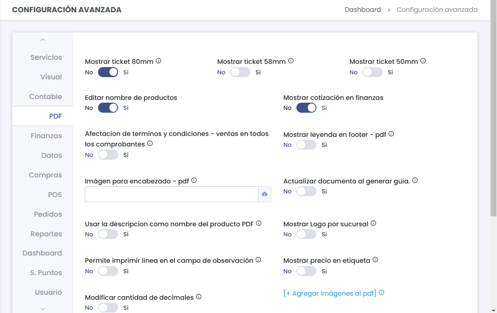  

### **A. Opciones Básicas**  
- **Permitir imprimir línea en observación**: Habilita comentarios adicionales en los comprobantes.  
- **Mostrar precio en etiqueta**: Visualiza precios en las etiquetas generadas.  
- **Modificar cantidad de decimales**: Define precisión decimal en los documentos.  
- **Términos y condiciones (Cotización/Ventas)**: Configura términos para cotizaciones y ventas.  

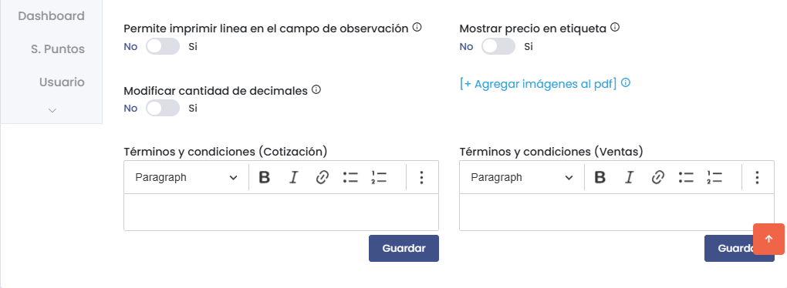  

### **B. Configuración Avanzada**  
- **Mostrar ticket (80mm, 58mm, 50mm)**: Selecciona formato de impresión para tickets.  
- **Mostrar logo por sucursal**: Permite añadir logos específicos según la sucursal.  
- **Mostrar cotización en finanzas**: Habilita la visualización de cotizaciones en el módulo financiero.  
- **Imagen para encabezado**: Personaliza los encabezados de los documentos PDF.  
- **Usar descripción como nombre**: Muestra la descripción completa en los PDF.  

---

## **5. POS (Punto de Venta)**  
> ### 🛒 POS  
> Gestiona ventas de forma eficiente.

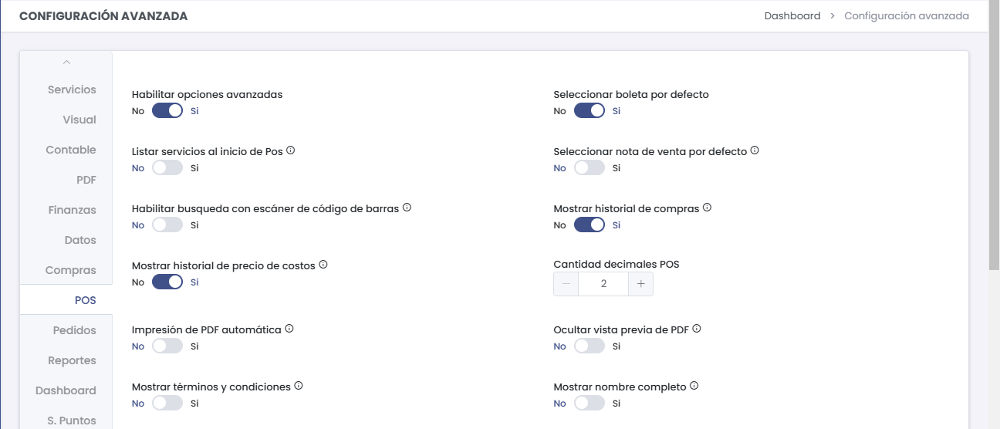

### **A. Configuración Básica**  
- **Habilitar restricción para descuento**:  
  Controla los límites de descuento aplicados en las transacciones para evitar descuentos excesivos.
- **Habilitar Agente de ventas**:  
  Asigna agentes a las transacciones para llevar un seguimiento detallado de las ventas por agente.
- **Activar descuento por cliente**:  
  Permite aplicar descuentos personalizados en función del cliente.
- **Agregar producto al seleccionar precio**:  
  Añade automáticamente el producto al carrito cuando se selecciona su precio.
- **Habilitar vista categorías y productos**:  
  Facilita la navegación y búsqueda de productos mediante la organización por categorías.
- **Modificar tipo de afectación**:  
  Cambia la afectación fiscal del producto en las transacciones, como bonificaciones o promociones.
- **Habilitar ticket de despacho**:  
  Activa la emisión de tickets de despacho para acompañar el proceso de venta.
- **Convertir a CPE**:  
  Facilita la conversión automática de las transacciones a Comprobantes de Pago Electrónicos (CPE).
- **Seleccionar boleta por defecto**:  
  Define la boleta como el documento predeterminado para las ventas.
- **Seleccionar nota de venta por defecto**:  
  Establece si la nota de venta será el documento predeterminado en el POS.

---

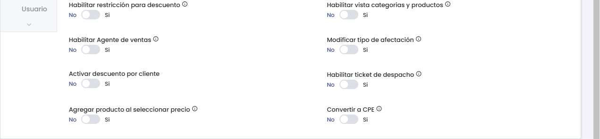

### **B. Funcionalidades Avanzadas**  
- **Habilitar opciones avanzadas**:  
  Activa configuraciones adicionales que permiten personalizar el punto de venta.
- **Listar servicios al inicio de POS**:  
  Muestra los servicios disponibles desde el inicio del módulo de POS.
- **Habilitar búsqueda con escáner de código de barras**:  
  Permite utilizar escáneres para agilizar la búsqueda de productos.
- **Mostrar historial de compras**:  
  Muestra las compras anteriores realizadas por el cliente para un mejor seguimiento.
- **Mostrar historial de precio de costos**:  
  Permite acceder al historial de costos de los productos en el sistema.
- **Cantidad de decimales POS**:  
  Define la precisión decimal para los precios mostrados en el POS (por defecto: 2 decimales).
- **Impresión de PDF automática**:  
  Automatiza la generación e impresión de PDFs al finalizar las ventas.
- **Ocultar vista previa de PDF**:  
  Desactiva la vista previa del PDF para agilizar el flujo de trabajo.
- **Mostrar términos y condiciones**:  
  Incluye términos y condiciones directamente en los comprobantes de venta.
- **Mostrar nombre completo**:  
  Visualiza el nombre completo del cliente o del vendedor en los documentos generados.

---

## **6. Compras**  
> ### 🛍️ Compras  
> Gestiona la configuración avanzada relacionada con las compras.

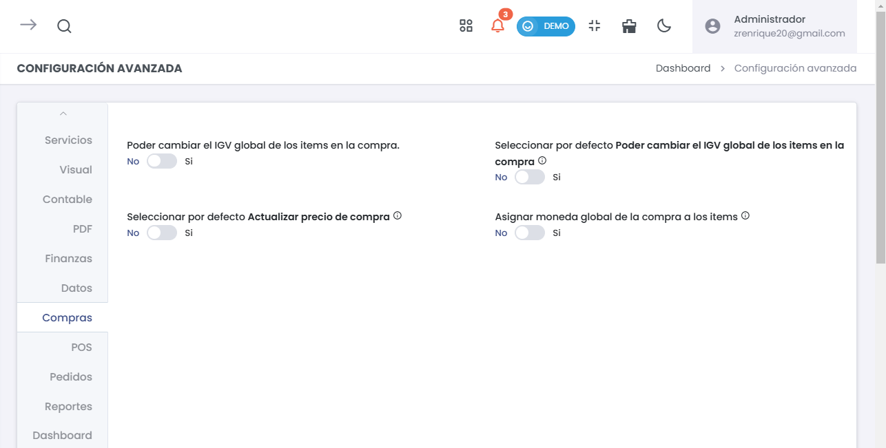

### **Configuración Básica de Compras**  
- **Poder cambiar el IGV global de los ítems en la compra**:  
  Permite modificar el valor del IGV global aplicado a todos los ítems en una compra, otorgando flexibilidad en las transacciones.

- **Seleccionar por defecto Poder cambiar el IGV global de los ítems en la compra**:  
  Define si la opción de cambiar el IGV global estará activada por defecto en cada operación de compra.

- **Seleccionar por defecto Actualizar precio de compra**:  
  Establece si los precios de los productos se actualizarán automáticamente al registrar una nueva compra, reflejando los costos más recientes.

- **Asignar moneda global de la compra a los ítems**:  
  Permite que la moneda global definida en la compra se aplique automáticamente a todos los ítems, asegurando coherencia en la facturación.

## **7. Finanzas**  
> ### ⚠️ Importante  
> Configuración de penalidades y pagos.  

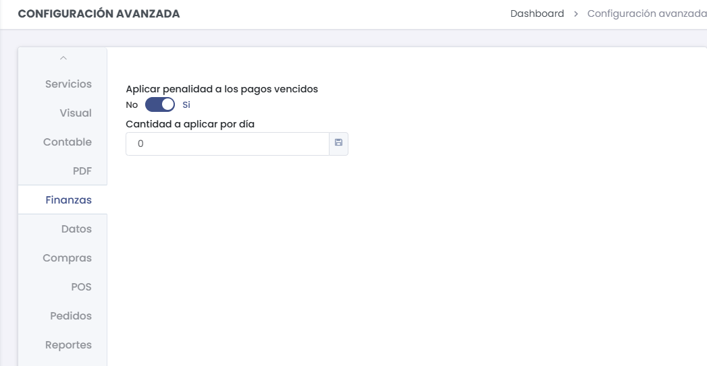

- **Aplicar penalidad a pagos vencidos**: Activa penalizaciones automáticas.  
- **Cantidad a aplicar por día**: Define el monto o porcentaje de penalización diaria.  
- **Mostrar cotización en finanzas**: Habilita la integración de cotizaciones en el módulo financiero.  

---

## **8. Datos**  
> ### 📊 Datos  
> Gestión de datos y validaciones.  

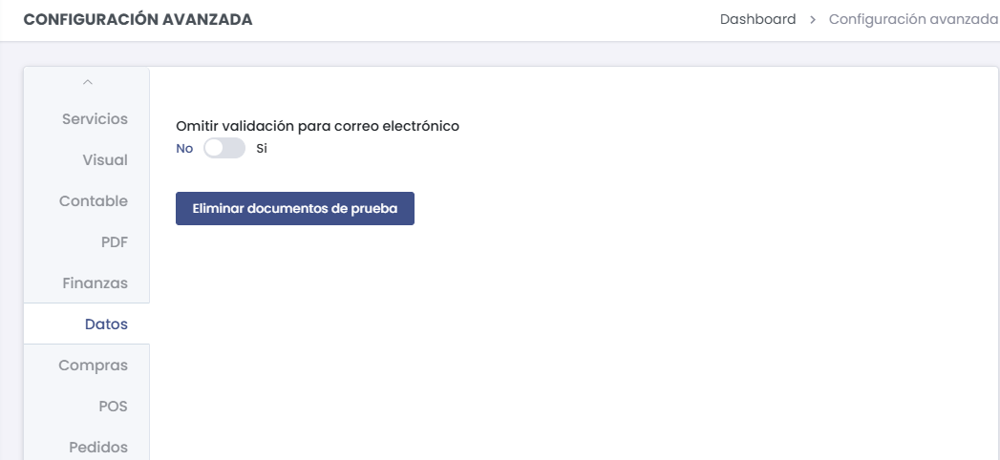

- **Omitir validación para correo**: Elimina validaciones en pruebas.  
- **Eliminar documentos de prueba**: Limpia documentos de prueba del sistema.  
- **Validar documentos**: Verifica la integridad de los documentos.  

---

## **9. Pedidos**  
> ### 📦 Pedidos  
> Gestión de pedidos y cotizaciones.  

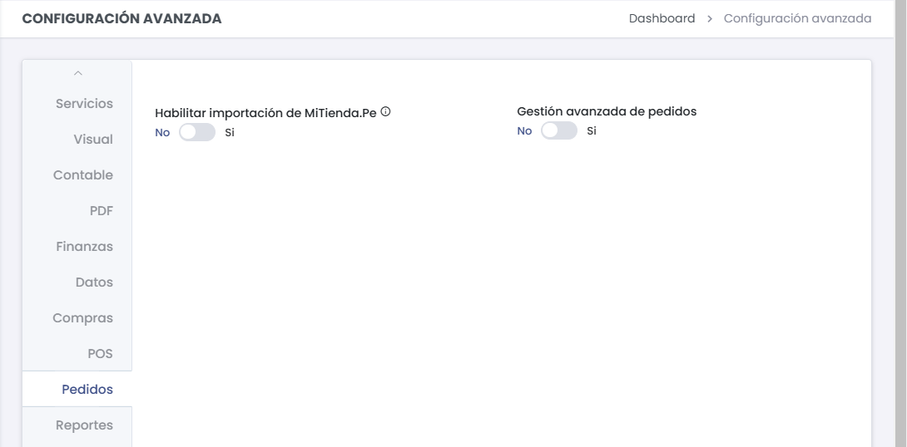

- **Habilitar importación de MiTienda.Pe**: Sincroniza con plataformas externas.  
- **Gestión avanzada de pedidos**: Activa funciones adicionales para pedidos.  
- **Convertir cotización a pedido**: Facilita la conversión de documentos.  

---

## **10. Reportes**  
> ### 📈 Reportes  
> Generación de informes detallados.  

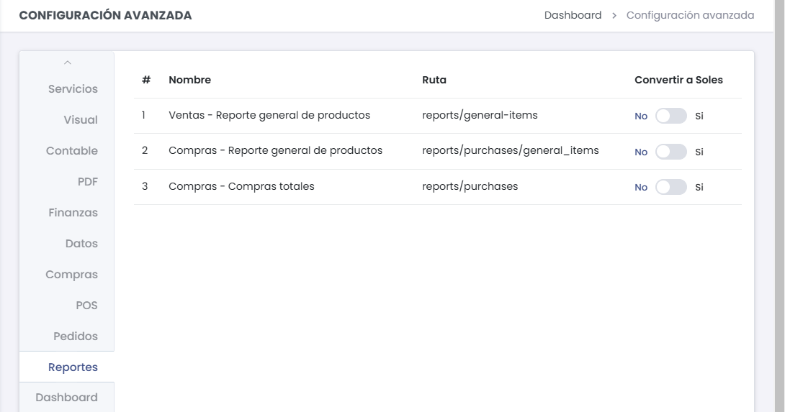

- **Ventas - Reporte general**: Analiza ventas por producto.  
- **Compras - Reporte general**: Analiza las compras realizadas.  
- **Reportes consolidados**: Genera informes integrados.  

---

## **11. Dashboard**  
> ### 🖥️ Dashboard  
> Visualización general de datos.  

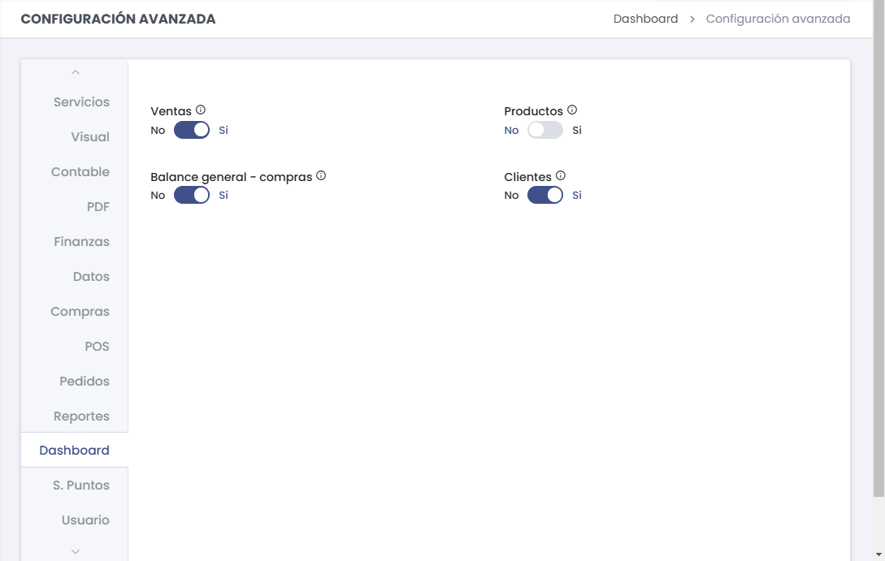

- **Ventas**: Muestra estadísticas de ventas.  
- **Clientes**: Visualiza datos relevantes de los clientes.  
- **Balance general**: Resume las operaciones financieras.  
- **Productos**: Monitorea el inventario disponible.  

---

## **12. S. Puntos**  
> ### 🎯 Sistema de Puntos  
> Fidelización de clientes mediante puntos.  

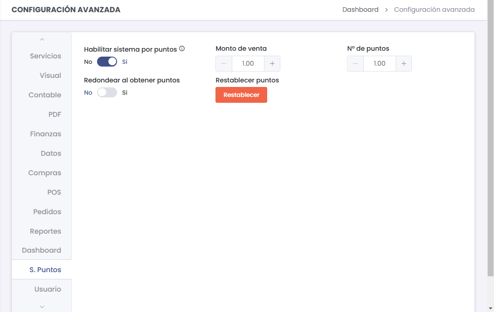

- **Habilitar sistema por puntos**: Activa la acumulación de puntos por compras.  
- **Restablecer puntos**: Reinicia los contadores de puntos acumulados.  
- **Configurar valor de puntos**: Define la equivalencia monetaria de los puntos.  

---

## **13. Usuario**  
> ### 👥 Usuarios  
> Gestión de accesos y seguridad.  

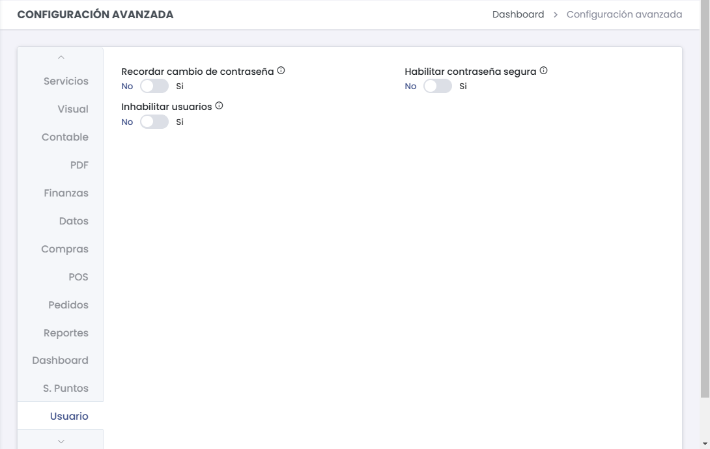

- **Recordar cambio de contraseña**: Solicita actualizaciones periódicas de contraseña.  
- **Habilitar contraseña segura**: Establece políticas de seguridad estrictas.  
- **Inhabilitar usuarios**: Gestiona accesos inactivos en el sistema.  

