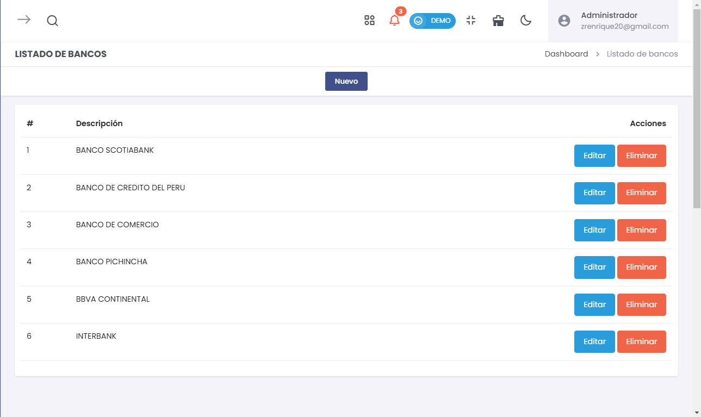

# Listado de Bancos  
> ### 🏦 Configuración de Bancos  
Gestiona y administra los bancos que se utilizarán en el sistema para operaciones financieras. Esta sección permite agregar, editar y eliminar bancos registrados.

---

## **Vista del Listado de Bancos**  
> ### 📝 Configuración del Listado de Bancos  
Aquí se muestra la lista completa de bancos registrados con opciones para su edición y eliminación.

  

- **Acciones Disponibles**:  
  - **Editar**: Modifica la información del banco registrado.  
  - **Eliminar**: Borra el banco de la lista.  

- **Añadir Nuevo Banco**:  
  Utiliza el botón **"Nuevo"** para registrar un banco adicional en el sistema.

---

## **Formulario para Nuevo Banco**  
> ### 📝 Configuración de Nuevo Banco  
El formulario de creación permite agregar un nuevo banco al sistema ingresando su descripción.

  

- **Campos del Formulario**:  
  - **Descripción**: Ingrese el nombre o descripción del banco.  

- **Botones Disponibles**:  
  - **Guardar**: Almacena la información del nuevo banco.  
  - **Cancelar**: Descarta los cambios realizados en el formulario.

---

## **Gestión de Bancos**  
> ### 📝 Administración del Listado de Bancos  
- **Agregar Bancos**:  
  Permite registrar nuevos bancos que estarán disponibles para las operaciones financieras.

- **Editar Bancos**:  
  Modifica la información de bancos ya registrados para mantener los datos actualizados.

- **Eliminar Bancos**:  
  Elimina bancos que ya no serán utilizados en el sistema.

---

Esta sección facilita la gestión eficiente de los bancos utilizados por la empresa para todas las operaciones financieras. Con opciones claras para agregar, editar y eliminar, se asegura que los datos siempre estén actualizados y alineados con las necesidades del negocio.
