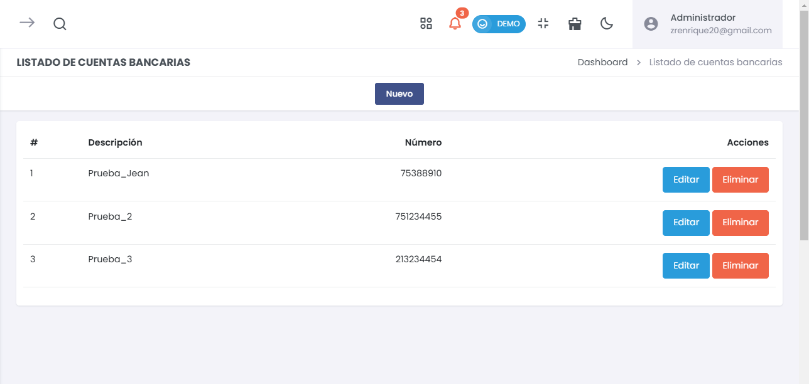
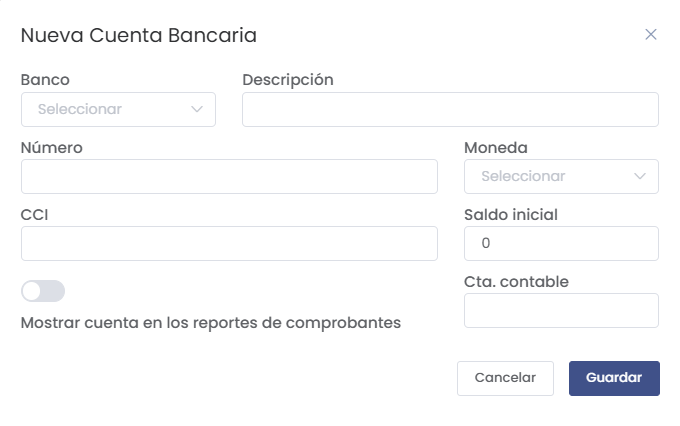
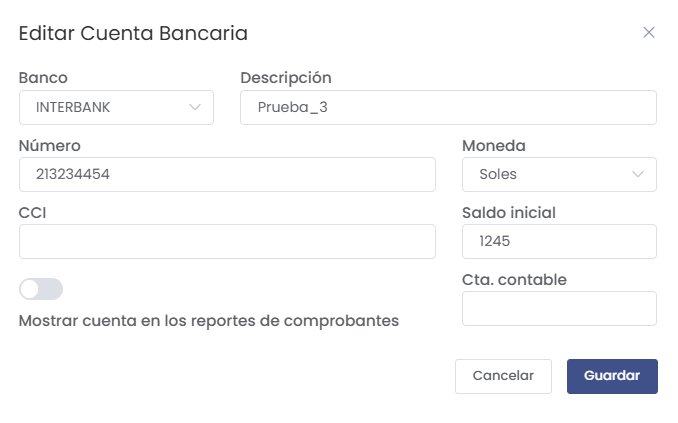

# Listado de Cuentas Bancarias
> ### 🏦 Configuración de Cuentas Bancarias  
Administra y organiza las cuentas bancarias utilizadas en el sistema. Esta sección permite registrar nuevas cuentas, editar las existentes y mantener actualizada la información bancaria.

---

## Vista del Listado de Cuentas Bancarias 
> ### 📝 Configuración del Listado de Cuentas Bancarias  
En esta sección se muestra un listado con las cuentas bancarias registradas, cada una con su número y acciones disponibles para su edición o eliminación.

  

- **Acciones Disponibles**:  
  - **Editar**: Modifica los detalles de la cuenta bancaria seleccionada.  
  - **Eliminar**: Borra la cuenta bancaria del sistema.  

- **Añadir Nueva Cuenta Bancaria**:  
  Utiliza el botón **"Nuevo"** para registrar una nueva cuenta bancaria en el sistema.

---

## Formulario para Nueva Cuenta Bancaria
> ### 📝 Configuración de Nueva Cuenta Bancaria  
El formulario permite ingresar los datos necesarios para registrar una nueva cuenta bancaria.

  

- **Campos del Formulario**:  
  - **Banco**: Selecciona el banco al cual pertenece la cuenta.  
  - **Descripción**: Ingrese una breve descripción de la cuenta.  
  - **Número**: Número de cuenta bancaria.  
  - **CCI**: Código de Cuenta Interbancario.  
  - **Moneda**: Selecciona la moneda de la cuenta (Soles, Dólares, etc.).  
  - **Saldo Inicial**: Registra el saldo inicial de la cuenta.  
  - **Cta. Contable**: Define la cuenta contable asociada.  
  - **Mostrar en Reportes**: Activa la opción para incluir la cuenta en los reportes de comprobantes.

- **Botones Disponibles**:  
  - **Guardar**: Almacena la nueva cuenta bancaria.  
  - **Cancelar**: Descarta los cambios realizados en el formulario.

---

## Editar Cuenta Bancaria  
> ### 📝 Configuración para Editar Cuenta Bancaria  
El formulario de edición permite actualizar los datos de una cuenta bancaria registrada.

  

- **Campos Disponibles**:  
  - **Banco**: Selecciona el banco correspondiente.  
  - **Descripción**: Modifica la descripción de la cuenta.  
  - **Número**: Actualiza el número de cuenta bancaria.  
  - **CCI**: Modifica el CCI de la cuenta.  
  - **Moneda**: Cambia la moneda de la cuenta.  
  - **Saldo Inicial**: Ajusta el saldo inicial.  
  - **Cta. Contable**: Modifica la cuenta contable asociada.  
  - **Mostrar en Reportes**: Activa o desactiva la opción de mostrar la cuenta en los reportes.

- **Botones Disponibles**:  
  - **Guardar**: Almacena los cambios realizados.  
  - **Cancelar**: Descarta los cambios realizados.

---

Esta sección facilita la gestión eficiente de las cuentas bancarias, garantizando que la información esté siempre actualizada y disponible para las operaciones del negocio.
