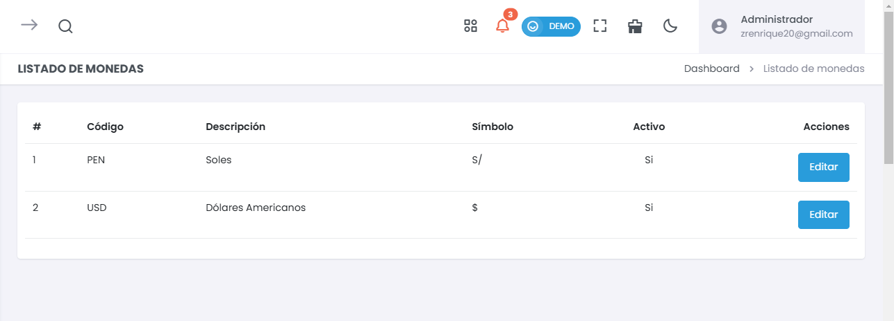
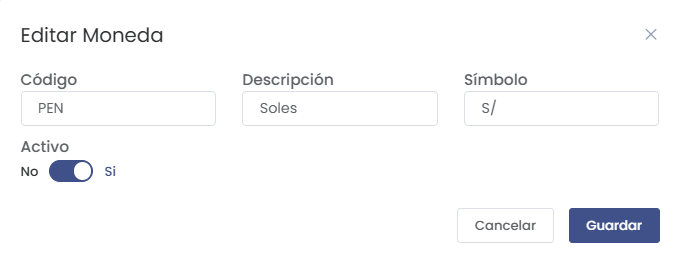

# Listado de Monedas  
> ### 💱 Gestión de Monedas  
Administra y personaliza las monedas disponibles en el sistema. Esta sección permite definir las monedas aceptadas para las transacciones y su activación dentro del sistema.

---

## 1. Listado de Monedas
En esta vista se muestran las monedas registradas, junto con su código, descripción, símbolo y estado de activación.

  

- **Código**:  
  Representa la abreviación oficial de la moneda (ej.: PEN para Soles, USD para Dólares).  
- **Descripción**:  
  Define el nombre completo de la moneda.  
- **Símbolo**:  
  Indica el símbolo monetario utilizado (ej.: S/ para Soles, $ para Dólares).  
- **Activo**:  
  Muestra si la moneda está habilitada para transacciones.  
- **Acciones**:  
  - **Editar**: Permite modificar la información de la moneda.

---

## 2. Edición de Moneda
Desde esta vista, se pueden realizar cambios en los datos de una moneda existente.

  

- **Código**:  
  Modifica el código de la moneda.  
- **Descripción**:  
  Cambia la descripción o nombre de la moneda.  
- **Símbolo**:  
  Edita el símbolo de la moneda.  
- **Activo**:  
  Permite activar o desactivar la moneda para transacciones.  
- **Guardar**:  
  Al finalizar los cambios, presiona **Guardar** para aplicarlos.  
- **Cancelar**:  
  Cancela la edición sin guardar cambios.

---

Esta sección de configuración asegura que las monedas utilizadas se ajusten a las necesidades del negocio, facilitando su gestión y control en las transacciones diarias.
