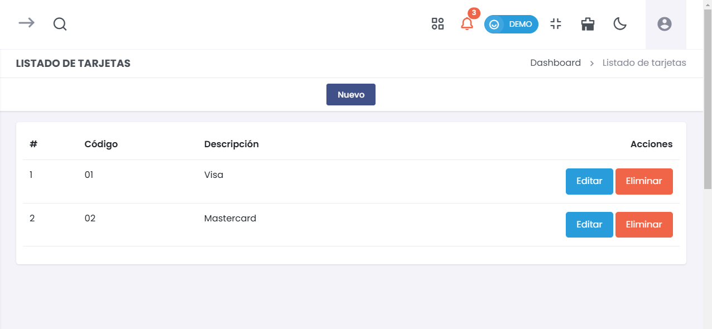
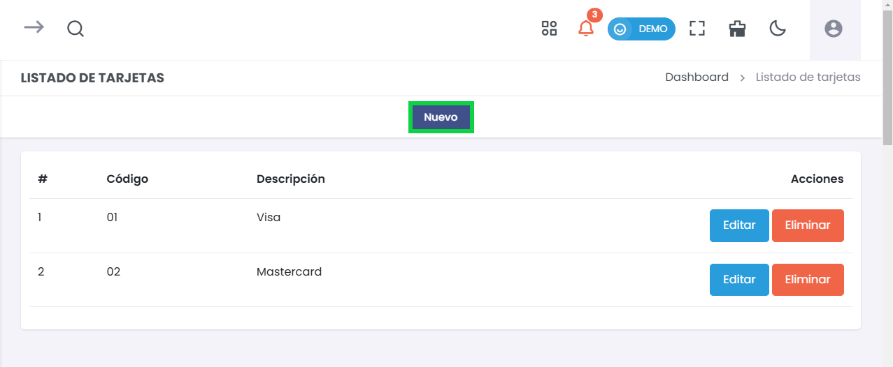
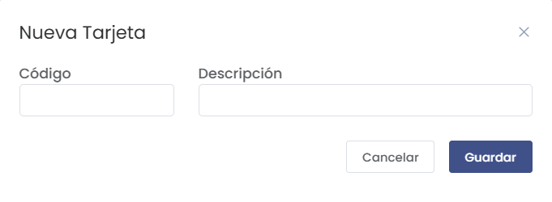
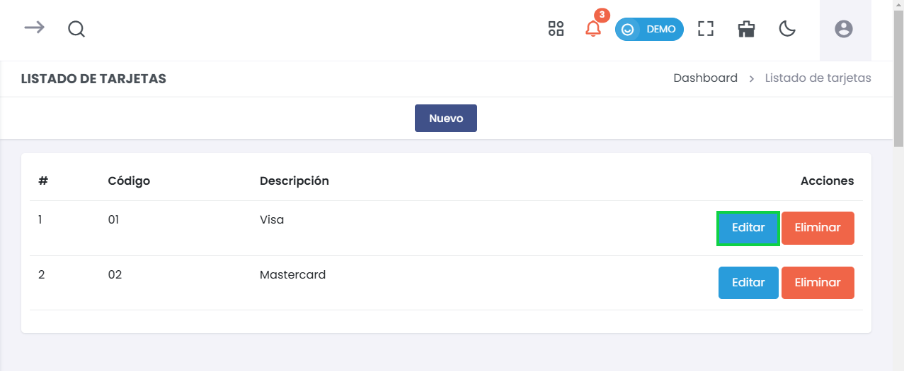

# Listado de Tarjetas  
> ### 💳 Gestión de Tarjetas  
Administra las tarjetas disponibles en el sistema para asociarlas a transacciones financieras. Esta sección permite agregar, editar y eliminar tarjetas, facilitando su uso en operaciones de pago.

---

## 1. Listado de Tarjetas
Consulta y administra las tarjetas disponibles en el sistema.

  

- **Código**:  
  Identificación única de cada tarjeta en el sistema.  
- **Descripción**:  
  Nombre o tipo de tarjeta (ej.: Visa, Mastercard).  
- **Acciones**:  
  - **Editar**: Modifica los datos de una tarjeta existente.  
  - **Eliminar**: Elimina la tarjeta del listado.

---

## 2. Nueva Tarjeta
Agrega una nueva tarjeta al sistema.

1. Hacer clic en **Nuevo** en la parte superior central de la pantalla.

Aparecera el siguiente formulario :

  

- **Código**:  
  Ingrese el código único para identificar la tarjeta.  
- **Descripción**:  
  Nombre o descripción de la tarjeta.  
- **Guardar**:  
  Almacena la nueva tarjeta en el sistema.  
- **Cancelar**:  
  Desestima la creación y cierra la ventana sin guardar cambios.

---

## Proceso de Edición
Modifica la información de una tarjeta ya existente en el sistema.

1. **Acceder al listado de tarjetas** desde el menú lateral.
2. Hacer clic en **Editar** al lado de la tarjeta correspondiente.

  

3. Realice los cambios necesarios en el **código** o **descripción**.
4. Hacer clic en **Guardar** para confirmar los cambios.

---

