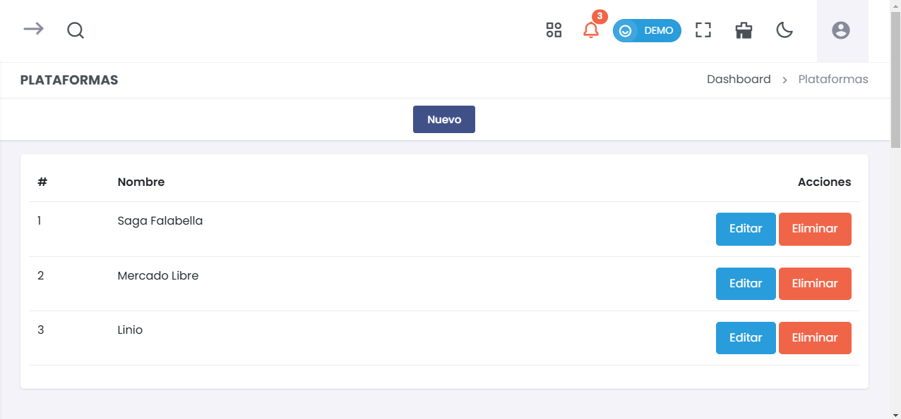
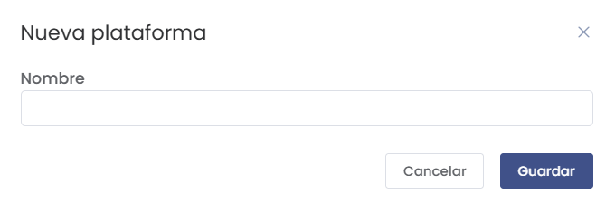

# Plataformas  
> ### 🛍️ Configuración de Plataformas  
Administra y personaliza las plataformas de ventas donde la empresa realiza sus transacciones. Esta sección permite agregar, editar y eliminar plataformas para una mejor gestión de los puntos de venta externos.

---

## 1. Listado de Plataformas  
Visualiza y gestiona las plataformas disponibles en el sistema.

  

- **Nombre**:  
  Muestra el nombre de cada plataforma configurada en el sistema.
- **Acciones**:  
  - **Editar**: Permite modificar la información de la plataforma seleccionada.
  - **Eliminar**: Borra la plataforma seleccionada del sistema.

### Agregar una Nueva Plataforma  
Haz clic en el botón **Nuevo** para agregar una plataforma nueva.

  

- **Nombre**:  
  Campo para ingresar el nombre de la nueva plataforma.

  **Botones**:
  - **Guardar**: Guarda la nueva plataforma.
  - **Cancelar**: Cancela el proceso de creación.

---

### Editar una Plataforma Existente  
Selecciona la opción **Editar** en la plataforma que deseas modificar.

  

- **Nombre**:  
  Modifica el nombre de la plataforma seleccionada.

  **Botones**:
  - **Guardar**: Guarda los cambios realizados.
  - **Cancelar**: Cancela el proceso de edición.

---

Esta sección de **Plataformas** facilita la gestión de los distintos canales de ventas que utiliza la empresa, permitiendo una mayor flexibilidad y control en los puntos de contacto externos.
