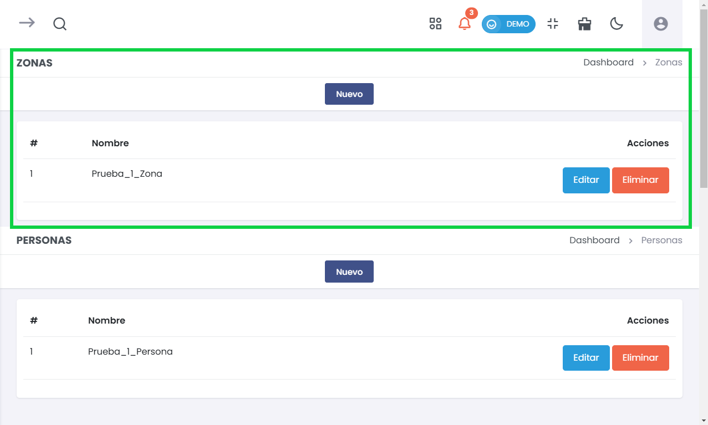
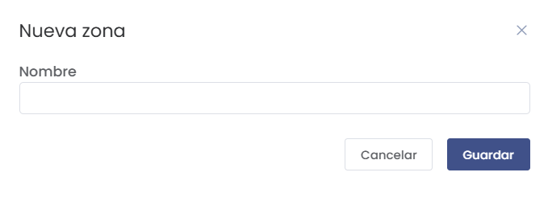
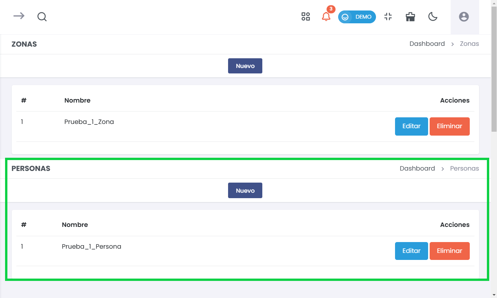
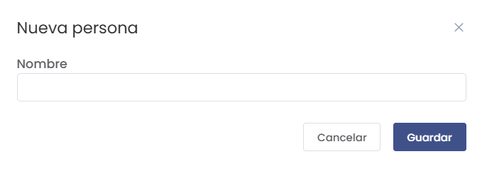
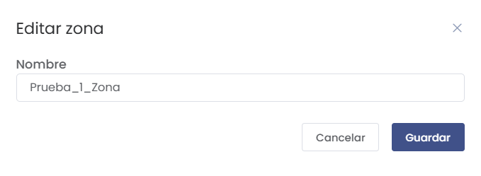

# Pedidos

> ### 📦 Configuración de Pedidos
Administra y configura las opciones de gestión de zonas y personas relacionadas con los pedidos en el sistema. Esta sección permite definir áreas específicas y asignar responsables o contactos, alineando los pedidos a las necesidades operativas del negocio.

---

## 1. Zonas

Administra y organiza las diferentes zonas que se encuentran dentro del sistema.

- **# (Número)**:  
  Identificador numérico de cada zona en la lista.
  
- **Nombre**:  
  Nombre de la zona asignada.

- **Acciones**:  
  - **Editar**: Permite modificar la información de la zona seleccionada.
  - **Eliminar**: Elimina la zona de la lista de registros.

### **Agregar una Nueva Zona**

Para añadir una nueva zona, selecciona **Nuevo** y completa los datos solicitados.

- **Nombre**:  
  Campo para ingresar el nombre de la nueva zona.
  
- **Guardar**:  
  Confirma la creación de la zona.

---

## 2. Personas

Administra las personas asignadas a zonas específicas dentro de la plataforma.

- **# (Número)**:  
  Identificador numérico de cada persona en la lista.
  
- **Nombre**:  
  Nombre asignado a la persona.

- **Acciones**:  
  - **Editar**: Permite modificar la información de la persona seleccionada.
  - **Eliminar**: Elimina la persona de la lista de registros.

### **Agregar una Nueva Persona**

Para añadir una nueva persona, selecciona **Nuevo** y completa los datos solicitados.

- **Nombre**:  
  Campo para ingresar el nombre de la nueva persona.
  
- **Guardar**:  
  Confirma la creación de la persona.

---

## Editar Información de Zonas y Personas

Selecciona la opción **Editar** en la fila correspondiente para modificar los datos de una zona o persona existente.

- **Nombre**:  
  Campo para actualizar el nombre de la zona o persona.
  
- **Guardar**:  
  Confirma las modificaciones realizadas.

---

Esta sección de **Pedidos** facilita la gestión de áreas geográficas y contactos relacionados, mejorando la organización y asignación de responsabilidades dentro del sistema.
