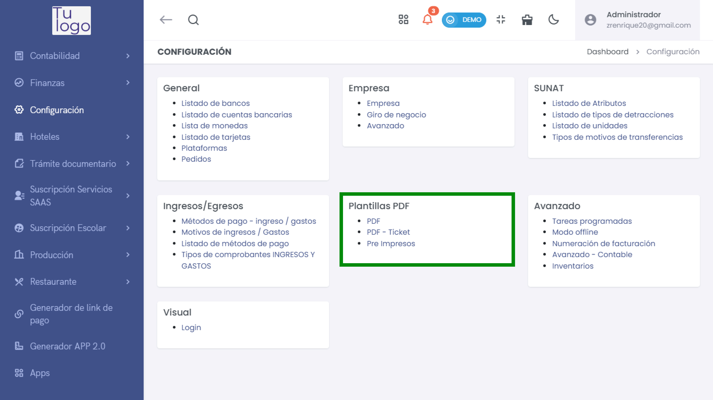
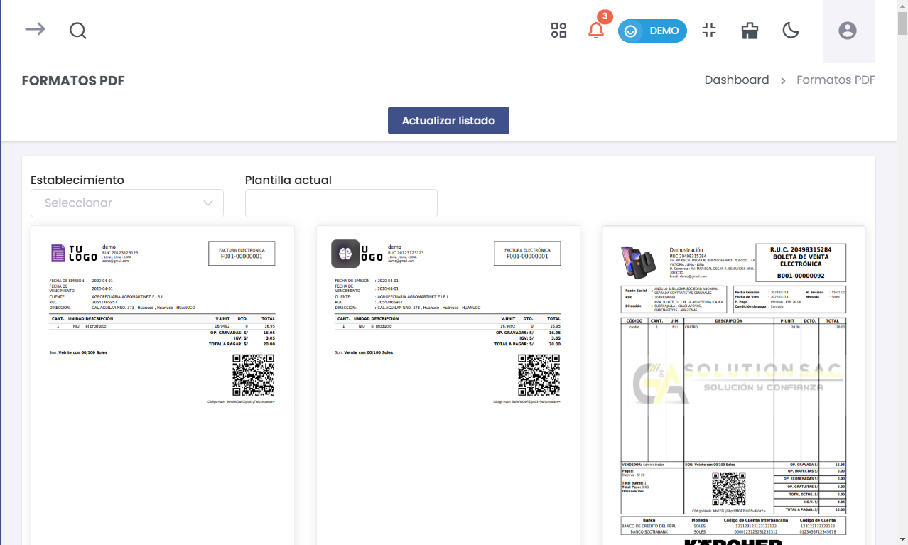
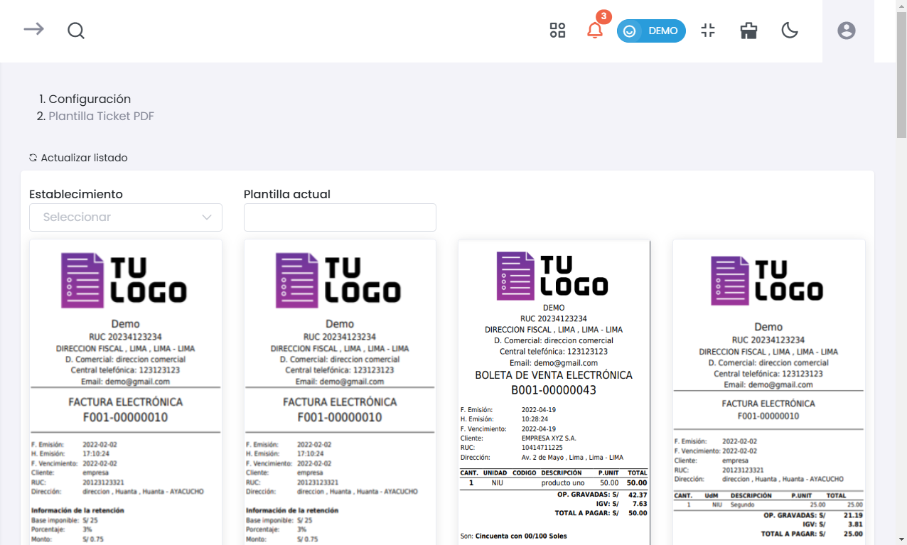
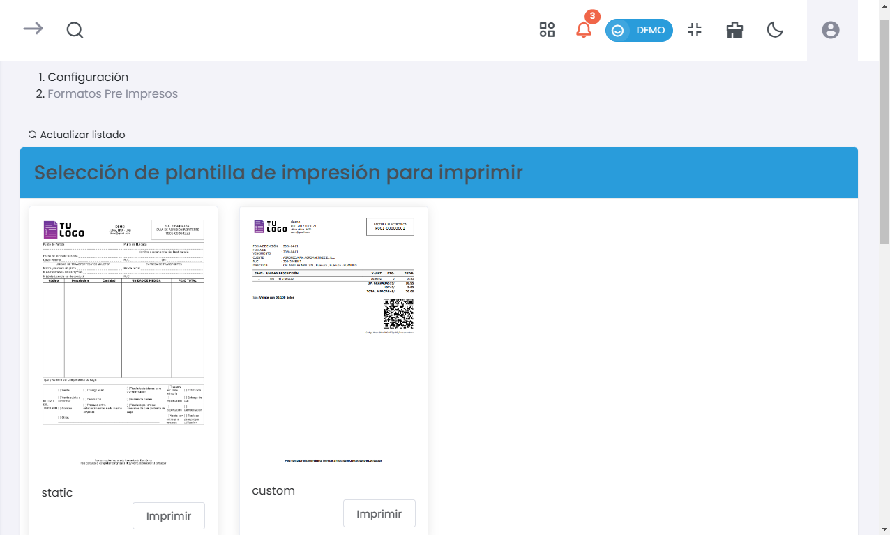

# Plantillas PDF 
> ### 📝 Configuración de Plantillas PDF  
Administra y personaliza los formatos de impresión en PDF utilizados en el sistema. Esta sección permite definir plantillas generales, tickets y preimpresos, alineando los documentos a las necesidades operativas del negocio.

---

## **Resumen de Plantillas PDF**  
> ### 📝 Configuración del Resumen de Plantillas PDF  
La sección de **Plantillas PDF** está dividida en las siguientes categorías:

  
- **PDF**: Configuración de formatos generales para documentos PDF.  
- **PDF - Ticket**: Configuración específica para la impresión de tickets en PDF.  
- **Pre Impresos**: Definición de plantillas preimpresas para documentos específicos.

---

## **1. Formatos PDF**  
> ### 📝 Configuración de Formatos PDF  
Configura los formatos de PDF utilizados para la emisión de comprobantes.

  

- **Establecimiento**:  
  Permite seleccionar el establecimiento para el cual se aplicará la plantilla PDF.  
- **Plantilla Actual**:  
  Visualiza la plantilla activa para el establecimiento seleccionado.  
- **Actualizar Listado**:  
  Utiliza esta opción para recargar el listado de plantillas disponibles.

---

## **2. Selección de Plantilla Pre Impresos**  
> ### 📝 Configuración de Plantilla Pre Impresos  
Selecciona el tipo de formato preimpreso para la impresión de comprobantes.

  

- **Visualización de Plantillas Disponibles**:  
  Muestra las plantillas disponibles, diferenciadas por tipo:  
  - **static**: Formato estático.  
  - **custom**: Plantilla personalizada.  

- **Botón Imprimir**:  
  Cada plantilla incluye un botón de **Imprimir** para generar el documento con el formato seleccionado.  

---

## **3. Plantilla Ticket PDF**  
> ### 📝 Configuración de Plantilla Ticket PDF  
Configura las plantillas específicas para la impresión de tickets en formato PDF.

  

- **Establecimiento**:  
  Selecciona el establecimiento para aplicar la plantilla de ticket.  
- **Plantilla Actual**:  
  Visualiza la plantilla de ticket activa para el establecimiento seleccionado.  
- **Actualizar Listado**:  
  Utiliza esta opción para recargar el listado de plantillas disponibles.

---

> ### 📝 Configuración de la Presentación  
Esta sección de la configuración permite personalizar la presentación de los comprobantes y tickets emitidos, alineando los documentos al estilo y necesidades de cada establecimiento.
