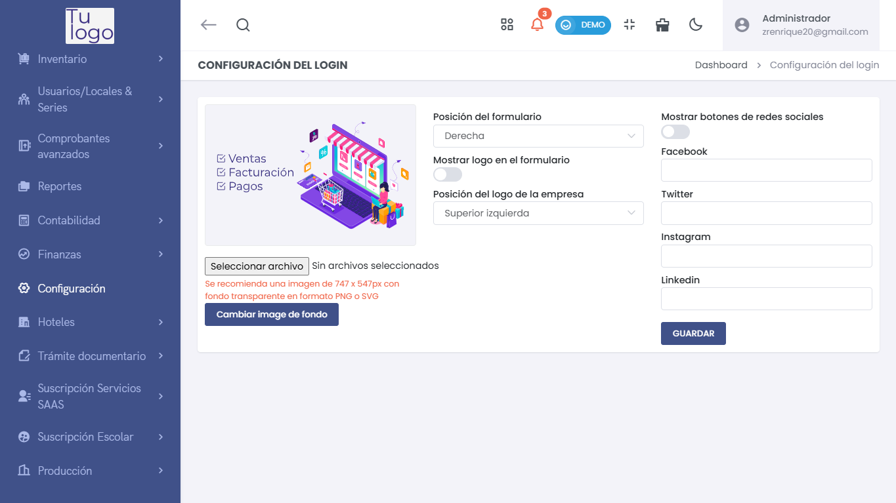

# Login
> ### 🔐 Configuración del Login  
La sección de **Login** permite personalizar la pantalla de inicio de sesión del sistema para ofrecer una experiencia alineada con la identidad de la empresa.

---

### **Opciones de Personalización del Login**  
- **Posición del formulario**:  
  Define en qué parte de la pantalla se ubicará el formulario de inicio de sesión (por ejemplo: derecha o izquierda).  
- **Mostrar logo en el formulario**:  
  Activa o desactiva la opción de mostrar el logotipo de la empresa en el formulario de inicio de sesión.  
- **Posición del logo de la empresa**:  
  Permite elegir la ubicación del logotipo en la pantalla (por ejemplo: superior izquierda o superior derecha).  
- **Cambiar imagen de fondo**:  
  Facilita la carga de una imagen personalizada para el fondo de la pantalla de login. Se recomienda una imagen con resolución de **747 x 547 px** en formato PNG o SVG con fondo transparente.  

---

### **Integración con Redes Sociales**  
- **Mostrar botones de redes sociales**:  
  Permite habilitar la integración con redes sociales para facilitar la autenticación o redirigir a páginas externas.  
- **Facebook**:  
  Ingresa el enlace del perfil o página de Facebook de la empresa.  
- **Twitter**:  
  Ingresa el enlace del perfil de Twitter de la empresa.  
- **Instagram**:  
  Define el enlace del perfil de Instagram.  
- **LinkedIn**:  
  Configura el enlace del perfil o página en LinkedIn.  

---

### **Guardar Cambios**  
Después de realizar los ajustes necesarios, presiona el botón **Guardar** para aplicar los cambios en la configuración del login.

---

Con esta configuración del **Login**, puedes personalizar la apariencia de la pantalla de inicio de sesión y añadir enlaces relevantes a redes sociales, brindando una experiencia alineada con la identidad visual y operativa de la empresa.
