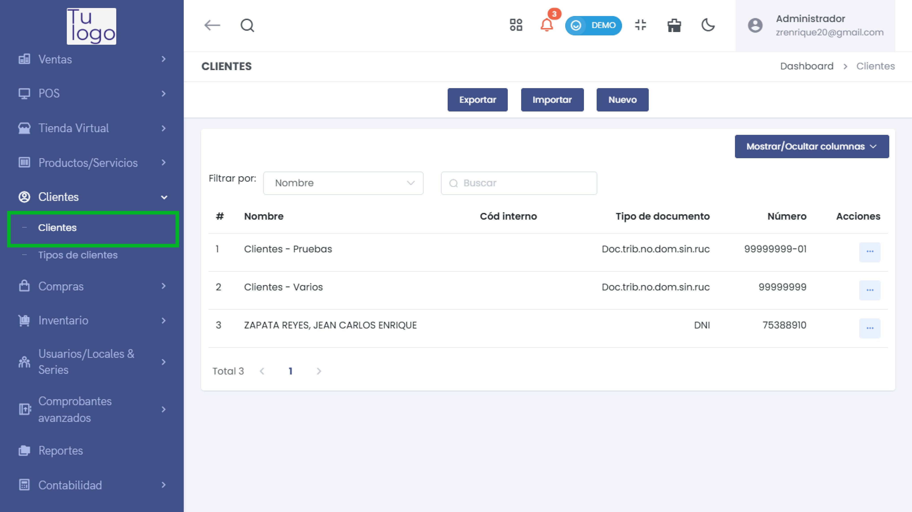
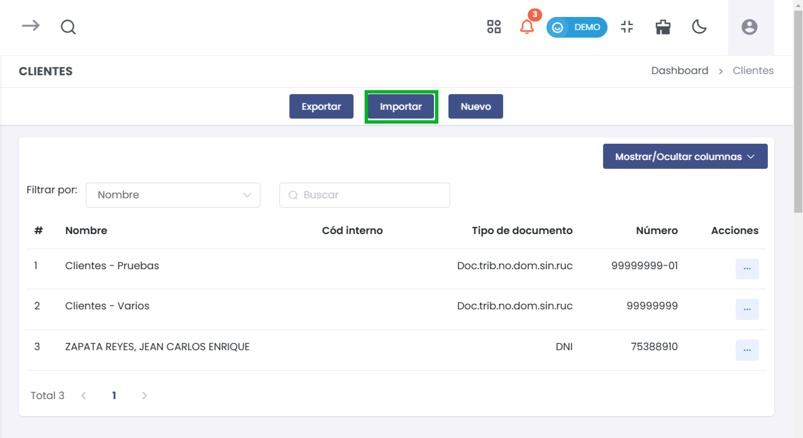
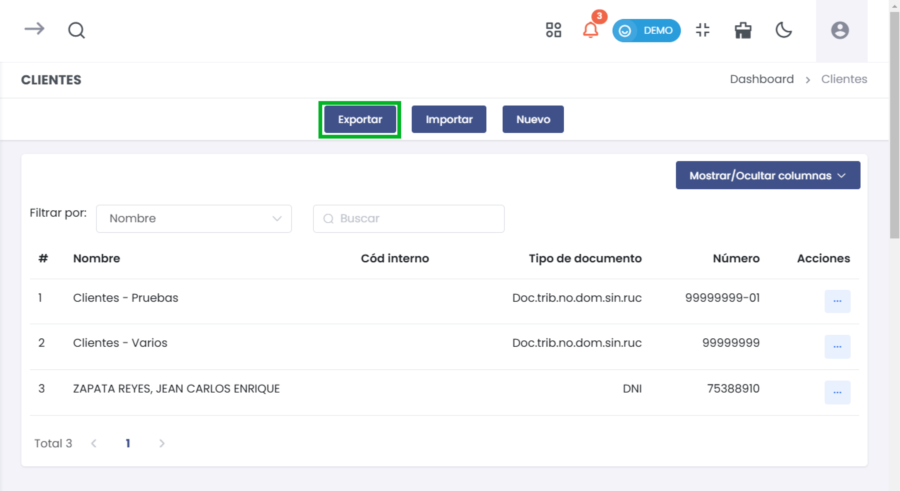
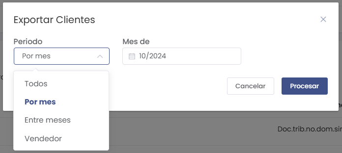
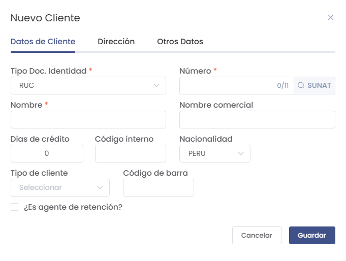
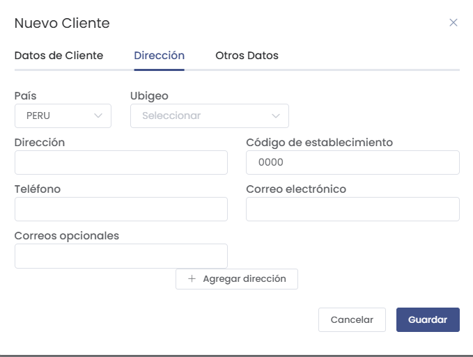
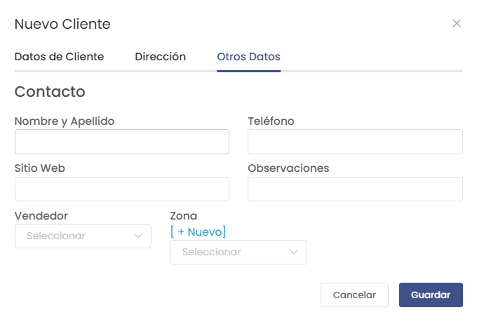
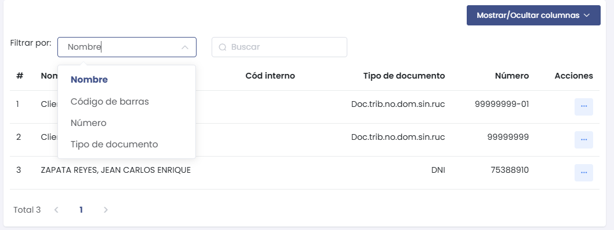
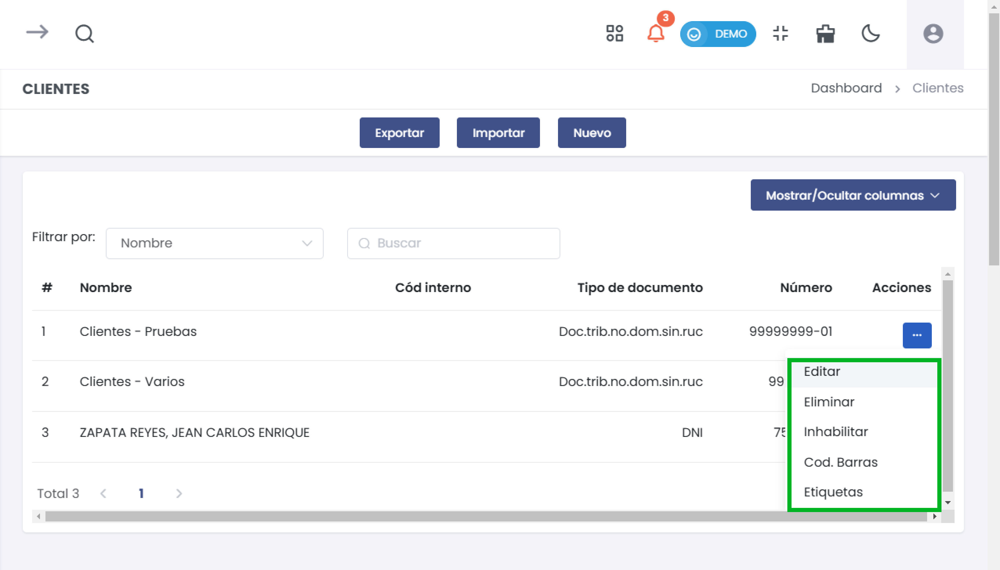

# Gestión de Clientes

Esta sección te permitirá gestionar tus clientes de manera eficiente a través de diversas funciones como la importación y exportación de datos, registro de nuevos clientes y búsqueda avanzada.

---

## Vista Principal de Clientes

Accede al módulo de **Clientes** en el menú lateral y selecciona **Clientes**. Aquí verás la lista completa de los clientes registrados en el sistema.

### Opciones Disponibles
- **Exportar**: Descarga la lista de clientes en formato Excel.
- **Importar**: Carga una lista de clientes desde un archivo XLSX.
- **Nuevo**: Registra un nuevo cliente en el sistema.

---

## Importar Clientes

La funcionalidad de importación permite subir una lista de clientes en formato Excel (XLSX) para agilizar el proceso de registro.

1. **Descargar Formato**: Haz clic en **Descargar formato** para obtener la plantilla con la estructura correcta.
2. **Seleccionar un archivo**: Haz clic en el botón **Seleccionar un archivo (xlsx)** para cargar la lista.
3. **Procesar**: Una vez subido el archivo, presiona **Procesar** para completar la importación.

---

## Exportar Clientes

Puedes exportar la lista de clientes filtrando por diferentes periodos o criterios.

1. **Periodo**: Selecciona el periodo deseado (Por mes, Entre meses, Vendedor, o Todos).
2. **Mes de**: Define el mes específico, si corresponde.
3. **Procesar**: Haz clic en **Procesar** para descargar la lista.

---

## Registro de Nuevo Cliente

El formulario de nuevo cliente te permite ingresar información detallada sobre el cliente.

### 1. **Datos de Cliente**
- **Tipo de Documento**: Selecciona entre RUC, DNI, CE, Pasaporte, entre otros.
- **Número**: Ingresa el número del documento.
- **Nombre**: Nombre del cliente.
- **Nombre Comercial**: (Opcional) Nombre alternativo del negocio.
- **Nacionalidad**: Selecciona el país de origen.
- **Tipo de Cliente**: Define la categoría del cliente.
- **¿Es agente de retención?**: Marca si corresponde.

---

### 2. **Dirección**

- **País** y **Ubigeo**: Selecciona la ubicación.
- **Dirección**: Ingresa la dirección del cliente.
- **Teléfono** y **Correo Electrónico**: Registra los datos de contacto.
- **Código de Establecimiento**: Ingresa el código correspondiente.

---

### 3. **Otros Datos**

- **Teléfono** y **Sitio Web**: Ingresa información adicional de contacto.
- **Zona**: Asigna la zona correspondiente.
- **Vendedor**: Selecciona al vendedor asociado al cliente.

---

## Búsqueda y Filtros

La vista principal permite realizar búsquedas avanzadas con varios filtros.

- **Filtrar por**: Puedes buscar clientes por nombre, número, tipo de documento o código de barras.
- **Buscar**: Ingresa el criterio y haz clic en **Buscar** para filtrar los resultados.

---

## Opciones de Cliente

Cada cliente registrado en el sistema permite realizar múltiples acciones para gestionar su información.

### Acciones Disponibles:

- **Editar**: Modifica la información del cliente registrado. Esta opción es útil para actualizar datos como la dirección, contactos o tipo de documento.
  
- **Eliminar**: Elimina permanentemente al cliente del sistema. Esta acción es irreversible, por lo que se recomienda precaución al usarla.

- **Inhabilitar**: Desactiva temporalmente al cliente. Esto es útil cuando no se desea eliminar al cliente, pero se requiere que deje de estar activo en el sistema.

- **Cod. Barras**: Genera y asocia un código de barras al cliente, permitiendo su identificación rápida en procesos de ventas o inventario.

- **Etiquetas**: Permite asignar etiquetas personalizadas para categorizar clientes, facilitando la segmentación y búsquedas específicas.

---
